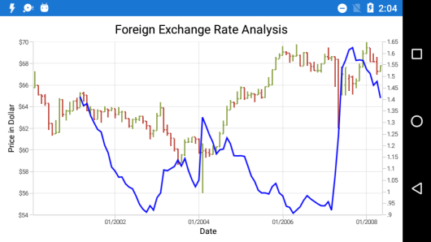
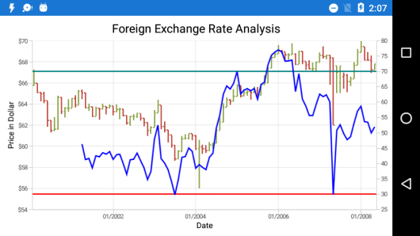
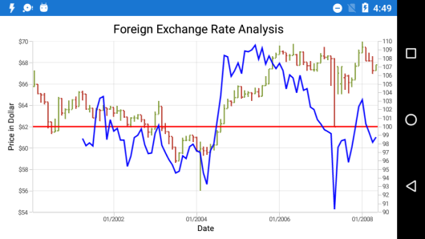
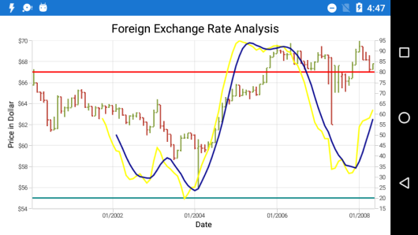
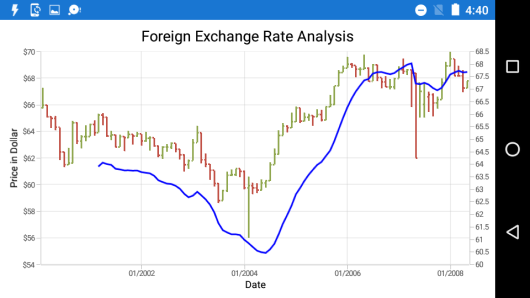
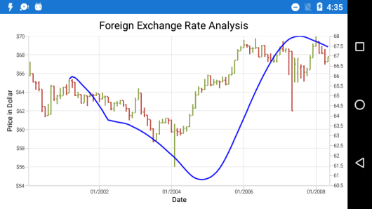
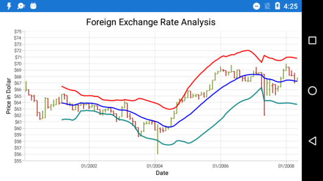

# Technical Indicators

The different types of technical indicators available in chart are follows:

* [`AverageTrueIndicator`](https://help.syncfusion.com/cr/cref_files/xamarin-android/sfchart/Syncfusion.SfChart.Android~Com.Syncfusion.Charts.AverageTrueIndicator.html)
* [`SimpleMovingAverageIndicator`](https://help.syncfusion.com/cr/cref_files/xamarin-android/sfchart/Syncfusion.SfChart.Android~Com.Syncfusion.Charts.SimpleMovingAverageIndicator.html)
* [`RSIIndicator`](https://help.syncfusion.com/cr/cref_files/xamarin-android/sfchart/Syncfusion.SfChart.Android~Com.Syncfusion.Charts.RSIIndicator.html)
* [`AccumulationDistributionIndicator`](https://help.syncfusion.com/cr/cref_files/xamarin-android/sfchart/Syncfusion.SfChart.Android~Com.Syncfusion.Charts.AccumulationDistributionIndicator.html)
* [`MomentumIndicator`](https://help.syncfusion.com/cr/cref_files/xamarin-android/sfchart/Syncfusion.SfChart.Android~Com.Syncfusion.Charts.MomentumIndicator.html) 
* [`StochasticIndicator`](https://help.syncfusion.com/cr/cref_files/xamarin-android/sfchart/Syncfusion.SfChart.Android~Com.Syncfusion.Charts.StochasticIndicator.html)
* [`ExponentialMovingAverageIndicator`](https://help.syncfusion.com/cr/cref_files/xamarin-android/sfchart/Syncfusion.SfChart.Android~Com.Syncfusion.Charts.ExponentialMovingAverageIndicator.html)
* [`TriangularMovingAverageIndicator`](https://help.syncfusion.com/cr/cref_files/xamarin-android/sfchart/Syncfusion.SfChart.Android~Com.Syncfusion.Charts.TriangularMovingAverageIndicator.html)
* [`BollingerBandIndicator`](https://help.syncfusion.com/cr/cref_files/xamarin-android/sfchart/Syncfusion.SfChart.Android~Com.Syncfusion.Charts.BollingerBandIndicator.html)
* [`MACDIndicator`](https://help.syncfusion.com/cr/cref_files/xamarin-android/sfchart/Syncfusion.SfChart.Android~Com.Syncfusion.Charts.MACDIndicator.html)

## Adding technical indicators to chart

The following section illustrates how to add technical indicators to chart.

**Initializing indicator**

Create an instance for any technical indicator, and add it to the [`TechnicalIndicators`](https://help.syncfusion.com/cr/cref_files/xamarin-android/sfchart/Syncfusion.SfChart.Android~Com.Syncfusion.Charts.ChartBase~TechnicalIndicators.html) collection.

Here, for an instance, the [`AccumulationDistributionIndicator`](https://help.syncfusion.com/cr/cref_files/xamarin-android/sfchart/Syncfusion.SfChart.Android~Com.Syncfusion.Charts.AccumulationDistributionIndicator.html) is added.



[C#] 

SfChart chart = new SfChart();
...
AccumulationDistributionIndicator indicator= new AccumulationDistributionIndicator();

chart.TechnicalIndicators.Add(indicator);



**Binding data**

Set the item source and binding paths ([`Open`](https://help.syncfusion.com/cr/cref_files/xamarin-android/sfchart/Syncfusion.SfChart.Android~Com.Syncfusion.Charts.FinancialTechnicalIndicator~Open.html), [`High`](https://help.syncfusion.com/cr/cref_files/xamarin-android/sfchart/Syncfusion.SfChart.Android~Com.Syncfusion.Charts.FinancialTechnicalIndicator~High.html), [`Low`](https://help.syncfusion.com/cr/cref_files/xamarin-android/sfchart/Syncfusion.SfChart.Android~Com.Syncfusion.Charts.FinancialTechnicalIndicator~Low.html), [`Close`](https://help.syncfusion.com/cr/cref_files/xamarin-android/sfchart/Syncfusion.SfChart.Android~Com.Syncfusion.Charts.FinancialTechnicalIndicator~Close.html) and [`XBindingPath`](https://help.syncfusion.com/cr/cref_files/xamarin-android/sfchart/Syncfusion.SfChart.Android~Com.Syncfusion.Charts.ChartSeries~XBindingPath.html) to fetch the values from model.



[C#]

SfChart chart = new SfChart()
{
      ...                
      TechnicalIndicators =
      {
          new AccumulationDistributionIndicator()
          {
              ItemsSource = viewModel.TechnicalIndicatorData,
              XBindingPath = "XValue",
              Open = "Open",
              High = "High",
              Low = "Low",
              Close = "Close"
          }
    }
};



**Binding the items source of chart series**

By setting [`Name`](https://help.syncfusion.com/cr/cref_files/xamarin-android/sfchart/Syncfusion.SfChart.Android~Com.Syncfusion.Charts.ChartSeries~Name.html) property of [`ChartSeries`](https://help.syncfusion.com/cr/cref_files/xamarin-android/sfchart/Syncfusion.SfChart.Android~Com.Syncfusion.Charts.ChartSeries.html) to the [`SeriesName`](https://help.syncfusion.com/cr/cref_files/xamarin-android/sfchart/Syncfusion.SfChart.Android~Com.Syncfusion.Charts.FinancialTechnicalIndicator~SeriesName.html) property of [`FinancialTechnicalIndicator`](https://help.syncfusion.com/cr/cref_files/xamarin-android/sfchart/Syncfusion.SfChart.Android~Com.Syncfusion.Charts.FinancialTechnicalIndicator.html) you can bind the items source of chart series to technical indicators, including x and y axis.



[C#]

SfChart chart = new SfChart()
{
    ...        
    Series =
      {
          new HiLoOpenCloseSeries()
          {
              ItemsSource = viewModel.TechnicalIndicatorData,
              XBindingPath = "XValue",
              Open = "Open",
              High = "High",
              Low = "Low",
              Close = "Close",
              Name = "OHLC"
          }
    },

    TechnicalIndicators =
      {
          new AccumulationDistributionIndicator()
          {
              SeriesName = "OHLC"              
          }
    }
};



Technical indicators have the below properties as common; 

 * [`Period`](https://help.syncfusion.com/cr/cref_files/xamarin-android/sfchart/Syncfusion.SfChart.Android~Com.Syncfusion.Charts.BollingerBandIndicator~Period.html) - used to indicates the moving average period.
 * [`SignalLineColor`](https://help.syncfusion.com/cr/cref_files/xamarin-android/sfchart/Syncfusion.SfChart.Android~Com.Syncfusion.Charts.FinancialTechnicalIndicator~SignalLineColor.html) - used to defines the color for the respective indicator line.
 * [`StrokeWidth`](https://help.syncfusion.com/cr/cref_files/xamarin-android/sfchart/Syncfusion.SfChart.Android~Com.Syncfusion.Charts.ChartSeries~StrokeWidth.html) - used to change the stroke width of the indicator.

**Adding axis**

The [`XAxis`](https://help.syncfusion.com/cr/cref_files/xamarin-android/sfchart/Syncfusion.SfChart.Android~Com.Syncfusion.Charts.FinancialTechnicalIndicator~XAxis.html) and [`YAxis`](https://help.syncfusion.com/cr/cref_files/xamarin-android/sfchart/Syncfusion.SfChart.Android~Com.Syncfusion.Charts.FinancialTechnicalIndicator~YAxis.html) properties of technical indicators are used to set the x and y-axes.

You can define the axis using the following code example.



[C#]

SfChart chart = new SfChart()
{
    ...        
    TechnicalIndicators =
      {
          new AccumulationDistributionIndicator()
          {
              SeriesName = "OHLC",
              XAxis = new NumericalAxis()
          }
      }
};



**Animation**

[`SfChart`](https://help.syncfusion.com/cr/cref_files/xamarin-android/sfchart/Syncfusion.SfChart.Android~Com.Syncfusion.Charts.SfChart.html) provides animation support for technical indicators. Technical indicators will be animated whenever the ItemsSource changes. Animation can be enabled by setting the [`EnableAnimation`](https://help.syncfusion.com/cr/cref_files/xamarin-android/sfchart/Syncfusion.SfChart.Android~Com.Syncfusion.Charts.ChartSeries~EnableAnimation.html) property to true. You can also control the duration of the animation using the [`AnimationDuration`](https://help.syncfusion.com/cr/cref_files/xamarin-android/sfchart/Syncfusion.SfChart.Android~Com.Syncfusion.Charts.ChartSeries~AnimationDuration.html) property.



[C#]

SfChart chart = new SfChart()
{
    ...        
    TechnicalIndicators =
      {
          new AccumulationDistributionIndicator()
          {
              SeriesName = "OHLC",
              EnableAnimation = true,
              AnimationDuration = 0.8      
          }
      }
};



## Average true range indicator 

ATR indicator is a technical analysis volatility indicator. This indicator does not provide an indication of price trend; simply the degree of price volatility. The average true range is an N-day smoothed moving average (SMMA) of the true range values.

You can define the [`AverageTrueIndicator`](https://help.syncfusion.com/cr/cref_files/xamarin-android/sfchart/Syncfusion.SfChart.Android~Com.Syncfusion.Charts.AverageTrueIndicator.html) using the following code example.



[C#]

SfChart chart = new SfChart()
{
    ...        
    TechnicalIndicators =
      {
          new AverageTrueIndicator()
          {
              Period = 14,
              SignalLineColor = Color.Blue,
              ItemsSource = viewModel.TechnicalIndicatorData,
              XBindingPath = "XValue",
              Open = "Open",
              High = "High",
              Low = "Low",
              Close = "Close",
          }
      }
};



The following screenshot illustrates an ATR indicator.

## Simple moving average indicator

A SMA indicator is a simple, arithmetic moving average that is calculated by adding the closing price for number of time periods and dividing the total value by the number of time periods.

The following code example demonstrates the usage of [`SimpleMovingAverageIndicator`](https://help.syncfusion.com/cr/cref_files/xamarin-android/sfchart/Syncfusion.SfChart.Android~Com.Syncfusion.Charts.SimpleMovingAverageIndicator.html).



[C#]

SfChart chart = new SfChart()
{
    ...        
    TechnicalIndicators =
      {
          new SimpleMovingAverageIndicator()
          {
              Period = 14,
              SignalLineColor = Color.Blue,
              ItemsSource = viewModel.TechnicalIndicatorData,
              XBindingPath = "XValue",
              Open = "Open",
              High = "High",
              Low = "Low",
              Close = "Close",
          }
      }
};



The following screenshot illustrates an SMA indicator.

## Relative strength index indicator

The RSI indicator has additional two lines other than signal line; they indicate the overbought and oversold region.

The [`UpperLineColor`](https://help.syncfusion.com/cr/cref_files/xamarin-android/sfchart/Syncfusion.SfChart.Android~Com.Syncfusion.Charts.RSIIndicator~UpperLineColor.html) property is used to define the color for the line that indicates overbought region, and the [`LowerLineColor`](https://help.syncfusion.com/cr/cref_files/xamarin-android/sfchart/Syncfusion.SfChart.Android~Com.Syncfusion.Charts.RSIIndicator~LowerLineColor.html) property is used to define the color for the line that indicates oversold region.

To define the [`RSIIndicator`](https://help.syncfusion.com/cr/cref_files/xamarin-android/sfchart/Syncfusion.SfChart.Android~Com.Syncfusion.Charts.RSIIndicator.html), use the following code example.



[C#]

SfChart chart = new SfChart()
{
    ...        
    TechnicalIndicators =
      {
          new RSIIndicator()
          {
              Period = 14,
              SignalLineColor = Color.Blue,
              UpperLineColor = Color.Teal,
              LowerLineColor = Color.Red,
              ItemsSource = viewModel.TechnicalIndicatorData,
              XBindingPath = "XValue",
              Open = "Open",
              High = "High",
              Low = "Low",
              Close = "Close",
          }
      }
};



The following screenshot illustrates an RSI technical indicator.

## Accumulation distribution indicator

Accumulation distribution indicator is a volume-based indicator designed to measure the accumulative flow of money into and out of a security. It requires [`Volume`](https://help.syncfusion.com/cr/cref_files/xamarin-android/sfchart/Syncfusion.SfChart.Android~Com.Syncfusion.Charts.AccumulationDistributionIndicator~Volume.html) property additionally with the data source to calculate the signal line. 

The following code example helps you to add [`AccumulationDistributionIndicator`](https://help.syncfusion.com/cr/cref_files/xamarin-android/sfchart/Syncfusion.SfChart.Android~Com.Syncfusion.Charts.AccumulationDistributionIndicator.html).



[C#]

SfChart chart = new SfChart()
{
    ...        
    TechnicalIndicators =
      {
          new AccumulationDistributionIndicator()
          {
              SignalLineColor = Color.Blue,
              ItemsSource = viewModel.TechnicalIndicatorData,
              XBindingPath = "XValue",
              Open = "Open",
              High = "High",
              Low = "Low",
              Close = "Close",
              Volume = "Volume"
          }
      }
};



The following screenshot illustrates an accumulation distribution indicator.

## Momentum indicator

This indicator is having two lines, momentum line and center line. The [`SignalLineColor`](https://help.syncfusion.com/cr/cref_files/xamarin-android/sfchart/Syncfusion.SfChart.Android~Com.Syncfusion.Charts.FinancialTechnicalIndicator~SignalLineColor.html) property and [`UpperLineColor`](https://help.syncfusion.com/cr/cref_files/xamarin-android/sfchart/Syncfusion.SfChart.Android~Com.Syncfusion.Charts.MomentumIndicator~UpperLineColor.html) property is used to define the color for the momentum and center line respectively.
You can define [`MomentumIndicator`](https://help.syncfusion.com/cr/cref_files/xamarin-android/sfchart/Syncfusion.SfChart.Android~Com.Syncfusion.Charts.MomentumIndicator.html) using the following code example.



[C#]

SfChart chart = new SfChart()
{
    ...        
    TechnicalIndicators =
      {
          new MomentumIndicator()
          {
              Period = 14,
              SignalLineColor = Color.Blue,
              UpperLineColor = Color.Red,
              ItemsSource = viewModel.TechnicalIndicatorData,
              XBindingPath = "XValue",
              Open = "Open",
              High = "High",
              Low = "Low",
              Close = "Close",
          }
      }
};



## Stochastic indicator

This indicator is used to measure the range and momentum of price movements. It contains [`KPeriod`](https://help.syncfusion.com/cr/cref_files/xamarin-android/sfchart/Syncfusion.SfChart.Android~Com.Syncfusion.Charts.StochasticIndicator~DPeriod.html) and [`DPeriod`](https://help.syncfusion.com/cr/cref_files/xamarin-android/sfchart/Syncfusion.SfChart.Android~Com.Syncfusion.Charts.StochasticIndicator~KPeriod.html) property defining the ‘K’ percentage and ‘D’ percentage respectively. No signal line in this indicator.
The [`UpperLineColor`](https://help.syncfusion.com/cr/cref_files/xamarin-android/sfchart/Syncfusion.SfChart.Android~Com.Syncfusion.Charts.StochasticIndicator~UpperLineColor.html), [`LowerLineColor`](https://help.syncfusion.com/cr/cref_files/xamarin-android/sfchart/Syncfusion.SfChart.Android~Com.Syncfusion.Charts.StochasticIndicator~LowerLineColor.html) and [`PeriodLineColor`](https://help.syncfusion.com/cr/cref_files/xamarin-android/sfchart/Syncfusion.SfChart.Android~Com.Syncfusion.Charts.StochasticIndicator~PeriodLineColor.html) property are used to define the color for the Stochastic indicator lines.
You can define [`StochasticIndicator`](https://help.syncfusion.com/cr/cref_files/xamarin-android/sfchart/Syncfusion.SfChart.Android~Com.Syncfusion.Charts.StochasticIndicator.html) using the following code example.



[C#]

SfChart chart = new SfChart()
{
    ...        
    TechnicalIndicators =
      {
          new StochasticIndicator()
          {
              Period = 14,
              SignalLineColor = Color.Yellow,
              UpperLineColor = Color.Red,
              LowerLineColor = Color.Teal,
              PeriodLineColor = Color.DarkBlue,
              KPeriod = 8,
              DPeriod = 5,
              ItemsSource = viewModel.TechnicalIndicatorData,
              XBindingPath = "XValue",
              Open = "Open",
              High = "High",
              Low = "Low",
              Close = "Close",
          }
      }
};


## Exponential moving average indicator

The [`ExponentialMovingAverageIndicator`](https://help.syncfusion.com/cr/cref_files/xamarin-android/sfchart/Syncfusion.SfChart.Android~Com.Syncfusion.Charts.ExponentialMovingAverageIndicator.html) is similar to [[`SimpleMovingAverageIndicator`](https://help.syncfusion.com/cr/cref_files/xamarin-android/sfchart/Syncfusion.SfChart.Android~Com.Syncfusion.Charts.SimpleMovingAverageIndicator.html) and this can be defined using the following code examples.



[C#]

SfChart chart = new SfChart()
{
    ...        
    TechnicalIndicators =
      {
          new ExponentialMovingAverageIndicator()
          {
              Period = 14,
              SignalLineColor = Color.Blue,
              ItemsSource = viewModel.TechnicalIndicatorData,
              XBindingPath = "XValue",
              Open = "Open",
              High = "High",
              Low = "Low",
              Close = "Close",
          }
      }
};



## Triangular moving average indicator

A Triangular moving average is simply a double-smoothed simple moving average of data calculated over a period of time where the middle portion of the data has more weight. 
The [`TriangularMovingAverageIndicator`](https://help.syncfusion.com/cr/cref_files/xamarin-android/sfchart/Syncfusion.SfChart.Android~Com.Syncfusion.Charts.TriangularMovingAverageIndicator.html) can be defined as in the following code example.



[C#]

SfChart chart = new SfChart()
{
    ...        
    TechnicalIndicators =
      {
          new TriangularMovingAverageIndicator()
          {
              Period = 14,
              SignalLineColor = Color.Blue,
              ItemsSource = viewModel.TechnicalIndicatorData,
              XBindingPath = "XValue",
              Open = "Open",
              High = "High",
              Low = "Low",
              Close = "Close",
          }
      }
};



## Bollinger band indicator

This indicator also having [`UpperLineColor`](https://help.syncfusion.com/cr/cref_files/xamarin-android/sfchart/Syncfusion.SfChart.Android~Com.Syncfusion.Charts.BollingerBandIndicator~UpperLineColor.html), [`LowerLineColor`](https://help.syncfusion.com/cr/cref_files/xamarin-android/sfchart/Syncfusion.SfChart.Android~Com.Syncfusion.Charts.BollingerBandIndicator~LowerLineColor.html)  and [`SignalLineColor`](https://help.syncfusion.com/cr/cref_files/xamarin-android/sfchart/Syncfusion.SfChart.Android~Com.Syncfusion.Charts.FinancialTechnicalIndicator~SignalLineColor.html) property for defining the brushes for the indicator lines.

Also, we can specify standard deviation values for BollingerBand indicator using [`StandardDeviation`](https://help.syncfusion.com/cr/cref_files/xamarin-android/sfchart/Syncfusion.SfChart.Android~Com.Syncfusion.Charts.BollingerBandIndicator~StandardDeviation.html) property.
You can define the [`BollingerBandIndicator`](https://help.syncfusion.com/cr/cref_files/xamarin-android/sfchart/Syncfusion.SfChart.Android~Com.Syncfusion.Charts.BollingerBandIndicator.html) using the following code example.



[C#]

SfChart chart = new SfChart()
{
    ...        
    TechnicalIndicators =
      {
          new BollingerBandIndicator()
          {
              Period = 14,
              SignalLineColor = Color.Blue,
              UpperLineColor = Color.Red,
              LowerLineColor = Color.Teal,
              ItemsSource = viewModel.TechnicalIndicatorData,
              XBindingPath = "XValue",
              Open = "Open",
              High = "High",
              Low = "Low",
              Close = "Close",
          }
      }
};



## MACD indicator

This is mostly using indicator having [`ShortPeriod`](https://help.syncfusion.com/cr/cref_files/xamarin-android/sfchart/Syncfusion.SfChart.Android~Com.Syncfusion.Charts.MACDIndicator~ShortPeriod.html) and [`LongPeriod`](https://help.syncfusion.com/cr/cref_files/xamarin-android/sfchart/Syncfusion.SfChart.Android~Com.Syncfusion.Charts.MACDIndicator~LongPeriod.html) for defining the motion of the indicator.
Also you can draw line, histogram MACD or both using the [`MACDType`](https://help.syncfusion.com/cr/cref_files/xamarin-android/sfchart/Syncfusion.SfChart.Android~Com.Syncfusion.Charts.MACDType.html) property, which defines the type of MACD to be drawn.

The [`MACDLineColor`](https://help.syncfusion.com/cr/cref_files/xamarin-android/sfchart/Syncfusion.SfChart.Android~Com.Syncfusion.Charts.MACDIndicator~MACDLineColor.html) property is used to define the color for the MACD line  and the  [`HistogramColor`](https://help.syncfusion.com/cr/cref_files/xamarin-android/sfchart/Syncfusion.SfChart.Android~Com.Syncfusion.Charts.MACDIndicator~HistogramColor.html) property is used to define the color for the MACD histogram.
You can specify the MACD indicator using the following code example.



[C#]

SfChart chart = new SfChart()
{
    ...        
    TechnicalIndicators =
      {
          new MACDIndicator()
          {
              MACDType = MACDType.Both,
              ShortPeriod = 2,
              LongPeriod = 10,
              Trigger = 14,
              indicator.SignalLineColor = Color.Blue,
              indicator.HistogramColor = Color.LightSkyBlue,
              indicator.MACDLineColor = Color.Orange,
              ItemsSource = viewModel.TechnicalIndicatorData,
              XBindingPath = "XValue",
              Open = "Open",
              High = "High",
              Low = "Low",
              Close = "Close",
          }
      }
};



