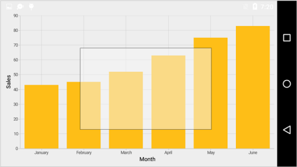
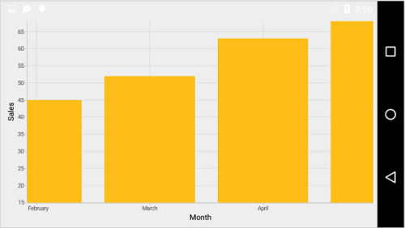
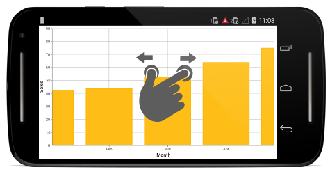

# Zooming and Panning

## Enable Zooming

Chart allows you to zoom in to view the data clearly. To enable this feature, you need to add an instance of [`ChartZoomPanBehavior`](http://help.syncfusion.com/cr/cref_files/xamarin-android/Syncfusion.SfChart.Android~Com.Syncfusion.Charts.ChartZoomPanBehavior.html) to the [`Behaviors`](https://help.syncfusion.com/cr/cref_files/xamarin-android/Syncfusion.SfChart.Android~Com.Syncfusion.Charts.ChartBehavior.html) collection property of [`SfChart`](http://help.syncfusion.com/cr/cref_files/xamarin-android/Syncfusion.SfChart.Android~Com.Syncfusion.Charts.SfChart.html).

Following properties are used to configure the zooming feature,

* [`ZoomingEnabled`](http://help.syncfusion.com/cr/cref_files/xamarin-android/Syncfusion.SfChart.Android~Com.Syncfusion.Charts.ChartZoomPanBehavior~ZoomingEnabled.html) – used to enable/disable the pinch zooming. Default value is true. 
* [`DoubleTapEnabled`](http://help.syncfusion.com/cr/cref_files/xamarin-android/Syncfusion.SfChart.Android~Com.Syncfusion.Charts.ChartZoomPanBehavior~DoubleTapEnabled.html) – when you enable this property, you can double tap on the chart to reset it to the original size or zoom in by one level.
* [`SelectionZoomingEnabled`](http://help.syncfusion.com/cr/cref_files/xamarin-android/Syncfusion.SfChart.Android~Com.Syncfusion.Charts.ChartZoomPanBehavior~SelectionZoomingEnabled.html) – when this property is set to true, you can double tap and drag to select a range on the chart to be zoomed in.
* [`ScrollingEnabled`](http://help.syncfusion.com/cr/cref_files/xamarin-android/Syncfusion.SfChart.Android~Com.Syncfusion.Charts.ChartZoomPanBehavior~ScrollingEnabled.html) – used to enable/disable the panning. Default value is true.
* [`MaximumZoomLevel`](https://help.syncfusion.com/cr/cref_files/xamarin-android/Syncfusion.SfChart.Android~Com.Syncfusion.Charts.ChartZoomPanBehavior~MaximumZoomLevel.html) - used to determine the maximum zoom level of the chart.
* [`SelectionRectStrokeWidth`](https://help.syncfusion.com/cr/cref_files/xamarin-android/Syncfusion.SfChart.Android~Com.Syncfusion.Charts.ChartZoomPanBehavior~SelectionRectStrokeWidth.html) - used to change the stroke width of selection rectangle
* [`SelectionRectStrokeColor`](https://help.syncfusion.com/cr/cref_files/xamarin-android/Syncfusion.SfChart.Android~Com.Syncfusion.Charts.ChartZoomPanBehavior~SelectionRectStrokeColor.html) - used to change the stroke color of selection rectangle.
* [`SelectionRectPathEffect`](https://help.syncfusion.com/cr/cref_files/xamarin-android/Syncfusion.SfChart.Android~Com.Syncfusion.Charts.ChartZoomPanBehavior~SelectionRectPathEffect.html) - used to change the stroke dashes of selection rectangle.
* [`SelectionRectFillColor`](https://help.syncfusion.com/cr/cref_files/xamarin-android/Syncfusion.SfChart.Android~Com.Syncfusion.Charts.ChartZoomPanBehavior~SelectionRectFillColor.html) - used to change the stroke fill color of selection rectangle.

Following code snippet illustrates how to enable zooming.

 
[C#]

SfChart chart = new SfChart();
...

ChartZoomPanBehavior zoomPanBehavior = new ChartZoomPanBehavior();
chart.Behaviors.Add(zoomPanBehavior);



Following code snippet illustrates how to enable the box selection zooming,

 
[C#]

ChartZoomPanBehavior zoomPanBehavior = new ChartZoomPanBehavior();
zoomPanBehavior.SelectionZoomingEnabled = true;



Following screenshot shows the box selection on chart area,

Following screenshot shows the zoomed area,

## Zoom Mode

The [`ZoomMode`](http://help.syncfusion.com/cr/cref_files/xamarin-android/Syncfusion.SfChart.Android~Com.Syncfusion.Charts.ChartZoomPanBehavior~ZoomMode.html) property specifies whether chart should be allowed to scale along horizontal axis or vertical axis or along both axis. The default value of [`ZoomMode`](http://help.syncfusion.com/cr/cref_files/xamarin-android/Syncfusion.SfChart.Android~Com.Syncfusion.Charts.ChartZoomPanBehavior~ZoomMode.html) is [`XY`](https://help.syncfusion.com/cr/cref_files/xamarin-android/Syncfusion.SfChart.Android~Com.Syncfusion.Charts.ZoomMode.html) (both axis).

Following code example illustrates how to restrict the chart to be zoomed only along horizontal axis,

 
[C#]

ChartZoomPanBehavior zoomPanBehavior = new ChartZoomPanBehavior();
zoomPanBehavior.ZoomMode = ZoomMode.X;



## Events

**ZoomStart**

The [`ZoomStart`](https://help.syncfusion.com/cr/cref_files/xamarin-android/Syncfusion.SfChart.Android~Com.Syncfusion.Charts.SfChart~ZoomStart_EV.html) event is triggered when the user starts zooming the chart through pinch gesture, and this is a cancelable event. The argument contains the following information.

* [`ChartAxis`](https://help.syncfusion.com/cr/cref_files/xamarin-android/Syncfusion.SfChart.Android~Com.Syncfusion.Charts.SfChart+ChartZoomEventArgs~ChartAxis.html) – the zoom start event will be triggered for all the axis in the Chart.
* [`CurrentZoomFactor`](https://help.syncfusion.com/cr/cref_files/xamarin-android/Syncfusion.SfChart.Android~Com.Syncfusion.Charts.SfChart+ChartZoomEventArgs~CurrentZoomFactor.html) – used to get the new zoom factor of the corresponding axis.
* [`CurrentZoomPosition`](https://help.syncfusion.com/cr/cref_files/xamarin-android/Syncfusion.SfChart.Android~Com.Syncfusion.Charts.SfChart+ChartZoomEventArgs~CurrentZoomPosition.html)– used to get the new zoom position of the corresponding axis.
* [`Cancel`](https://help.syncfusion.com/cr/cref_files/xamarin-android/Syncfusion.SfChart.Android~Com.Syncfusion.Charts.SfChart+ZoomStartEventArgs~Cancel.html) – used to set the value indicating whether the zooming should be canceled.

**ZoomDelta**

The [`ZoomDelta`](https://help.syncfusion.com/cr/cref_files/xamarin-android/Syncfusion.SfChart.Android~Com.Syncfusion.Charts.SfChart~ZoomDelta_EV.html) event is triggered while zooming, and this is a cancelable event. The argument contains the following information.

* [`ChartAxis`](https://help.syncfusion.com/cr/cref_files/xamarin-android/Syncfusion.SfChart.Android~Com.Syncfusion.Charts.SfChart+ChartZoomEventArgs~ChartAxis.html) – Instance of the axis whose range is changed because of zooming. This event is triggered for each axis in the chart.
* [`PreviousZoomFactor`](https://help.syncfusion.com/cr/cref_files/xamarin-android/Syncfusion.SfChart.Android~Com.Syncfusion.Charts.SfChart+ZoomDeltaEventArgs~PreviousZoomFactor.html) – used to get the previous zoom factor of the axis.
* [`PreviousZoomPosition`](https://help.syncfusion.com/cr/cref_files/xamarin-android/Syncfusion.SfChart.Android~Com.Syncfusion.Charts.SfChart+ZoomDeltaEventArgs~PreviousZoomPosition.html) – used to get the previous zoom position of the axis.
* [`CurrentZoomFactor`](https://help.syncfusion.com/cr/cref_files/xamarin-android/Syncfusion.SfChart.Android~Com.Syncfusion.Charts.SfChart+ChartZoomEventArgs~CurrentZoomFactor.html) – used to get the current zoom factor of the axis.
* [`CurrentZoomPosition`](https://help.syncfusion.com/cr/cref_files/xamarin-android/Syncfusion.SfChart.Android~Com.Syncfusion.Charts.SfChart+ChartZoomEventArgs~CurrentZoomPosition.html) – used to get the current zoom position of the axis.
* [`Cancel`](https://help.syncfusion.com/cr/cref_files/xamarin-android/Syncfusion.SfChart.Android~Com.Syncfusion.Charts.SfChart+ZoomDeltaEventArgs~Cancel.html) – used to set the value indicating whether the zooming should be canceled.

**ZoomEnd**

The [`ZoomEnd`](https://help.syncfusion.com/cr/cref_files/xamarin-android/Syncfusion.SfChart.Android~Com.Syncfusion.Charts.SfChart~ZoomEnd_EV.html) event is triggered after the zooming is stopped. The argument contains the following information.

* [`ChartAxis`](https://help.syncfusion.com/cr/cref_files/xamarin-android/Syncfusion.SfChart.Android~Com.Syncfusion.Charts.SfChart+ChartZoomEventArgs~ChartAxis.html) – Instance of the axis whose range is changed because of zooming. This event is triggered for each axis in the chart.
* [`CurrentZoomFactor`](https://help.syncfusion.com/cr/cref_files/xamarin-android/Syncfusion.SfChart.Android~Com.Syncfusion.Charts.SfChart+ChartZoomEventArgs~CurrentZoomFactor.html) – the axis zoom factor after zoom.
* [`CurrentZoomPosition`](https://help.syncfusion.com/cr/cref_files/xamarin-android/Syncfusion.SfChart.Android~Com.Syncfusion.Charts.SfChart+ChartZoomEventArgs~CurrentZoomPosition.html) - the axis zoom position after zoom.

**SelectionZoomStart**

The [`SelectionZoomStart`](https://help.syncfusion.com/cr/cref_files/xamarin-android/Syncfusion.SfChart.Android~Com.Syncfusion.Charts.SfChart~SelectionZoomStart_EV.html) event is triggered when the user starts the box selection zooming. The argument contains the following information.

* [`ZoomRect`](https://help.syncfusion.com/cr/cref_files/xamarin-android/Syncfusion.SfChart.Android~Com.Syncfusion.Charts.SfChart+SelectionZoomStartEventArgs~ZoomRect.html) – used to get the initial bounds of the box selection.

**SelectionZoomDelta**

The [`SelectionZoomDelta`](https://help.syncfusion.com/cr/cref_files/xamarin-android/Syncfusion.SfChart.Android~Com.Syncfusion.Charts.SfChart~SelectionZoomDelta_EV.html) event is triggered while selecting a region to be zoomed, and this is a cancelable event. The argument contains the following information.

* [`ZoomRect`](https://help.syncfusion.com/cr/cref_files/xamarin-android/Syncfusion.SfChart.Android~Com.Syncfusion.Charts.SfChart+SelectionZoomDeltaEventArgs~ZoomRect.html) – contains the bounds of the currently selected region.
* [`Cancel`](https://help.syncfusion.com/cr/cref_files/xamarin-android/Syncfusion.SfChart.Android~Com.Syncfusion.Charts.SfChart+SelectionZoomDeltaEventArgs~Cancel.html) – used to set the value indicating whether the box selection zooming should be canceled.

**SelectionZoomEnd**

The [`SelectionZoomEnd`](https://help.syncfusion.com/cr/cref_files/xamarin-android/Syncfusion.SfChart.Android~Com.Syncfusion.Charts.SfChart~SelectionZoomEnd_EV.html) event is triggered after selection zooming ends. The argument contains the following information.

* [`ZoomRect`](https://help.syncfusion.com/cr/cref_files/xamarin-android/Syncfusion.SfChart.Android~Com.Syncfusion.Charts.SfChart+SelectionZoomEndEventArgs~ZoomRect.html) – used to get the final bounds of the zoomed region.

**Scroll**

The [`Scroll`](https://help.syncfusion.com/cr/cref_files/xamarin-android/Syncfusion.SfChart.Android~Com.Syncfusion.Charts.SfChart~Scroll_EV.html) event is triggered while panning, and this is a cancelable event. The argument contains the following information.

* [`ChartAxis`](https://help.syncfusion.com/cr/cref_files/xamarin-android/Syncfusion.SfChart.Android~Com.Syncfusion.Charts.SfChart+ScrollEventArgs~ChartAxis.html) – Instance of the axis whose range is changed while panning. This event is triggered for each axis in the chart.
* [`ZoomPosition`](https://help.syncfusion.com/cr/cref_files/xamarin-android/Syncfusion.SfChart.Android~Com.Syncfusion.Charts.SfChart+ScrollEventArgs~ZoomPosition.html) – the current zoom position of the axis.
* [`Cancel`](https://help.syncfusion.com/cr/cref_files/xamarin-android/Syncfusion.SfChart.Android~Com.Syncfusion.Charts.SfChart+ScrollEventArgs~Cancel.html) – used to set a value indicating whether the scrolling should be canceled.

**ResetZoom**

The [`ResetZoom`](https://help.syncfusion.com/cr/cref_files/xamarin-android/Syncfusion.SfChart.Android~Com.Syncfusion.Charts.SfChart~ResetZoom_EV.html) event is triggered after the chart is reset on double tap. The argument contains the following information.

* [`ChartAxis`](https://help.syncfusion.com/cr/cref_files/xamarin-android/Syncfusion.SfChart.Android~Com.Syncfusion.Charts.SfChart+ResetZoomEventArgs~ChartAxis.html) – Instance of the axis whose range is changed because of this event. This event is triggered for each axis in the chart.
* [`PreviousZoomFactor`](https://help.syncfusion.com/cr/cref_files/xamarin-android/Syncfusion.SfChart.Android~Com.Syncfusion.Charts.SfChart+ResetZoomEventArgs~PreviousZoomFactor.html) – used to get the previous zoom factor.
* [`PreviousZoomPosition`](https://help.syncfusion.com/cr/cref_files/xamarin-android/Syncfusion.SfChart.Android~Com.Syncfusion.Charts.SfChart+ResetZoomEventArgs~PreviousZoomPosition.html) – used to get the previous zoom position.

## Methods

Zooming and panning can be performed programmatically with the following methods:

### ZoomIn

[`ZoomIn`](https://help.syncfusion.com/cr/cref_files/xamarin-android/Syncfusion.SfChart.Android~Com.Syncfusion.Charts.ChartZoomPanBehavior~ZoomIn.html) method is used to increase the magnification of the plot area to view the data clearly.


[C#]

ChartZoomPanBehavior zoomPan = new ChartZoomPanBehavior();

zoomPan.ZoomIn();



### ZoomOut 

[`ZoomOut`](https://help.syncfusion.com/cr/cref_files/xamarin-android/Syncfusion.SfChart.Android~Com.Syncfusion.Charts.ChartZoomPanBehavior~ZoomOut.html) is used to decrease the magnification of the plot area to reset the default view.


[C#]

ChartZoomPanBehavior zoomPan = new ChartZoomPanBehavior();

zoomPan.ZoomOut();



### Zoom

**Zoom(factor)**

[`Zoom`](https://help.syncfusion.com/cr/cref_files/xamarin-android/Syncfusion.SfChart.Android~Com.Syncfusion.Charts.ChartZoomPanBehavior~Zoom(Single).html) method is used to change the zoom level by using zoom factor.


[C#]

ChartZoomPanBehavior zoomPan = new ChartZoomPanBehavior();

zoomPan.Zoom(0.5f);



**Zoom(RectF)**

[`Zoom`](https://help.syncfusion.com/cr/cref_files/xamarin-android/Syncfusion.SfChart.Android~Com.Syncfusion.Charts.ChartZoomPanBehavior~Zoom(RectF).html) method is used to zoom the chart for a given rectangle value.


[C#]

ChartZoomPanBehavior zoomPan = new ChartZoomPanBehavior();

zoomPan.Zoom(new RectF(10, 10, 200, 350));



**Zoom(cumulativeLevel, origin, chartAxis)**

[`Zoom`](https://help.syncfusion.com/cr/cref_files/xamarin-android/Syncfusion.SfChart.Android~Com.Syncfusion.Charts.ChartZoomPanBehavior~Zoom(Single,Single,ChartAxis).html) method is used to change the zoom level of given axis to the specified level and origin.


[C#]

ChartZoomPanBehavior zoomPan = new ChartZoomPanBehavior();

zoomPan.Zoom(0.5f, 0.5f, axis);



### ZoomByRange

**ZoomByRange(chartAxis, start, end)**

[`ZoomByRange`](https://help.syncfusion.com/cr/cref_files/xamarin-android/Syncfusion.SfChart.Android~Com.Syncfusion.Charts.ChartZoomPanBehavior~ZoomByRange(ChartAxis,Double,Double).html) method is used to zoom the given axis to given range.


[C#]

ChartZoomPanBehavior zoomPan = new ChartZoomPanBehavior();

zoomPan.ZoomByRange(axis, 20, 25);



**ZoomByRange(dateTimeAxis, start, end)**

[`ZoomByRange`](https://help.syncfusion.com/cr/cref_files/xamarin-android/Syncfusion.SfChart.Android~Com.Syncfusion.Charts.ChartZoomPanBehavior~ZoomByRange(DateTimeAxis,DateTime,DateTime).html) method is used to zoom the given axis to given date time range.


[C#]

ChartZoomPanBehavior zoomPan = new ChartZoomPanBehavior(); 

zoomPan.ZoomByRange(axis, new DateTime(2017,3,1), new DateTime(2017,5,1));



### ZoomToFactor(chartAxis, zoomPosition, zoomFactor)

[`ZoomToFactor`](https://help.syncfusion.com/cr/cref_files/xamarin-android/Syncfusion.SfChart.Android~Com.Syncfusion.Charts.ChartZoomPanBehavior~ZoomToFactor.html) method is used to change the zoom level by using zoom position and zoom factor. Zoom position value specifies the starting point of zooming, and zoom factor value specifies the level of zooming.


[C#]

ChartZoomPanBehavior zoomPan = new ChartZoomPanBehavior(); 

zoomPan.ZoomToFactor(axis, 0.5f, 0.5f);



### Reset

[`Reset`](https://help.syncfusion.com/cr/cref_files/xamarin-android/Syncfusion.SfChart.Android~Com.Syncfusion.Charts.ChartZoomPanBehavior~Reset.html) method is used to return the plot area back to its original position after zooming. 


[C#]

ChartZoomPanBehavior zoomPan = new ChartZoomPanBehavior(); 

zoomPan.Reset();


