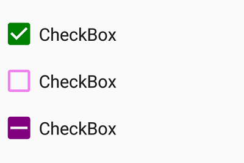

# Visual Customization

## Customizing shape
The check box shape can be customized using the `CornerRadius` property. This property specifies uniform radius value for every corner of the check box.



SfCheckBox checkBox = new SfCheckBox(this);
checkBox.Text = "CheckBox";
checkBox.Checked = true;
checkBox.CornerRadius = 5.0f;



## Customizing state color
The default state colors can be customized using the `ButtonTintList` property. The checked/unchecked/indeterminate state color is updated with `ColorStateList` to the `ButtonTintList`.


int[][] states ={new int[]{ Android.Resource.Attribute.StateChecked },                            
                new int[]{Syncfusion.Buttons.Android.Resource.Attribute.state_indeterminate},
		new int[]{-Android.Resource.Attribute.StateChecked }};
int[] colors = { Color.Green,  Color.Purple, Color.Violet};

SfCheckBox check = new SfCheckBox(this);
check.Text = "CheckBox";
check.Checked = true;            
check.ButtonTintList = new ColorStateList(states, colors);
SfCheckBox uncheck = new SfCheckBox(this);
uncheck.Text = "CheckBox";            
uncheck.ButtonTintList = new ColorStateList(states, colors);
SfCheckBox indeterminate = new SfCheckBox(this);
indeterminate.Checked = null;
indeterminate.IsThreeState = true;
indeterminate.Text = "CheckBox";
indeterminate.ButtonTintList = new ColorStateList(states, colors);



## BorderWidth
The tick box border thickness of the checkbox control can be customized with the `BorderWidth` property. 



SfCheckBox check1 = new SfCheckBox();
check1.Text = "Hello";
check1.BorderWidth = 2;
check1.FontSize = 20;
check1.UncheckedColor = Color.Blue;
SfCheckBox check2= new SfCheckBox();
check2.Text = "Hello";
check2.BorderWidth = 4;
check2.FontSize = 25;
check2.UncheckedColor = Color.Blue;
SfCheckBox check3 = new SfCheckBox();
check3.Text = "Hello";
check3.BorderWidth = 6;
check3.FontSize = 30;
check3.UncheckedColor = Color.Blue;



## Setting caption text appearance 
You can customize the display text appearance of the `SfCheckBox` control using the following properties:

* `SetTextColor`: Changes the color of the text.
* `TextAlignment`: Changes the horizontal alignment of the caption text.
* `Typeface`: Changes the font family of the text and sets font attributes(bold/italic/none) of the caption text.
* `TextSize`: Sets font size of the caption text.



SfCheckBox caption = new SfCheckBox(this);
caption.Checked = true;
caption.Text = "CheckBox";
caption.SetTextColor(Color.Violet);
caption.TextAlignment = TextAlignment.Center;
caption.Typeface = Typeface.Create("Arial", TypefaceStyle.Bold);
caption.TextSize = 20;



This demo can be downloaded from this [link](http://files2.syncfusion.com/Xamarin.Android/Samples/CheckBox_VisualCustomization.zip).