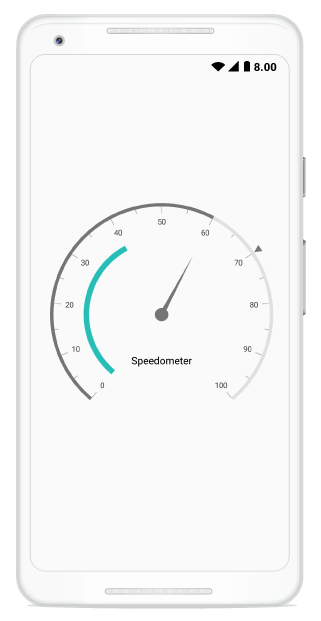

---

layout: post
title: Syncfusion SfCircularGauge control for Xamarin.Android 
description:  A quick tour to initial users on Syncfusion SfCircularGauge control for Xamarin.Android  Platform
platform: Xamarin.Android
control: SfCircularGauge
documentation: ug

---

# Getting Started

This section explains the steps required to configure the [`SfCircularGauge`](https://help.syncfusion.com/cr/cref_files/xamarin-android/sfgauge/Syncfusion.SfGauge.Android~Com.Syncfusion.Gauges.SfCircularGauge.SfCircularGauge.html), and also explains the steps required to add basic elements to [`SfCircularGauge`](https://help.syncfusion.com/cr/cref_files/xamarin-android/sfgauge/Syncfusion.SfGauge.Android~Com.Syncfusion.Gauges.SfCircularGauge.SfCircularGauge.html) through various APIs available within it.

## Create your first circular gauge in Xamarin.Android studio

You can configure an Xamarin.Android circular gauge in simple steps. In this section, you can learn how to configure a circular gauge control in a real-time scenario and also provides a walk-through on some of the customization features available in circular gauge control.
 
### Adding namespace for the assemblies



    using Com.Syncfusion.Gauges.SfCircularGauge;



## Initialize gauge 

You can initialize the [`SfCircularGauge`](https://help.syncfusion.com/cr/cref_files/xamarin-android/sfgauge/Syncfusion.SfGauge.Android~Com.Syncfusion.Gauges.SfCircularGauge.SfCircularGauge.html) control with a required optimal name by using the included namespace.



      protected override void OnCreate(Bundle bundle)
        {
            base.OnCreate(bundle);
            SfCircularGauge circularGauge = new SfCircularGauge(this);
            SetContentView(circularGauge);
        }



## Adding header

You can assign a unique header to [`SfCircularGauge`](https://help.syncfusion.com/cr/cref_files/xamarin-android/sfgauge/Syncfusion.SfGauge.Android~Com.Syncfusion.Gauges.SfCircularGauge.SfCircularGauge.html) by using the [`Header`](https://help.syncfusion.com/cr/cref_files/xamarin-android/sfgauge/Syncfusion.SfGauge.Android~Com.Syncfusion.Gauges.SfCircularGauge.Header.html) property and position it by using the [`Position`](https://help.syncfusion.com/cr/cref_files/xamarin-android/sfgauge/Syncfusion.SfGauge.Android~Com.Syncfusion.Gauges.SfCircularGauge.Header~Position.html) property as you want.



            SfCircularGauge circularGauge = new SfCircularGauge(this);
            Header header = new Header();
            header.Text = "Speedometer";
            header.TextColor = Color.Black;
            circularGauge.Headers.Add(header);
            SetContentView(circularGauge); 
	


## Configuring scales

You can configure the [`CircularScale`](https://help.syncfusion.com/cr/cref_files/xamarin-android/sfgauge/Syncfusion.SfGauge.Android~Com.Syncfusion.Gauges.SfCircularGauge.CircularScale.html) elements by using following APIs, which are available in [`SfCircularGauge`](https://help.syncfusion.com/cr/cref_files/xamarin-android/sfgauge/Syncfusion.SfGauge.Android~Com.Syncfusion.Gauges.SfCircularGauge.SfCircularGauge.html):

* `StartAngle`
* `SweepAngle`
* `StartValue`
* `EndValue`
* `Interval`
* `RimThickness`
* `RimColor`



            ObservableCollection<CircularScale> scales = new ObservableCollection<CircularScale>();
            CircularScale scale = new CircularScale();
            scale.StartValue = 0;
            scale.EndValue = 100;
            scales.Add(scale);
            circularGauge.CircularScales = scales;
	


## Adding ranges

You can add ranges to [`SfCircularGauge`](https://help.syncfusion.com/cr/cref_files/xamarin-android/sfgauge/Syncfusion.SfGauge.Android~Com.Syncfusion.Gauges.SfCircularGauge.SfCircularGauge.html) by creating ranges collection using the [`CircularRange`](https://help.syncfusion.com/cr/cref_files/xamarin-android/sfgauge/Syncfusion.SfGauge.Android~Com.Syncfusion.Gauges.SfCircularGauge.CircularRange.html) property.



           ObservableCollection<CircularScale> scales = new ObservableCollection<CircularScale>();
            CircularScale scale = new CircularScale();
            scale.StartValue = 0;
            scale.EndValue = 100;
            scales.Add(scale);
            CircularRange range = new CircularRange();
            range.StartValue = 0;
            range.EndValue = 40;
            scale.CircularRanges.Add(range);
            circularGauge.CircularScales = scales;
	


## Adding a needle pointer

Create a [`Needle Pointer`](https://help.syncfusion.com/cr/cref_files/xamarin-android/sfgauge/Syncfusion.SfGauge.Android~Com.Syncfusion.Gauges.SfCircularGauge.NeedlePointer.html), and associate it with a scale that is to be displayed the current value.



           ObservableCollection<CircularScale> scales = new ObservableCollection<CircularScale>();
            CircularScale scale = new CircularScale();
            scale.StartValue = 0;
            scale.EndValue = 100;
            scales.Add(scale);         
            NeedlePointer needlePointer = new NeedlePointer();
            needlePointer.Value = 60;
            scale.CircularPointers.Add(needlePointer);
            circularGauge.CircularScales = scales;
	


## Adding a range pointer

[`Range Pointer`](https://help.syncfusion.com/cr/cref_files/xamarin-android/sfgauge/Syncfusion.SfGauge.Android~Com.Syncfusion.Gauges.SfCircularGauge.RangePointer.html) provides an alternative way to indicate the current value.

    

           ObservableCollection<CircularScale> scales = new ObservableCollection<CircularScale>();
            CircularScale scale = new CircularScale();
            scale.StartValue = 0;
            scale.EndValue = 100;
            scales.Add(scale);
            RangePointer rangePointer = new RangePointer();
            rangePointer.Value = 60;
            scale.CircularPointers.Add(rangePointer);
            circularGauge.CircularScales = scales;
	


## Adding a marker pointer

[`Marker Pointer`](https://help.syncfusion.com/cr/cref_files/xamarin-android/sfgauge/Syncfusion.SfGauge.Android~Com.Syncfusion.Gauges.SfCircularGauge.MarkerPointer.html) points the current value in scale.

  
   
            ObservableCollection<CircularScale> scales = new ObservableCollection<CircularScale>();
            CircularScale scale = new CircularScale();
            scale.StartValue = 0;
            scale.EndValue = 100;
            scales.Add(scale);
            MarkerPointer markerPointer = new MarkerPointer();
            markerPointer.Value = 70;
            scale.CircularPointers.Add(markerPointer);
            circularGauge.CircularScales = scales;
	

       

 
