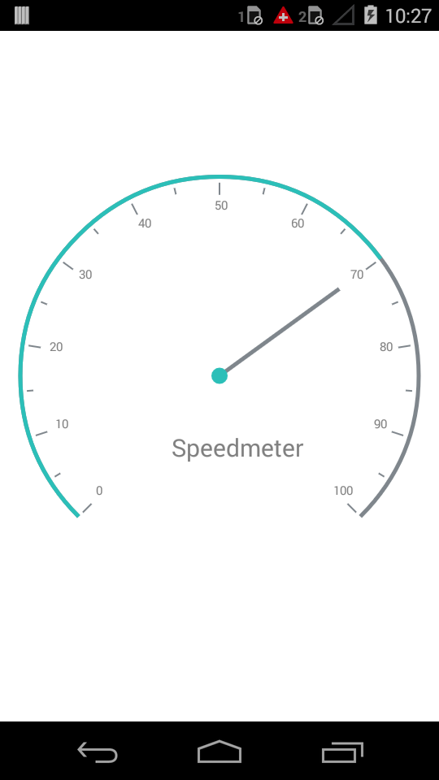

---

layout: post
title: Header in Syncfusion SfCircularGauge control for Xamarin.Android 
description: Learn how to set header in Syncfusion SfCircularGauge control
platform: Xamarin.Android
control: SfCircularGauge
documentation: ug

---

# HEADER

Header support allows you to show text inside the Gauge control. A circular gauge can be made self-descriptive about the data it is measuring through the use of a header.

## Adding Header in Circular Gauge

###  Header

The `Header` can be used to set a unique header for the Circular Gauge. You can add text as headers in a circular gauge, multiple headers can be added in a circular gauge.

####  Position

This property places the header in a circular gauge. The value for `Position` should be specified in offset value. By default, it is placed at (50,70).



    SfCircularGauge circularGauge = new SfCircularGauge(this);
    Header header = new Header();
    header.Text = "Speedometer";
    header.TextSize = 20;
    header.Position = new PointF((float)0.5, (float)0.7);
    header.TextColor = Color.Gray;
    circularGauge.Headers.Add(header);
    SetContentView(circularGauge);



