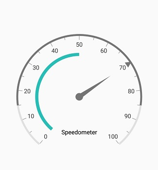
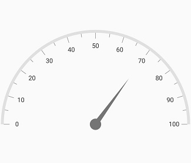

---

layout: post
title: Customizations in Syncfusion SfCircularGauge control for Xamarin.Android
description: This section explains the steps required to customize the Syncfusion Circular Gauge control for Xamarin.Android
platform: xamarin
control: SfCircularGauge
documentation: ug

---

# How to

## Changing the gauge size

The [`CircularCoefficient`](https://help.syncfusion.com/cr/xamarin-android/Syncfusion.SfGauge.Android~Com.Syncfusion.Gauges.SfCircularGauge.SfCircularGauge~CircularCoefficient.html) property is used to change the diameter of the gauge.
It ranges from 0 to 1, and the default value is 1.



    SfCircularGauge sfCircularGauge = new SfCircularGauge(this);
    sfCircularGauge.CircularCoefficient = 0.7f;
    Header header = new Header();
    header.Text = "Speedometer";
    header.TextColor = Color.Black;
    sfCircularGauge.Headers.Add(header);
    ObservableCollection<CircularScale> scales = new ObservableCollection<CircularScale>();
    CircularScale scale = new CircularScale();
    scale.StartValue = 0;
    scale.EndValue = 100;
    NeedlePointer needlePointer = new NeedlePointer();
    needlePointer.Value = 70;
    scale.CircularPointers.Add(needlePointer);
    scales.Add(scale);
    RangePointer rangePointer = new RangePointer();
    rangePointer.RangeStart = 15;
    rangePointer.Value = 85;
    scale.CircularPointers.Add(rangePointer);
    MarkerPointer markerPointer = new MarkerPointer();
    markerPointer.Value = 70;
    markerPointer.MarkerShape = MarkerShape.Triangle;
    scale.CircularPointers.Add(markerPointer);
    CircularRange range = new CircularRange();
    range.StartValue = 0;
    range.EndValue = 50;
    scale.CircularRanges.Add(range);
    sfCircularGauge.CircularScales = scales;



## Gauge alignment

The [`IsCenterAligned`](https://help.syncfusion.com/cr/xamarin-android/Syncfusion.SfGauge.Android~Com.Syncfusion.Gauges.SfCircularGauge.SfCircularGauge~IsCenterAligned.html) property is used to align the gauge to the center. In semi-circular gauge, bottom space will be removed using the [`IsCenterAligned`](https://help.syncfusion.com/cr/xamarin-android/Syncfusion.SfGauge.Android~Com.Syncfusion.Gauges.SfCircularGauge.SfCircularGauge~IsCenterAligned.html) property.



    SfCircularGauge sfCircularGauge = new SfCircularGauge(this);
    sfCircularGauge.IsCenterAligned = true;
    ObservableCollection<CircularScale> scales = new ObservableCollection<CircularScale>();
    CircularScale scale = new CircularScale();
    scale.StartValue = 0;
    scale.EndValue = 100;
    scale.StartAngle = 180;
    scale.SweepAngle = 180;
    NeedlePointer needlePointer = new NeedlePointer();
    needlePointer.Value = 70;
    scale.CircularPointers.Add(needlePointer);
    scales.Add(scale);
    sfCircularGauge.CircularScales = scales;



