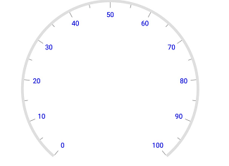
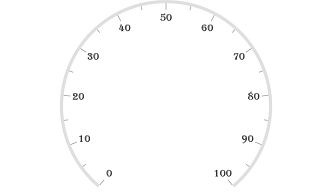
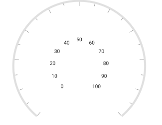
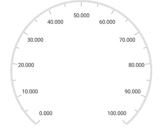
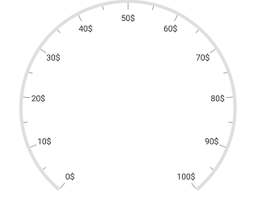
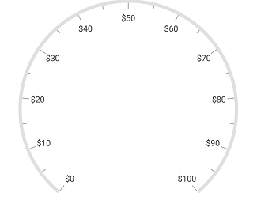
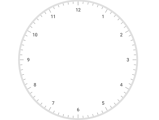
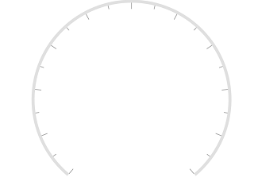
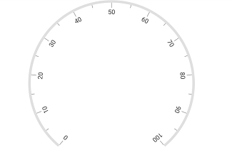

---

layout: post
title: Labels in Syncfusion SfCircularGauge control for Xamarin.Android 
description: Learn how to set labels and customize the labels in Syncfusion CircularGauge control for Xamarin.Android 
platform: Xamarin.Android
control: SfCircularGauge
documentation: ug

---

# Labels in SfCircularGauge

The [`CircularScale`](https://help.syncfusion.com/cr/cref_files/xamarin-android/Syncfusion.SfGauge.Android~Com.Syncfusion.Gauges.SfCircularGauge.CircularScale.html) labels associate a numeric value with major scale tick marks.

## Label color customization

The label color can be changed using the [`LabelColor`](https://help.syncfusion.com/cr/cref_files/xamarin-android/Syncfusion.SfGauge.Android~Com.Syncfusion.Gauges.SfCircularGauge.CircularScale~LabelColor.html) property.



            SfCircularGauge circularGauge = new SfCircularGauge(this);
            ObservableCollection<CircularScale> scales = new ObservableCollection<CircularScale>();
            CircularScale scale = new CircularScale();
            scale.StartValue = 0;
            scale.EndValue = 100;
            scale.LabelColor = Color.Blue;
            scales.Add(scale);
            circularGauge.CircularScales = scales;
    


## Label font customization

The label font can be customized by using the [`LabelTextSize`](https://help.syncfusion.com/cr/cref_files/xamarin-android/Syncfusion.SfGauge.Android~Com.Syncfusion.Gauges.SfCircularGauge.CircularScale~LabelTextSize.html), [`LabelTextStyle`](https://help.syncfusion.com/cr/cref_files/xamarin-android/Syncfusion.SfGauge.Android~Com.Syncfusion.Gauges.SfCircularGauge.CircularScale~LabelTextStyle.html) properties. 



           SfCircularGauge circularGauge = new SfCircularGauge(this);
            ObservableCollection<CircularScale> scales = new ObservableCollection<CircularScale>();
            CircularScale scale = new CircularScale();
            scale.StartValue = 0;
            scale.EndValue = 100;
            scale.LabelTextStyle = Typeface.Create("calibri", TypefaceStyle.Italic);
            scale.LabelTextSize = 20;
            scales.Add(scale);
            circularGauge.CircularScales = scales; 
    


## Setting position for labels

The labels can be positioned far away from the ticks by using the [`LabelOffset`](https://help.syncfusion.com/cr/cref_files/xamarin-android/Syncfusion.SfGauge.Android~Com.Syncfusion.Gauges.SfCircularGauge.CircularScale~LabelOffset.html) property.



            SfCircularGauge circularGauge = new SfCircularGauge(this);
            ObservableCollection<CircularScale> scales = new ObservableCollection<CircularScale>();
            CircularScale scale = new CircularScale();
            scale.StartValue = 0;
            scale.EndValue = 100;
            scale.LabelOffset = 0.4;
            scales.Add(scale);
            circularGauge.CircularScales = scales;
    


## Setting number of decimal digits for labels

The [`NumberOfDecimalDigits`](https://help.syncfusion.com/cr/cref_files/xamarin-android/Syncfusion.SfGauge.Android~Com.Syncfusion.Gauges.SfCircularGauge.CircularScale~NumberOfDecimalDigits.html) property is used to set the number of decimal digits to be displayed in the scale labels.



           SfCircularGauge circularGauge = new SfCircularGauge(this);
            ObservableCollection<CircularScale> scales = new ObservableCollection<CircularScale>();
            CircularScale scale = new CircularScale();
            scale.StartValue = 0;
            scale.EndValue = 100;
            scale.NumberOfDecimalDigits = 3;
            scales.Add(scale);
            circularGauge.CircularScales = scales;
    


## Setting postfix and prefix for labels

You can postfix/prefix values to the scale labels by using the [`LabelPostfix`](https://help.syncfusion.com/cr/cref_files/xamarin-android/Syncfusion.SfGauge.Android~Com.Syncfusion.Gauges.SfCircularGauge.CircularScale~LabelPostfix.html) and [`LabelPrefix`](https://help.syncfusion.com/cr/cref_files/xamarin-android/Syncfusion.SfGauge.Android~Com.Syncfusion.Gauges.SfCircularGauge.CircularScale~LabelPrefix.html) properties, respectively.

### Label postfix

`LabelPostfix` property allows you to postfix the values to the scale labels.



            SfCircularGauge circularGauge = new SfCircularGauge(this);
            ObservableCollection<CircularScale> scales = new ObservableCollection<CircularScale>();
            CircularScale scale = new CircularScale();
            scale.StartValue = 0;
            scale.EndValue = 100;
            scale.LabelPostfix = "$";
            scales.Add(scale);
            circularGauge.CircularScales = scales; 
    


### Label prefix

`LabelPrefix` property allows you to prefix the values to the scale labels.



            SfCircularGauge circularGauge = new SfCircularGauge(this);
            ObservableCollection<CircularScale> scales = new ObservableCollection<CircularScale>();
            CircularScale scale = new CircularScale();
            scale.StartValue = 0;
            scale.EndValue = 100;
            scale.LabelPrefix = "$";
            scales.Add(scale);
            circularGauge.CircularScales = scales;
    


## Edge label customization

You can customize the edge label by using the [`ShowFirstLabel`](https://help.syncfusion.com/cr/cref_files/xamarin-android/Syncfusion.SfGauge.Android~Com.Syncfusion.Gauges.SfCircularGauge.CircularScale~ShowFirstLabel.html) and [`ShowLastLabel`](https://help.syncfusion.com/cr/cref_files/xamarin-android/Syncfusion.SfGauge.Android~Com.Syncfusion.Gauges.SfCircularGauge.CircularScale~ShowLastLabel.html) properties, which are Boolean properties. The [`ShowFirstLabel`](https://help.syncfusion.com/cr/cref_files/xamarin-android/Syncfusion.SfGauge.Android~Com.Syncfusion.Gauges.SfCircularGauge.CircularScale~ShowFirstLabel.html) property is used to enable or disable first label, and the [`ShowLastLabel`](https://help.syncfusion.com/cr/cref_files/xamarin-android/Syncfusion.SfGauge.Android~Com.Syncfusion.Gauges.SfCircularGauge.CircularScale~ShowLastLabel.html) property is used to enable or disable the last label in circular gauge.



            SfCircularGauge circularGauge = new SfCircularGauge(this);
            ObservableCollection<CircularScale> scales = new ObservableCollection<CircularScale>();
            CircularScale scale = new CircularScale();
            scale.StartValue = 0;
            scale.Interval = 1;
            scale.MinorTicksPerInterval = 5;
            scale.EndValue = 12;
            scale.StartAngle = 270;
            scale.SweepAngle = 360;
            scale.ShowFirstLabel = false;
            scales.Add(scale);
            circularGauge.CircularScales = scales;
    


## Show labels

The [`ShowLabels`](https://help.syncfusion.com/cr/cref_files/xamarin-android/Syncfusion.SfGauge.Android~Com.Syncfusion.Gauges.SfCircularGauge.CircularScale~ShowLabels.html) property is a Boolean property, which is used to enable or disable the labels in circular gauge.



            SfCircularGauge circularGauge = new SfCircularGauge(this);
            ObservableCollection<CircularScale> scales = new ObservableCollection<CircularScale>();
            CircularScale scale = new CircularScale();
            scale.StartValue = 0;
            scale.EndValue = 100;
            scale.ShowLabels = false;
            scales.Add(scale);
            circularGauge.CircularScales = scales;
    


## Setting auto angle for label

Scale labels can be rotated automatically based on the current angle. To enable or disable the auto angle, use the [`EnableAutoAngle`](https://help.syncfusion.com/cr/cref_files/xamarin-android/Syncfusion.SfGauge.Android~Com.Syncfusion.Gauges.SfCircularGauge.CircularScale~EnableAutoAngle.html) property.



            SfCircularGauge circularGauge = new SfCircularGauge(this);
            ObservableCollection<CircularScale> scales = new ObservableCollection<CircularScale>();
            CircularScale scale = new CircularScale();
            scale.StartValue = 0;
            scale.EndValue = 100;
            scale.EnableAutoAngle = true;
            scales.Add(scale);
            circularGauge.CircularScales = scales;  
    


