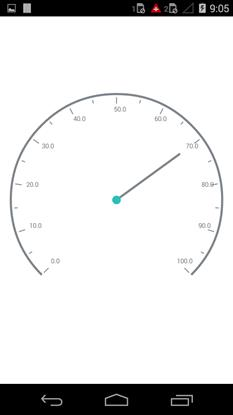
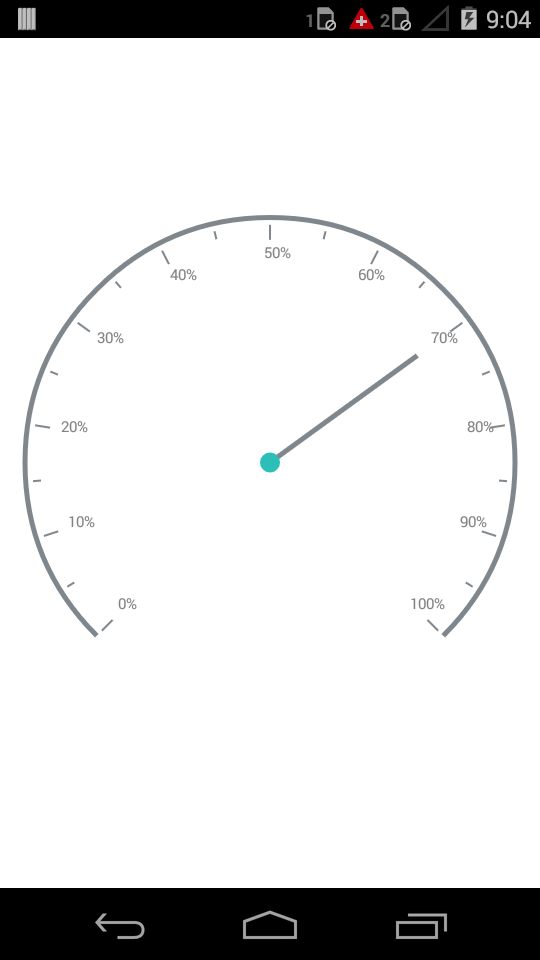
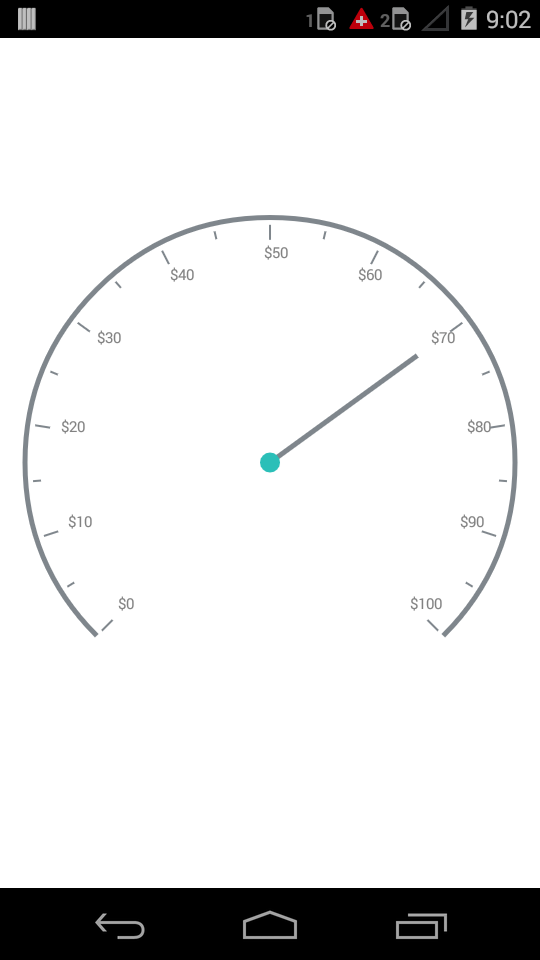

---

layout: post
title: Labels in Syncfusion SfCircularGauge control for Xamarin.Android 
description: Learn how to set labels in Syncfusion SfCircularGauge control
platform: Xamarin.Android
control: SfCircularGauge
documentation: ug

---

# LABELS

Scale labels associate a numeric value with major scale tick marks.

## Label Customization

The label color can be changed using the `LabelColor` property. The labels can be positioned far away from the ticks by using the `LabelOffset` property. The size of the Labels can be changed by using the `LabelFontSize` property.



    ObservableCollection<CircularScale> circularScales = new ObservableCollection<CircularScale>();
    SfCircularGauge circularGauge = new SfCircularGauge(this);
        CircularScale scale = new CircularScale();
        scale.LabelColor = Color.Gray;
        scale.LabelOffset = 0.1;
        scale.LabelTextSize = 10;
        circularScales.Add(scale);
        circularGauge.CircularScales = circularScales;
        SetContentView(circularGauge);



## Number of Decimal Digits

The `NumberOfDecimalDigits` property is used to set the number of decimal digits to be displayed in the scale labels.



    SfCircularGauge circularGauge = new SfCircularGauge(this);
        CircularScale scale = new CircularScale();
        scale.NumberOfDecimalDigits = 1;
        circularScales.Add(scale);  
        circularGauge.CircularScales = circularScales;
        SetContentView(circularGauge);



## Label Postfix and Prefix

You can set the Postfix/Prefix values to the scale labels using `LabelPostfix` and `LabelPrefix` properties respectively.

### LabelPostfix 

This property allows you to set the postfix values to the scale labels.



    SfCircularGauge circularGauge = new SfCircularGauge(this);
        CircularScale scale = new CircularScale();
        scale.LabelPostfix = "%";
        circularGauge.CircularScales = circularScales;
        SetContentView(circularGauge);



### LabelPrefix 

This property allows you to set the prefix values to the scale labels.



    SfCircularGauge circularGauge = new SfCircularGauge(this);
        CircularScale scale = new CircularScale();
        scale.LabelPrefix = "$";
        circularGauge.CircularScales = circularScales;
        SetContentView(circularGauge);



