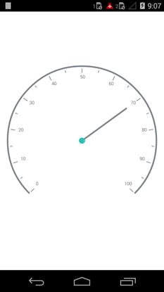
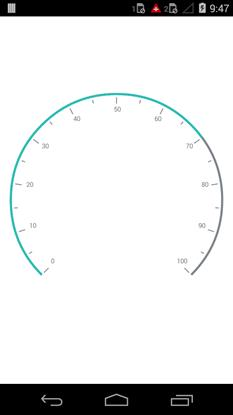

---

layout: post
title: Pointers in Syncfusion SfCircularGauge control for Xamarin.Android 
description: Learn about pointers in Syncfusion SfCircularGauge control
platform: Xamarin.Android
control: SfCircularGauge
documentation: ug

---

# POINTERS

You can add multiple pointers to the gauge to point at multiple values on the same scale. This can be useful for showing a low and a high value at the same time. The value of the pointer is set using the Value property. There are two types of pointers. You can choose a pointer using the `PointerType` property.

## Needle Pointer

A needle pointer contains two parts, the needle and the knob that can be placed on a gauge to mark values. The needle length is controlled by the `LengthFactor` property. The `LengthFactor` property’s minimum and maximum bounds are 0 and 1. The needle’s UI is customized by the `Color` and `Thickness` properties. The user can modify the Knob’s size by changing the `KnobRadius` property.

### NeedlePointerType

NeedlePointer appearance can be customized by using the Type property . The default value of this property is Bar.

It is `enum` and includes the following option.

* Bar
* Triangle



    SfCircularGauge circular = new SfCircularGauge(this);
        CircularScale scale = new CircularScale();
        List<CircularPointer> pointers = new List<CircularPointer>();
        NeedlePointer needlePointer = new NeedlePointer();
        needlePointer.Value = 60;
        needlePointer.Color = Color.Gray;
        needlePointer.KnobRadius = 10;
        needlePointer.KnobColor = Color.ParseColor("#2bbfb8");
        needlePointer.Width = 5;
        needlePointer.LengthFactor = 0.8;
        needlePointer.Type = NeedleType.Bar;
        pointers.Add(needlePointer);
        scale.CircularPointers = pointers;
        circularScales.Add(scale);
        circular.CircularScales = circularScales;



## Range Pointer

A range pointer is an accenting line or shaded background range that can be placed on a gauge to mark values. The range pointer’s UI is customized by the `Color` and `Thickness` properties.

### RangePointerPosition

The `RangePointer` in the scale can be placed inside the scale or outside the scale by setting `Offset` property.



    SfCircularGauge circular = new SfCircularGauge(this);
        CircularScale scale = new CircularScale();
        List<CircularPointer> pointers = new List<CircularPointer>();
        RangePointer rangePointer = new RangePointer();
        rangePointer.Value = 70;
        rangePointer.Color = Color.ParseColor("#2bbfb8");
        rangePointer.Width = 10;
        pointers.Add(rangePointer);
        scale.CircularPointers = pointers;
        circularScales.Add(scale);
        circular.CircularScales = circularScales;



## Pointer Animation

EnableAnimation property is a Boolean property that enables or disables the animation of the pointers in circulargauge.



            NeedlePointer needlePointer = new NeedlePointer();
            needlePointer.Value = 60;    
            needlePointer.EnableAnimation = true;          
            pointers.Add(needlePointer);
            scale.CircularPointers = pointers;
            circularScales.Add(scale);
            circular.CircularScales = circularScales;

