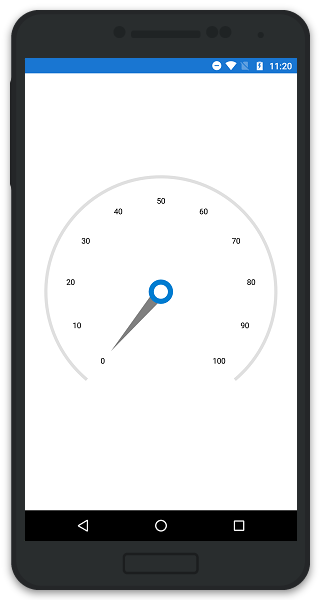
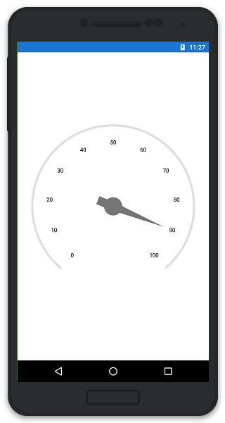
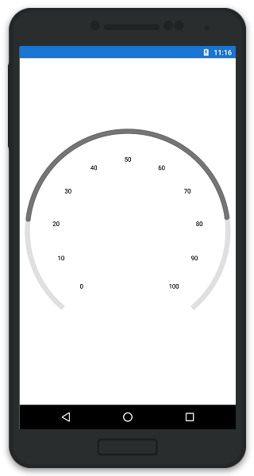
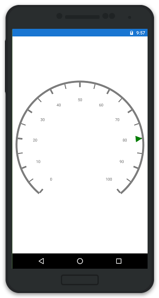
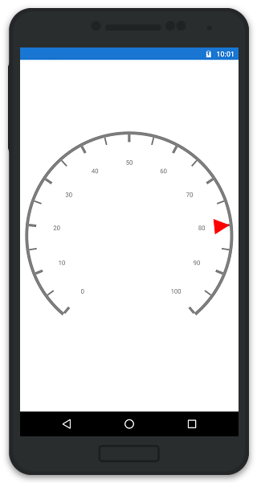

---

layout: post
title: Pointers in Syncfusion SfCircularGauge control for Xamarin.Android 
description: Learn about pointers in Syncfusion SfCircularGauge control
platform: Xamarin.Android
control: SfCircularGauge
documentation: ug

---

# POINTERS

You can add multiple pointers to the gauge to point at multiple values on the same scale. This can be useful for showing a low and a high value at the same time. The value of the pointer is set using the Value property. There are two types of pointers. You can choose a pointer using the `PointerType` property.

## Needle Pointer

A needle pointer contains two parts, the needle and the knob that can be placed on a gauge to mark values. The needle length is controlled by the `LengthFactor` property. The `LengthFactor` property’s minimum and maximum bounds are 0 and 1. The needle’s UI is customized by the `Color` and `Thickness` properties. The user can modify the Knob’s size by changing the `KnobRadius` property.

### NeedlePointerType

NeedlePointer appearance can be customized by using the Type property . The default value of this property is Bar.

It is `enum` and includes the following option.

* Bar
* Triangle



    SfCircularGauge circular = new SfCircularGauge(this);
    CircularScale scale = new CircularScale();
    List<CircularPointer> pointers = new List<CircularPointer>();
    NeedlePointer needlePointer = new NeedlePointer();
    needlePointer.Value = 60;
    needlePointer.Color = Color.Gray;
    needlePointer.KnobRadius = 10;
    needlePointer.KnobColor = Color.ParseColor("#2bbfb8");
    needlePointer.Width = 5;
    needlePointer.LengthFactor = 0.8;
    needlePointer.Type = NeedleType.Bar;
    pointers.Add(needlePointer);
    scale.CircularPointers = pointers;
    circularScales.Add(scale);
    circular.CircularScales = circularScales;



### Knob Customization

Knob of `NeedlePointer` can be customized by using `KnobColor`, `KnobRadius`, `KnobRadiusFactor`, `KnobStrokeColor`, and `KnobStrokeWidth` properties. You can set the radius of knob as pixel value by using `KnobRadius` property, and as percentage value by using `KnobRadiusFactor` property.



    SfCircularGauge circular = new SfCircularGauge();
    ObservableCollection<Scale> circularScales = new ObservableCollection<Scale>();
    CircularScale scale = new CircularScale();
    ObservableCollection<CircularPointer> pointers = new ObservableCollection<CircularPointer();
    NeedlePointer needlePointer = new NeedlePointer();
    needlePointer.Value = 90;
    needlePointer.KnobColor = Color.White;
    needlePointer.KnobRadius = 15;
    needlePointer.KnobStrokeColor = Color.Blue;
    needlePointer.KnobStrokeWidth = 8;
    pointers.Add(needlePointer);
    scale.CircularPointers = pointers;
    circularScales.Add(scale);
    circular.CircularScales = circularScales;
    this.Content=circular;



### Tail Support

Tail of `NeedlePointer` can be customized by using `TailColor`, `TailLengthFactor`, `TailStrokeColor`, and `TailStrokeWidth` properties.



    SfCircularGauge circular = new SfCircularGauge();
    ObservableCollection<Scale> circularScales = new ObservableCollection<Scale>();
    CircularScale scale = new CircularScale();
    ObservableCollection<CircularPointer> pointers = new ObservableCollection<CircularPointer();
    NeedlePointer needlePointer = new NeedlePointer();
    needlePointer.Value = 90;
    needlePointer.TailColor = Color.DarkGray;
    needlePointer.TailLengthFactor = 0.2;
    needlePointer.TailStrokeWidth = 1;
    needlePointer.TailStrokeColor = Color.DarkGray;
    pointers.Add(needlePointer);
    scale.CircularPointers = pointers;
    circularScales.Add(scale);
    circular.CircularScales = circularScales;
    this.Content=circular;



## Range Pointer

A range pointer is an accenting line or shaded background range that can be placed on a gauge to mark values. The range pointer’s UI is customized by the `Color` and `Thickness` properties.

### RangePointerPosition

The `RangePointer` in the scale can be placed inside the scale or outside the scale by setting `Offset` property.



    SfCircularGauge circular = new SfCircularGauge(this);
    CircularScale scale = new CircularScale();
    List<CircularPointer> pointers = new List<CircularPointer>();
    RangePointer rangePointer = new RangePointer();
    rangePointer.Value = 70;
    rangePointer.Color = Color.ParseColor("#2bbfb8");
    rangePointer.Width = 10;
    pointers.Add(rangePointer);
    scale.CircularPointers = pointers;
    circularScales.Add(scale);
    circular.CircularScales = circularScales;



### Range Cap

`RangeCap` is an enum property that provides the position options for range cap of the `RangePointer`, which contains Start, End, Both, and None options.



    SfCircularGauge circular = new SfCircularGauge();
    ObservableCollection<CircularScale> circularScales = new ObservableCollection<CircularScale();
    CircularScale scale = new CircularScale();
    ObservableCollection<CircularPointer> pointers = new ObservableCollection<CircularPointer();
    RangePointer rangePointer = new RangePointer();
    rangePointer.Value = 80;
    rangePointer.RangeCap = Com.Syncfusion.Gauges.SfCircularGauge.Enums.RangeCap.Both
    pointers.Add(rangePointer);
    scale.CircularPointers = pointers;
    circularScales.Add(scale);
    circular.CircularScales = circularScales;
    this.Content=circularGauge;



## Marker Pointer

Different types of marker shape can be used to mark the pointer value in scale. You can change the marker shape by using `MarkerShape` property in pointer. Gauge supports the following types of  marker shape:-

* Circle
* Rectangle
* Triangle
* InvertedTriangle
* Diamond
* Image

The image can be used instead of rendering marker shape to denote the pointer value. It can be achieved by setting `MarkerShape` to Image, and assigning image path to `ImageSource` in pointer.



    SfCircularGauge circular = new SfCircularGauge(this);
    ObservableCollection<CircularScale> circularScales = new ObservableCollection<CircularScale();
    CircularScale scale = new CircularScale();
    ObservableCollection<CircularPointer> pointers = new ObservableCollection<CircularPointer>();
    MarkerPointer markerPointer = new MarkerPointer();
    markerPointer.Value = 80;
    markerPointer.MarkerShape = Com.Syncfusion.Gauges.SfCircularGauge.Enums.MarkerShape.Triangle;
    markerPointer.Color = Color.Green;
    pointers.Add(markerPointer);
    scale.CircularPointers = pointers;
    circularScales.Add(scale);
    circular.CircularScales = circularScales;
    this.Content=circularGauge;



### Marker Pointer Customization

The marker can be customized in terms of color, width, and height by using `Color`, `MarkerWidth`, and `MarkerHeight` property in pointer.



    SfCircularGauge circular = new SfCircularGauge(this);
    ObservableCollection<CircularScale> circularScales = new ObservableCollection<CircularScale();
    CircularScale scale = new CircularScale();
    ObservableCollection<CircularPointer> pointers = new ObservableCollection<CircularPointer>();
    MarkerPointer markerPointer = new MarkerPointer();
    markerPointer.Value = 80;
    markerPointer.MarkerShape = Com.Syncfusion.Gauges.SfCircularGauge.Enums.MarkerShape.Triangle;
    markerPointer.Color = Color.Red;
    markerPointer.MarkerHeight = 30;
    markerPointer.MarkerWidth = 30;
    pointers.Add(markerPointer);
    scale.CircularPointers = pointers;
    circularScales.Add(scale);
    circular.CircularScales = circularScales;
    this.Content=circularGauge;



### Multiple Pointers

In addition to the default pointer, you can add n number of pointers to a scale by using `Pointers` property.



    SfCircularGauge circular = new SfCircularGauge(this);
    ObservableCollection<CircularScale> circularScales = new ObservableCollection<CircularScale();
    CircularScale scale = new CircularScale();
    ObservableCollection<CircularPointer> pointers = new ObservableCollection<CircularPointer>();
    MarkerPointer markerPointer = new MarkerPointer();
    markerPointer.Value = 80;
    markerPointer.MarkerShape = Com.Syncfusion.Gauges.SfCircularGauge.Enums.MarkerShape.Triangle;
    markerPointer.Color = Color.Green;
    markerPointer.Offset = 0.79;
    pointers.Add(markerPointer);
    NeedlePointer needlePointer = new NeedlePointer();
    needlePointer.Value = 80;
    needlePointer.Color = Color.Purple;
    needlePointer.LengthFactor = 0.5;
    needlePointer.KnobColor = Color.White;
    needlePointer.KnobStrokeColor = Color.DarkGray;
    needlePointer.KnobStrokeWidth = 2;
    needlePointer.Width = 10;
    needlePointer.Type = Com.Syncfusion.Gauges.SfCircularGauge.Enums.NeedleType.Triangle;
    pointers.Add(needlePointer);
    RangePointer rangePointer = new RangePointer();
    rangePointer.Value = 80;
    rangePointer.Color = Color.Yellow;
    rangePointer.Offset = 0.5;
    rangePointer.Width = 10;
    pointers.Add(rangePointer);
    scale.CircularPointers = pointers;
    circularScales.Add(scale);
    circular.CircularScales = circularScales;
    this.Content=circularGauge;



## Pointer Animation

EnableAnimation property is a Boolean property that enables or disables the animation of the pointers in CircularGauge.



    NeedlePointer needlePointer = new NeedlePointer();
    needlePointer.Value = 60;    
    needlePointer.EnableAnimation = true;          
    pointers.Add(needlePointer);
    scale.CircularPointers = pointers;
    circularScales.Add(scale);
    circular.CircularScales = circularScales;



### Pointer Drag

Pointers can be dragged over the scale value. This can be achieved by clicking and dragging the pointer. To enable or disable the pointer drag, use `EnableDragging` property.



    SfCircularGauge circular = new SfCircularGauge(this);
    ObservableCollection<CircularScale> circularScales = new ObservableCollection<CircularScale();
    CircularScale scale = new CircularScale();
    ObservableCollection<CircularPointer> pointers = new ObservableCollection<CircularPointer>();
    NeedlePointer needlePointer = new NeedlePointer();
    needlePointer.Value = 90;
    needlePointer.Color = Color.DarkGray;
    needlePointer.KnobColor = Color.DarkGray;
    needlePointer.Type = Com.Syncfusion.Gauges.SfCircularGauge.Enums.NeedleType.Triangle;
    needlePointer.EnableDragging = true;
    pointers.Add(needlePointer);
    scale.CircularPointers = pointers;
    circularScales.Add(scale);
    circular.CircularScales = circularScales;

