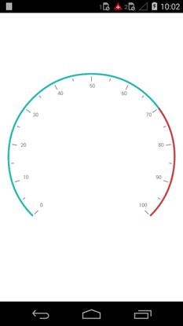
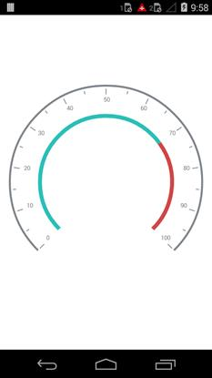

---

layout: post
title: Ranges in Syncfusion SfCircularGauge control for Xamarin.Android 
description: Learn how to set ranges in Syncfusion SfCircularGauge control
platform: Xamarin.Android
control: SfCircularGauge
documentation: ug

---

# RANGES

A range is a visual element which begins and ends at specified values within a scale.

## Ranges Customization

Ranges start and end values are set by the `StartValue` and `EndValue` properties of the range. A range's UI is customized by the `Color` and `Thickness` properties.



    SfCircularGauge circularGauge = new SfCircularGauge(this);
    ObservableCollection<CircularScale> circularScales = new ObservableCollection<CircularScale>();
        CircularScale scale = new CircularScale();
        CircularRange range1 = new CircularRange();
        range1.StartValue = 0;
        range1.EndValue = 70;
        range1.Color = Color.ParseColor("#d14646");
        range1.Width = 10;
        scale.CircularRanges.Add(range1);
        CircularRange range2 = new CircularRange();
        range2.StartValue = 70;
        range2.EndValue = 100;
        range2.Color = Color.ParseColor("#444444");
        range2.Width = 10;
        scale.CircularRanges.Add(range2);
        circularScales.Add(scale);
        circularGauge.CircularScales = circularScales;
        SetContentView(circularGauge);



## Range Offset

The range can be placed inside the scale, outside the scale, or on the scale by setting `Offset` property.



    SfCircularGauge circularGauge = new SfCircularGauge(this);
    ObservableCollection<CircularScale> circularScales = new ObservableCollection<CircularScale>();
        CircularScale scale = new CircularScale();
        CircularRange range1 = new CircularRange();
        range1.StartValue = 0;
        range1.EndValue = 70;
        range1.Color = Color.ParseColor("#d14646");
        range1.Width = 10;
        range1.Offset = 0.3;
        scale.CircularRanges.Add(range1);
        CircularRange range2 = new CircularRange();
        range2.StartValue = 70;
        range2.EndValue = 100;
        range2.Color = Color.ParseColor("#444444");
        range2.Width = 10;
        range2.Offset = 0.3;
        scale.CircularRanges.Add(range2);
        circularScales.Add(scale);
        circularGauge.CircularScales = circularScales;
        SetContentView(circularGauge);



