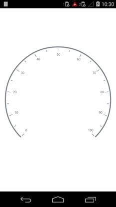

---

layout: post
title: Rim in Syncfusion SfCircularGauge control for Xamarin.Android 
description:  in Syncfusion SfCircularGauge control
platform: Xamarin.Android
control: SfCircularGauge
documentation: ug

---

# RIM

Scale determines the structure of the circular gauge using the circular rim. By setting the `StartAngle` and `SweepAngle` properties, you can shape the circular gauge into a full circular gauge, half circular gauge, or quarter circular gauge.

The `StartValue` and `EndValue` properties will determine the overall range of the circular rim. The rim’s color and thickness can be set using the `RimColor` and `RimThickness` properties.



    SfCircularGauge circularGauge = new SfCircularGauge(this);
        CircularScale scale = new CircularScale();
        scale.StartValue = 0;
        scale.EndValue = 100;
        scale.Interval = 10;
        scale.StartAngle = 135;
        scale.SweepAngle = 270;
        scale.RimWidth = 10;
        scale.RimColor = Color.ParseColor("#777777");
        scale.LabelColor = Color.Gray;
        scale.LabelOffset = 0.2;    
        scale.MinorTicksPerInterval = 1;
        circularScales.Add(scale);
        circularGauge.CircularScales = circularScales;
        SetContentView(circularGauge);



