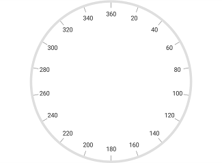
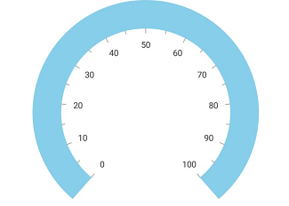
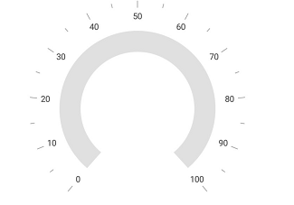
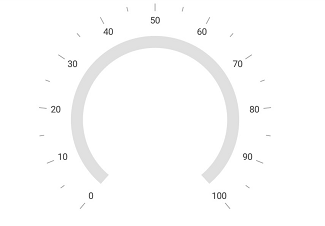
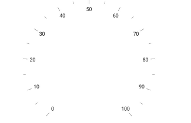

---

layout: post
title: Rim in Syncfusion SfCircularGauge control for Xamarin.Android 
description:  in Syncfusion SfCircularGauge control
platform: Xamarin.Android
control: SfCircularGauge
documentation: ug

---

# Rim

Scale determines the structure of a circular gauge by using the circular rim. By setting the [`StartAngle`](https://help.syncfusion.com/cr/cref_files/xamarin-android/Syncfusion.SfGauge.Android~Com.Syncfusion.Gauges.SfCircularGauge.CircularScale~StartAngle.html) and [`SweepAngle`](https://help.syncfusion.com/cr/cref_files/xamarin-android/Syncfusion.SfGauge.Android~Com.Syncfusion.Gauges.SfCircularGauge.CircularScale~SweepAngle.html) properties, you can change the shape of the circular gauge into a full circular gauge, half circular gauge, or quarter circular gauge.

The [`StartValue`](https://help.syncfusion.com/cr/cref_files/xamarin-android/Syncfusion.SfGauge.Android~Com.Syncfusion.Gauges.SfCircularGauge.CircularScale~StartValue.html) and [`EndValue`](https://help.syncfusion.com/cr/cref_files/xamarin-android/Syncfusion.SfGauge.Android~Com.Syncfusion.Gauges.SfCircularGauge.CircularScale~EndValue.html) properties will determine the overall range of the circular rim.



            SfCircularGauge circularGauge = new SfCircularGauge(this);
            ObservableCollection<CircularScale> scales = new ObservableCollection<CircularScale>();
            CircularScale scale = new CircularScale();
            scale.StartAngle = 270;
            scale.SweepAngle = 360;
            scale.StartValue = 0;
            scale.EndValue = 360;
            scale.Interval = 20;
            scale.MinorTicksPerInterval = 0;
            scale.ShowFirstLabel = false;
            circularGauge.CircularScales.Add(scale);



## Rim customization

The color and thickness of rim can be set by using the [`RimColor`](https://help.syncfusion.com/cr/cref_files/xamarin-android/Syncfusion.SfGauge.Android~Com.Syncfusion.Gauges.SfCircularGauge.CircularScale~RimColor.html) and [`RimWidth`](https://help.syncfusion.com/cr/cref_files/xamarin-android/Syncfusion.SfGauge.Android~Com.Syncfusion.Gauges.SfCircularGauge.CircularScale~RimWidth.html) properties. To increase the [`RimWidth`](https://help.syncfusion.com/cr/cref_files/xamarin-android/Syncfusion.SfGauge.Android~Com.Syncfusion.Gauges.SfCircularGauge.CircularScale~RimWidth.html), set the [`RadiusFactor`](https://help.syncfusion.com/cr/cref_files/xamarin-android/Syncfusion.SfGauge.Android~Com.Syncfusion.Gauges.SfCircularGauge.CircularScale~RadiusFactor.html).



            SfCircularGauge circularGauge = new SfCircularGauge(this);
            ObservableCollection<CircularScale> scales = new ObservableCollection<CircularScale>();
            CircularScale scale = new CircularScale();   
            scale.StartValue = 0;
            scale.EndValue = 100;
            scale.RadiusFactor = 1;
            scale.RimWidth = 40;
            scale.LabelOffset = 0.6;
            scale.MajorTickSettings.Offset = 0.8;
            scale.MinorTickSettings.Offset = 0.8;
            scale.RimColor = Color.SkyBlue;
            circularGauge.CircularScales.Add(scale); 



## Setting position for rim

You can customize the position of [`CircularScales`](https://help.syncfusion.com/cr/cref_files/xamarin-android/Syncfusion.SfGauge.Android~Com.Syncfusion.Gauges.SfCircularGauge.SfCircularGauge~CircularScales.html) in the following two ways:
1. [`RadiusFactor`](https://help.syncfusion.com/cr/cref_files/xamarin-android/Syncfusion.SfGauge.Android~Com.Syncfusion.Gauges.SfCircularGauge.CircularScale~RadiusFactor.html) with the [`RimWidth`](https://help.syncfusion.com/cr/cref_files/xamarin-android/Syncfusion.SfGauge.Android~Com.Syncfusion.Gauges.SfCircularGauge.CircularScale~RimWidth.html) property.
2. The [`ScaleStartOffset`](https://help.syncfusion.com/cr/cref_files/xamarin-android/Syncfusion.SfGauge.Android~Com.Syncfusion.Gauges.SfCircularGauge.CircularScale~ScaleStartOffset.html) and [`ScaleEndOffset`](https://help.syncfusion.com/cr/cref_files/xamarin-android/Syncfusion.SfGauge.Android~Com.Syncfusion.Gauges.SfCircularGauge.CircularScale~ScaleEndOffset.html) properties.

### Setting radius factor for rim



            SfCircularGauge circularGauge = new SfCircularGauge(this);
            ObservableCollection<CircularScale> scales = new ObservableCollection<CircularScale>();
            CircularScale scale = new CircularScale();   
            scale.StartValue = 0;
            scale.EndValue = 100;
            scale.RadiusFactor = 0.7;
            scale.RimWidth = 30;
            circularGauge.CircularScales.Add(scale);



### Setting scale start and end offsets for rim



            SfCircularGauge circularGauge = new SfCircularGauge(this);
            ObservableCollection<CircularScale> scales = new ObservableCollection<CircularScale>();
            CircularScale scale = new CircularScale();   
            scale.StartValue = 0;
            scale.EndValue = 100;
            scale.ScaleStartOffset = 0.6;
            scale.ScaleEndOffset = 0.7;
            circularGauge.CircularScales.Add(scale); 



## Show rim

The [`ShowRim`](https://help.syncfusion.com/cr/cref_files/xamarin-android/Syncfusion.SfGauge.Android~Com.Syncfusion.Gauges.SfCircularGauge.CircularScale~ShowRim.html) property is a Boolean property, which is used to enable or disable the rim in circular gauge.



            SfCircularGauge circularGauge = new SfCircularGauge(this);
            ObservableCollection<CircularScale> scales = new ObservableCollection<CircularScale>();
            CircularScale scale = new CircularScale();   
            scale.StartValue = 0;
            scale.EndValue = 100;
            scale.ShowRim = false;
            circularGauge.CircularScales.Add(scale);
    


