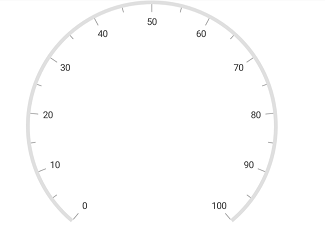
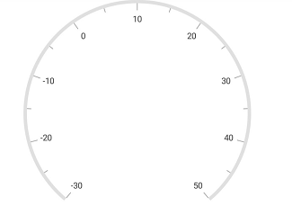
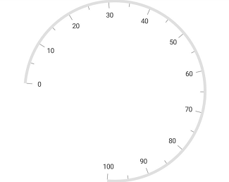
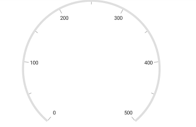
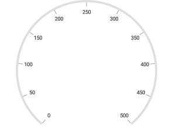
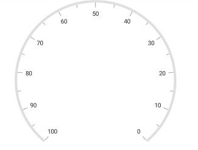
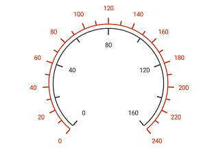
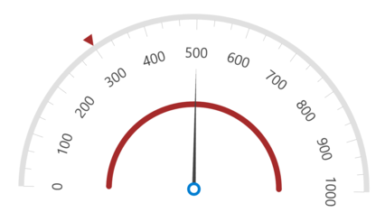

---

layout: post
title: Scales in Syncfusion SfCircularGauge control for Xamarin.Android 
description: Learn about scale in Syncfusion SfCircularGauge control
platform: Xamarin.Android
control: SfCircularGauge
documentation: ug

---

# Scales

CircularScales contain a collection of [`CircularScale`](https://help.syncfusion.com/cr/cref_files/xamarin-android/Syncfusion.SfGauge.Android~Com.Syncfusion.Gauges.SfCircularGauge.CircularScale.html) elements, which integrates labels, tick marks, and a rim to customize the basic look and feel of the circular gauge.

## Scale

[`CircularScale`](https://help.syncfusion.com/cr/cref_files/xamarin-android/Syncfusion.SfGauge.Android~Com.Syncfusion.Gauges.SfCircularGauge.CircularScale.html) contains the sub elements such as rim, ticks, labels, ranges, and pointers. It defines the radius, start angle, sweep direction, sweep angle, overall minimum and maximum values, frequency of labels, and tick marks. It will have multiple ranges.

A range is a visual element, which begins and ends at specified values within a [`CircularScale`](https://help.syncfusion.com/cr/cref_files/xamarin-android/Syncfusion.SfGauge.Android~Com.Syncfusion.Gauges.SfCircularGauge.CircularScale.html). It will have one or more pointers to point out the values in scale.



            SfCircularGauge circularGauge = new SfCircularGauge(this);
            ObservableCollection<CircularScale> scales = new ObservableCollection<CircularScale>();
            CircularScale scale = new CircularScale();
            scale.StartValue = 0;
            scale.EndValue = 100;
            scales.Add(scale);
            circularGauge.CircularScales = scales;



## Setting start and end values for scale

The [`StartValue`](https://help.syncfusion.com/cr/cref_files/xamarin-android/Syncfusion.SfGauge.Android~Com.Syncfusion.Gauges.SfCircularGauge.CircularScale~StartValue.html) and [`EndValue`](https://help.syncfusion.com/cr/cref_files/xamarin-android/Syncfusion.SfGauge.Android~Com.Syncfusion.Gauges.SfCircularGauge.CircularScale~EndValue.html) properties allow  you to set the start and end values for scale.



            SfCircularGauge circularGauge = new SfCircularGauge(this);
            ObservableCollection<CircularScale> scales = new ObservableCollection<CircularScale>();
            CircularScale scale = new CircularScale();
            scale.StartValue = -30;
            scale.EndValue = 50;
            scales.Add(scale);
            circularGauge.CircularScales = scales;



## Setting start and sweep angles for scale

The [`StartAngle`](https://help.syncfusion.com/cr/cref_files/xamarin-android/Syncfusion.SfGauge.Android~Com.Syncfusion.Gauges.SfCircularGauge.CircularScale~StartAngle.html) and [`SweepAngle`](https://help.syncfusion.com/cr/cref_files/xamarin-android/Syncfusion.SfGauge.Android~Com.Syncfusion.Gauges.SfCircularGauge.CircularScale~SweepAngle.html) properties allow you to set the start and end angles for scale.



            SfCircularGauge circularGauge = new SfCircularGauge(this);
            ObservableCollection<CircularScale> scales = new ObservableCollection<CircularScale>();
            CircularScale scale = new CircularScale();
            scale.StartValue = 0;
            scale.EndValue = 100;
            scale.StartAngle = 185;
            scale.SweepAngle = 270;
            scales.Add(scale);
            circularGauge.CircularScales = scales; 



## Setting interval for scale

The [`Interval`](https://help.syncfusion.com/cr/cref_files/xamarin-android/Syncfusion.SfGauge.Android~Com.Syncfusion.Gauges.SfCircularGauge.CircularScale~Interval.html) property allows you to set the interval for scale.



            SfCircularGauge circularGauge = new SfCircularGauge(this);
            ObservableCollection<CircularScale> scales = new ObservableCollection<CircularScale>();
            CircularScale scale = new CircularScale();
            scale.StartValue = 0;
            scale.EndValue = 500;
            scale.Interval = 100;
            scales.Add(scale);
            circularGauge.CircularScales = scales; 



## Setting auto interval for scale

By default, the interval value is calculated by 10. By using the [`EnableAutoInterval`](https://help.syncfusion.com/cr/cref_files/xamarin-android/Syncfusion.SfGauge.Android~Com.Syncfusion.Gauges.SfCircularGauge.CircularScale~EnableAutoInterval.html) property, you can set auto interval based on the start and end values.



           SfCircularGauge circularGauge = new SfCircularGauge(this);
            ObservableCollection<CircularScale> scales = new ObservableCollection<CircularScale>();
            CircularScale scale = new CircularScale();
            scale.StartValue = 0;
            scale.EndValue = 500;
            scale.EnableAutoInterval = true;
            scales.Add(scale);
            circularGauge.CircularScales = scales;



## Setting scale direction for scale

The [`Direction`](https://help.syncfusion.com/cr/cref_files/xamarin-android/Syncfusion.SfGauge.Android~Com.Syncfusion.Gauges.SfCircularGauge.CircularScale~Direction.html) property allows you to render the gauge scale in either clockwise or counterclockwise direction.



           SfCircularGauge circularGauge = new SfCircularGauge(this);
            ObservableCollection<CircularScale> scales = new ObservableCollection<CircularScale>();
            CircularScale scale = new CircularScale();
            scale.StartValue = 0;
            scale.EndValue = 100;
            scale.Direction = Com.Syncfusion.Gauges.SfCircularGauge.Enums.ScaleDirection.AntiClockwise;
            scales.Add(scale);
            circularGauge.CircularScales = scales; 



## Setting multiple scales for scale

It helps you to add multiple scales to the same circular gauge. You can customize all the scales in a [`CircularScales`](https://help.syncfusion.com/cr/cref_files/xamarin-android/Syncfusion.SfGauge.Android~Com.Syncfusion.Gauges.SfCircularGauge.SfCircularGauge~CircularScales.html) collection.



            SfCircularGauge circularGauge = new SfCircularGauge(this);
            ObservableCollection<CircularScale> scales = new ObservableCollection<CircularScale>();
            CircularScale scale = new CircularScale();
            scale.StartValue = 0;
            scale.EndValue = 240;
            scale.Interval = 20;
            scale.MinorTicksPerInterval = 1;
            scale.RimColor = Color.ParseColor("#C62E0A");
            scale.LabelOffset = 0.88;
            scale.LabelColor = Color.ParseColor("#C62E0A");
            scale.ScaleStartOffset = 0.7;
            scale.ScaleEndOffset = 0.69;

            TickSetting majorTicks = new TickSetting();
            majorTicks.StartOffset = 0.7;
            majorTicks.EndOffset = 0.77;
            majorTicks.Width = 2;
            majorTicks.Color = Color.ParseColor("#C62E0A");
            scale.MajorTickSettings = majorTicks;

            TickSetting minorTicks = new TickSetting();
            minorTicks.StartOffset = 0.7;
            minorTicks.EndOffset = 0.75;
            minorTicks.Width = 2;
            minorTicks.Color = Color.ParseColor("#C62E0A");
            scale.MinorTickSettings = minorTicks;
            scales.Add(scale);

            CircularScale circularScale = new CircularScale();
            circularScale.StartValue = 0;
            circularScale.EndValue = 160;
            circularScale.Interval = 40;
            circularScale.MinorTicksPerInterval = 1;
            circularScale.RimColor = Color.ParseColor("#333333");
            circularScale.LabelOffset = 0.45;
            circularScale.LabelColor = Color.ParseColor("#333333");
            circularScale.ScaleStartOffset = 0.65;
            circularScale.ScaleEndOffset = 0.64;

            TickSetting majorTick = new TickSetting();
            majorTick.StartOffset = 0.64;
            majorTick.EndOffset = 0.57;
            majorTick.Width = 2;
            majorTick.Color = Color.ParseColor("#333333");
            circularScale.MajorTickSettings = majorTick;

            TickSetting minorTick = new TickSetting();
            minorTick.StartOffset = 0.64;
            minorTick.EndOffset = 0.59;
            minorTick.Width = 2;
            minorTick.Color = Color.ParseColor("#333333");
            circularScale.MinorTickSettings = minorTick;

            scales.Add(circularScale);
            circularGauge.CircularScales = scales;

	


## Calculate radius and center based on angle

This feature is used to automatically adjust the radius and center of a circular gauge based on the `StartAngle` and `SweepAngle` properties by enable the `IsCenterAligned` property of gauge.

N> Default value of the IsCenterAligned property is false. 



            SfCircularGauge sfCircularGauge = new SfCircularGauge(this);
            ObservableCollection<CircularScale> circularScales = new ObservableCollection<CircularScale>();
            sfCircularGauge.IsCenterAligned = true;
            CircularScale scale = new CircularScale();
            scale.EnableAutoAngle = true;
            scale.StartAngle = 180;
            scale.SweepAngle = 180;
            scale.StartValue = 0;
            scale.EndValue = 1000;
            scale.Interval = 500;
            scale.EnableAutoInterval = true;
            scale.RimWidth = 15;
            scale.LabelColor = Color.Black;
            scale.LabelTextSize = 10;
            ObservableCollection<CircularPointer> pointers = new ObservableCollection<CircularPointer>();
            NeedlePointer needlePointer = new NeedlePointer();
            needlePointer.Value = 500;
            needlePointer.Color = Color.ParseColor("#666666");
            needlePointer.Type =NeedleType.Triangle;
            needlePointer.LengthFactor = 0.7;
            needlePointer.KnobStrokeWidth = 10;
            needlePointer.KnobRadius = 15;
            needlePointer.KnobStrokeColor = Color.Aqua;
            needlePointer.KnobStrokeWidth = 8;
            needlePointer.KnobColor = Color.White;
            needlePointer.KnobRadiusFactor = 0.1;
            pointers.Add(needlePointer);
            MarkerPointer markerPointer = new MarkerPointer();
            markerPointer.MarkerShape = Com.Syncfusion.Gauges.SfCircularGauge.Enums.MarkerShape.InvertedTriangle;
            markerPointer.Value = 300;
            markerPointer.Color = Color.Brown;
            markerPointer.MarkerHeight = 30;
            markerPointer.MarkerWidth = 30;
            markerPointer.Offset = 1;
            pointers.Add(markerPointer);
            RangePointer rangePointer = new RangePointer();
            rangePointer.RangeCap = RangeCap.Both;
            rangePointer.Value = 1000;
            rangePointer.Color = Color.Brown;
            rangePointer.Width = 15;
            rangePointer.Offset = 0.5;
            pointers.Add(rangePointer);
            scale.CircularPointers = pointers;
            circularScales.Add(scale);
            sfCircularGauge.CircularScales = circularScales;
            sfCircularGauge.SetBackgroundColor(Color.White);
            SetContentView(sfCircularGauge);
	


