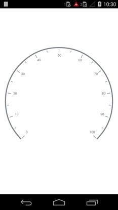

---

layout: post
title: Scales in Syncfusion SfCircularGauge control for Xamarin.Android 
description: Learn about scale in Syncfusion SfCircularGauge control
platform: Xamarin.Android
control: SfCircularGauge
documentation: ug

---

# SCALES

The Scales contains a Collection of `CircularScale` which integrates labels, tick marks, and a rim to customize the basic look and feel of the `SfCircularGauge`.

## Scale

`CircularScale` contains three sub elements such as Rim, Ticks, and Labels. It defines the Radius, start angle and sweep angle, overall minimum and maximum values, and frequency of labels and tick marks. It can have multiple ranges. 

A range is a visual element which begins and ends at specified values within a scale. It can have one or more pointers to point out the values in the scale.



    ObservableCollection<CircularScale> circularScales = new ObservableCollection<CircularScale>();
    SfCircularGauge circularGauge = new SfCircularGauge(this);  
    CircularScale scale = new CircularScale();
    scale.StartValue = 0;
    scale.EndValue = 100;
    scale.Interval = 10;
    scale.StartAngle = 135;
    scale.SweepAngle = 270;
    scale.RimWidth = 20;
    scale.RimColor = Color.ParseColor("#FF777777");
    scale.LabelColor = Color.Gray;
    scale.LabelOffset = 0.2;
    scale.MinorTicksPerInterval = 1;
    circularScales.Add(scale);
    circularGauge.CircularScales = circularScales;
    SetContentView(circularGauge);



## Multiple Scale

It helps to be able to add multiple scales to the same circular gauge, and also it helps to customize all the scales in a Scales collection.

