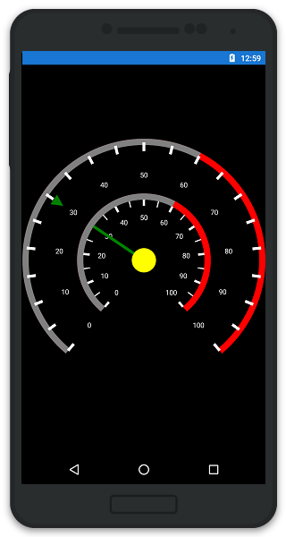
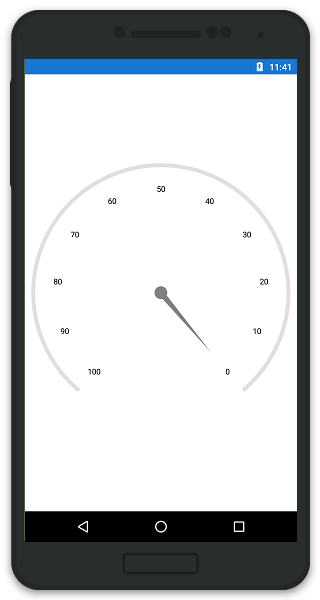
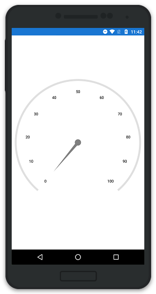
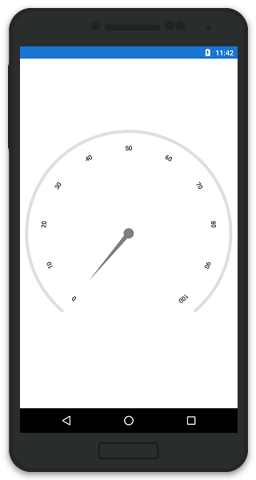
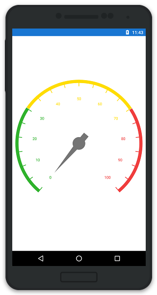

---

layout: post
title: Scales in Syncfusion SfCircularGauge control for Xamarin.Android 
description: Learn about scale in Syncfusion SfCircularGauge control
platform: Xamarin.Android
control: SfCircularGauge
documentation: ug

---

# SCALES

The Scales contains a Collection of `CircularScale` which integrates labels, tick marks, and a rim to customize the basic look and feel of the `SfCircularGauge`.

## Scale

`CircularScale` contains three sub elements such as Rim, Ticks, and Labels. It defines the Radius, start angle and sweep angle, overall minimum and maximum values, and frequency of labels and tick marks. It can have multiple ranges. 

A range is a visual element which begins and ends at specified values within a scale. It can have one or more pointers to point out the values in the scale.



    ObservableCollection<CircularScale> circularScales = new ObservableCollection<CircularScale>();
    SfCircularGauge circularGauge = new SfCircularGauge(this);  
    CircularScale scale = new CircularScale();
    scale.StartValue = 0;
    scale.EndValue = 100;
    scale.Interval = 10;
    scale.StartAngle = 135;
    scale.SweepAngle = 270;
    scale.RimWidth = 20;
    scale.RimColor = Color.ParseColor("#FF777777");
    scale.LabelColor = Color.Gray;
    scale.LabelOffset = 0.2;
    scale.MinorTicksPerInterval = 1;
    circularScales.Add(scale);
    circularGauge.CircularScales = circularScales;
    SetContentView(circularGauge);



## Multiple Scale

It helps to be able to add multiple scales to the same circular gauge, and also it helps to customize all the scales in a Scales collection.



    ObservableCollection<CircularScale> scales = new ObservableCollection<CircularScale>();
    CircularScale scale = new CircularScale();
    scale.MinorTicksPerInterval = 1;
	scale.LabelColor = Color.White;
	scale.MinorTickSettings.Color = Color.White;
	scale.MajorTickSettings.Color = Color.White;
	
	CircularRange range = new CircularRange();
	range.StartValue = 0;
	range.EndValue = 60;
	range.Offset = 1;
	range.Color = Color.Gray;
	range.Width = 11;
	scale.CircularRanges.Add(range);
	
	CircularRange rangeLayer = new CircularRange();
	rangeLayer.StartValue = 60;
	rangeLayer.EndValue = 100;
	rangeLayer.Offset = 1;
	rangeLayer.Color = Color.Red;
	rangeLayer.Width = 11;
	scale.CircularRanges.Add(rangeLayer);
	
	ObservableCollection<CircularPointer> pointers = new ObservableCollection<CircularPointer>();
	MarkerPointer markerPointer = new MarkerPointer();
	markerPointer.Value = 30;
	markerPointer.Color = Color.Green;
	markerPointer.Offset = 0.8;
	markerPointer.MarkerShape = Com.Syncfusion.Gauges.SfCircularGauge.Enums.MarkerShape.InvertedTriangle;
	markerPointer.EnableAnimation = false;
	pointers.Add(markerPointer);
	scale.CircularPointers = pointers;
    scales.Add(scale);
	
	CircularScale circularScale = new CircularScale();
    circularScale.MinorTicksPerInterval = 1;
	circularScale.ScaleStartOffset = 0.5;
	circularScale.ScaleEndOffset = 0.55;
	circularScale.LabelOffset = 0.35;
	circularScale.LabelColor = Color.White;
	scale.MinorTickSettings.StartOffset = 0.5;
	scale.MajorTickSettings.StartOffset = 0.5;
	scale.MinorTickSettings.EndOffset = 0.45;
	scale.MajorTickSettings.EndOffset = 0.45;
	scale.MinorTickSettings.Width = 2;
	scale.MajorTickSettings.Width = 4;
	scale.MinorTickSettings.Color = Color.White;
	scale.MajorTickSettings.Color = Color.White;
	
	CircularRange circularRange = new CircularRange();
	circularRange.StartValue = 0;
	circularRange.EndValue = 60;
	circularRange.Offset = 0.55;
	circularRange.Color = Color.Gray;
	circularRange.Width = 11;
	circularScale.CircularRanges.Add(range);
	
	CircularRange circularRangeLayer = new CircularRange();
	circularRangeLayer.StartValue = 60;
	circularRangeLayer.EndValue = 100;
	circularRangeLayer.Offset = 0.55;
	circularRangeLayer.Color = Color.Red;
	circularRangeLayer.Width = 11;
	circularScale.CircularRanges.Add(circularRangeLayer);
	
	ObservableCollection<CircularPointer> circularPointers = new ObservableCollection<CircularPointer>();
	NeedlePointer needlePointer = new NeedlePointer();
	needlePointer.Value = 30;
	needlePointer.Color = Color.Green;
	needlePointer.EnableAnimation = false;
	needlePointer.LengthFactor = 0.5;
	circularPointers.Add(needlePointer);
	circularScale.CircularPointers = circularPointers;
    scales.Add(circularScale);
    circular.CircularScales = scales;  
    this.Content= circular;
	


### Scale Direction

`Direction` property enables you to render the gauge scale either in `ClockWise` or in `AntiClockWise` direction.


 
    SfCircularGauge circular = new SfCircularGauge(this);
    ObservableCollection<CircularScale> circularScales = new ObservableCollection<CircularScale();
    CircularScale scale = new CircularScale();
    scale.StartValue = 0;
    scale.EndValue = 100;
    scale.Direction = Com.Syncfusion.Gauges.SfCircularGauge.Enums.ScaleDirection.AntiClockwise;
    circularScales.Add(scale);
    circular.CircularScales = circularScales;
    this.Content= circular;
	


### Auto Angle

Scale labels can be rotated automatically based on the current angle. To enable or disable the Auto Angle, you can use `EnableAutoAngle` property.



    SfCircularGauge circular = new SfCircularGauge(this);
    ObservableCollection<CircularScale> circularScales = new ObservableCollection<CircularScale();
    CircularScale scale = new CircularScale();
    scale.StartValue = 0;
    scale.EndValue = 100;
    scale.EnableAutoAngle = true;
    circularScales.Add(scale);
    circular.CircularScales = circularScales;
    this.Content= circular;
	


### Range color for Labels and Ticks

You can set the range color to scale labels and ticks by enabling `UseRangeColorForLabels` property.



    SfCircularGauge circular = new SfCircularGauge(this);
    ObservableCollection<CircularScale> circularScales = new ObservableCollection<CircularScale();
    CircularScale scale = new CircularScale();
    scale.StartValue = 0;
    scale.EndValue = 100; 
    scale.UseRangeColorForLabels  = true;
    circularScales.Add(scale);
    circular.CircularScales = circularScales;
    this.Content= circular;
	


### LabelCreated

This event is triggered when the scale label is created. The argument contains the following information.

* `LabelCreated` - used to get or set the scale label content.
