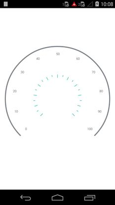

---

layout: post
title: Tick Setting in Syncfusion SfCircularGauge control for Xamarin.Android 
description: Learn how to set ticks in Syncfusion SfCircularGauge control
platform: Xamarin.Android
control: SfCircularGauge
documentation: ug

---

# TICK SETTING

TickSetting help you identify the gauge's data value by marking the gauge scale in regular increments.

## Tick Customization  

The `Interval` property is used to calculate the tick count for a scale. Like ticks, minor ticks are calculated using the `MinorTicksPerInterval` property.

A tick's length, color, and thickness are set by the `Length`, `Color` and  `Thickness` UI properties.

The Major and Minor ticks can be positioned far away from the rim by using the `Offset` property



    SfCircularGauge circularGauge = new SfCircularGauge(this);  
        TickSetting minor = new TickSetting();
        minor.Size = 6;
        minor.Color = Color.ParseColor("#2bbfb8");
        minor.Width = 3;
        minor.Offset = 0.5;
        scale.MinorTickSettings = minor;
    	
        TickSetting major = new TickSetting();
        major.Size = 12;
        major.Color = Color.ParseColor("#2bbfb8");
        major.Width = 3;
        major.Offset = 0.5;
        scale.MajorTickSettings = major;
        circularGauge.CircularScales = circularScales;
        SetContentView(circularGauge);



## ShowTicks

ShowTicks property is a Boolean property which is used to enable or disable feature of ticks in CircularGauge



            SfCircularGauge circulargauge = new SfCircularGauge();    
            ObservableCollection<CircularScale> circularScales = new ObservableCollection<CircularScale>();   
            CircularScale scale = new CircularScale();     
            scale.ShowTicks = false;
            circularScales.Add(scale);
            circularGauge.CircularScales = circularScales;
            SetContentView(circularGauge);
   
    
