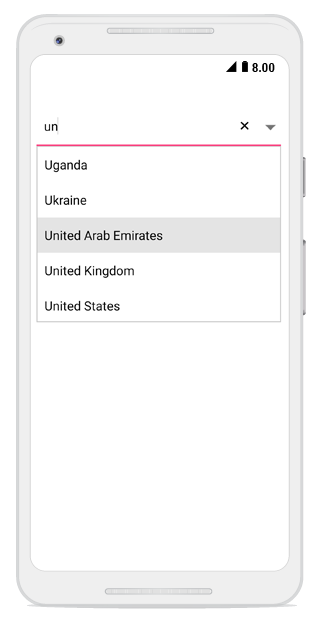
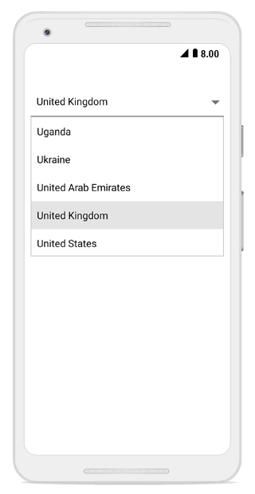

# ComboBox Modes

The Syncfusion SfComboBox control supports both editable and non-editable modes, providing flexibility in how users interact with the control. In both modes, users can select items from a dropdown list populated with data from a given data source.
## Editable ComboBox

In editable mode, the ComboBox allows users to type directly into the text input field. As users type, the control displays filtered suggestions in a dropdown list based on their input. This mode is ideal when you want to provide both selection and custom input capabilities.


	
comboBox.IsEditableMode = true; 	 




	
## Non-editable ComboBox

Non-editable mode restricts user input to selection only, preventing users from typing in the text field. Users can only choose from the predefined items in the dropdown list. This mode is suitable when you want to limit user choices to specific options and prevent custom input.



comboBox.IsEditableMode = false;  




 

