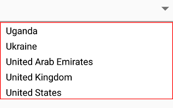

# UI Customization

The Syncfusion SfComboBox control provides comprehensive customization options for both the entry field and dropdown components. This section demonstrates how to customize the visual appearance of the entire ComboBox control to match your application's design requirements.
## Customizing the Entry Field

The entry field appearance can be customized using properties such as `TextColor`, `TextSize`, `FontTypeface`, and `BorderColor` to modify the text color, font size, font style, and border color respectively.



LinearLayout linearLayout = new LinearLayout(this);
linearLayout.LayoutParameters = new ViewGroup.LayoutParams(500, ViewGroup.LayoutParams.MatchParent);
linearLayout.SetBackgroundColor(Android.Graphics.Color.White);

SfComboBox comboBox = new SfComboBox(this);
comboBox.Text = "Sample Text";
comboBox.TextColor = Color.ParseColor("#1976d2");
comboBox.TextSize = 20;
comboBox.FontTypeface = Typeface.DefaultBold;
comboBox.BorderColor = Color.Brown;
comboBox.LayoutParameters = new ViewGroup.LayoutParams(ViewGroup.LayoutParams.MatchParent, 50);

linearLayout.AddView(comboBox);
SetContentView(linearLayout);	 



	

## Customizing the Dropdown

### Changing Dropdown Item Height

The `DropDownItemHeight` property allows you to modify the height of individual items in the dropdown list, providing better visual spacing and improved readability.




List<String> countryList = new List<String>();
countryList.Add("Uganda");
countryList.Add("Ukraine");
countryList.Add("United Arab Emirates");
countryList.Add("United Kingdom");
countryList.Add("United States");
comboBox.DataSource = countryList; 
comboBox.DropDownItemHeight = 70;	




### Changing the Dropdown Border Color

The `DropDownBorderColor` property customizes the border color of the dropdown container, allowing you to match your application's color scheme.




            LinearLayout linearLayout = new LinearLayout(this);
            linearLayout.LayoutParameters = new ViewGroup.LayoutParams(1000, ViewGroup.LayoutParams.MatchParent);
            linearLayout.SetBackgroundColor(Android.Graphics.Color.Transparent);

            SfComboBox countryComboBox = new SfComboBox(this);
            countryComboBox.LayoutParameters = new ViewGroup.LayoutParams(ViewGroup.LayoutParams.MatchParent, 50);

            List<String> countryList = new List<String>();
            countryList.Add("Uganda");
            countryList.Add("Ukraine");
            countryList.Add("United Arab Emirates");
            countryList.Add("United Kingdom");
            countryList.Add("United States");

            ArrayAdapter<String> countryListDataAdapters = new ArrayAdapter<String>(this, Android.Resource.Layout.SimpleListItem1, countryList);
            countryComboBox.ComboBoxSource = countryListDataAdapters;
            countryComboBox.DropDownBorderColor = Color.Red;
            countryComboBox.MaximumDropDownHeight = 200;

            linearLayout.AddView(countryComboBox);
            SetContentView(linearLayout);
     



	

### Customizing suggestion items

Suggestion box items can be customized using the `DropDownItemFontAttributes`, `DropDownItemFontFamily`, `DropDownTextSize`, and `DropDownTextColor` properties.




List<String> countryList = new List<String>();
countryList.Add("Uganda");
countryList.Add("Ukraine");
countryList.Add("United Arab Emirates");
countryList.Add("United Kingdom");
countryList.Add("United States");
comboBox.DataSource = countryList;
comboBox.DropDownTextSize = 16;
comboBox.DropDownTextColor = Color.ParseColor("#1976d2");
comboBox.DropDownItemFontTypeface = Typeface.DefaultBold;       



	

## Drop-down button customization 

The drop-down button can be customized using the `DropDownButtonSettings` property in the following ways:

* Width – Sets the width for the drop-down button. 

* Height - Sets the height for drop-down button. 

* FontIcon - Sets the different FontIcon for drop-down button. 

* FontColor - Sets the different  FontColor for drop-down button. 

* FontSize - Sets the different  FontSize for drop-down button. 

* FontFamily - Sets the different  FontFamily for drop-down button. 

* BackgroundColor - Sets the background color for drop-down button. 

* HighlightedBackgroundColor - Sets the background color for the drop-down button when it is pressed. 

* HighlightedFontColor - Sets the font color for the drop-down button when it is pressed. 

* Image - Sets the image to drop-down button. 

* View – Sets a custom view to the drop-down button.




DropDownButtonSettings buttonSettings = new DropDownButtonSettings();
buttonSettings.Image = "date.png";
comboBox.DropDownButtonSettings = buttonSettings; 	 



	

## Watermark

This property is used to customize the watermark text that is displayed when the textbox is empty.




comboBox.Watermark = "Enter a Country Name"; 



	

### Changing watermark text color
 
The text color of watermark can be customized using the `WatermarkColor` property.




comboBox.WatermarkColor= Color.ParseColor("#1976d2");	 



	

