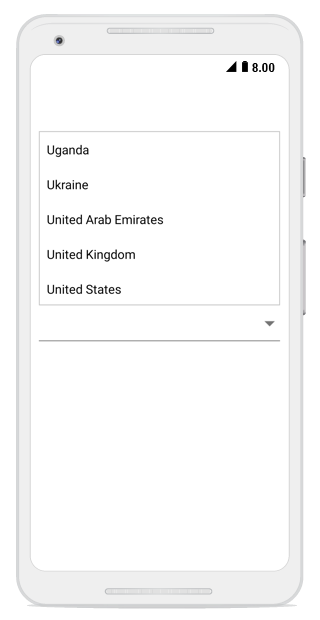

# Suggestion Box Placement

The Syncfusion SfComboBox control provides flexible positioning options for the suggestion box (dropdown) to ensure optimal user experience across different screen layouts and orientations. The suggestion box can be positioned in two locations relative to the ComboBox control:

* **Bottom** - Displays below the ComboBox (default behavior)
* **Top** - Displays above the ComboBox

The `SuggestionBoxPlacement` property allows you to explicitly control where the suggestion box appears, ensuring it remains visible and accessible.

## Bottom Placement

Bottom placement displays the suggestion box below the ComboBox control. This is the default behavior.



combobox.SuggestionBoxPlacement = SuggestionBoxPlacement.Bottom; 
 



## Top Placement

Top placement displays the suggestion box above the ComboBox control.



combobox.SuggestionBoxPlacement = SuggestionBoxPlacement.Top; 
 



