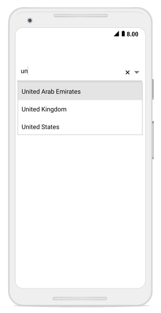

# Filtering Options

The SfComboBox control provides filtering functionality that allows users to filter the dropdown list based on the text they type. You can enable this feature by setting the `AllowFiltering` boolean property to `true`.

N> The AllowFiltering property works only when the IsEditableMode property is set to true.





combobox = new SfComboBox(); 
combobox.IsEditableMode = true; 
combobox.AllowFiltering = true; 





