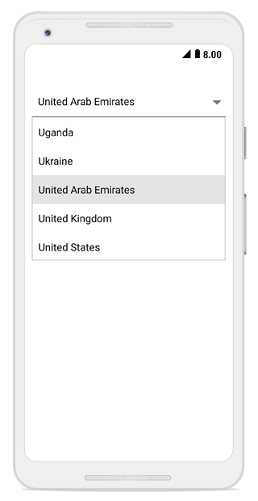

# Getting started

This section explains the steps required to create the combo box control and populate it with data and filter  .This section covers only the minimal features that are needed to get started with the combo box control. 

## Referencing Essential Studio components in your solution

After installing Essential Studio for Xamarin,find all the required assemblies in the installation folders,

{Syncfusion Installed location}\Essential Studio\12.4.0.24\lib

Add the following assembly references to the Android project,

android\Syncfusion.SfComboBox.Android.dll

### Adding SfComboBox

You can add the SfComboBox control to your application using the following codes.

*  Add namespace for the added assemblies.





using Syncfusion.Android.ComboBox;





* Then, add the SfComboBox control with a required optimal name using the included namespace.





LinearLayout linearLayout = new LinearLayout(this);
linearLayout.LayoutParameters = new ViewGroup.LayoutParams(500, ViewGroup.LayoutParams.MatchParent);
linearLayout.SetBackgroundColor(Android.Graphics.Color.White);

SfComboBox comboBox = new SfComboBox(this);
comboBox.LayoutParameters = new ViewGroup.LayoutParams(ViewGroup.LayoutParams.MatchParent, 50);
linearLayout.AddView(comboBox);
SetContentView(linearLayout); 





	
## Adding items

A list of string with country names are created and added to the combo box control. This list will be populated as suggestion list by setting the `ComboBoxSource` property based on text entry.

You can set the suggestion list to the combo box using the ComboBoxSource property. Add the ComboBoxSource property for the SfComboBox as follows.





LinearLayout linearLayout = new LinearLayout(this);
linearLayout.LayoutParameters = new ViewGroup.LayoutParams(500, ViewGroup.LayoutParams.MatchParent);
linearLayout.SetBackgroundColor(Android.Graphics.Color.White);

SfComboBox comboBox = new SfComboBox(this);
comboBox.LayoutParameters = new ViewGroup.LayoutParams(ViewGroup.LayoutParams.MatchParent, 50);

List<String> countryList = new List<String>();
countryList.Add("Uganda");
countryList.Add("Ukraine");
countryList.Add("United Arab Emirates");
countryList.Add("United Kingdom");
countryList.Add("United States");

ArrayAdapter<String> countryListDataAdapters = new ArrayAdapter<String>(this, Android.Resource.Layout.SimpleListItem1, countryList);
comboBox.ComboBoxSource = countryListDataAdapters;
comboBox.ComboBoxMode= ComboBoxMode.Suggest;

linearLayout.AddView(comboBox);
SetContentView(linearLayout); 





