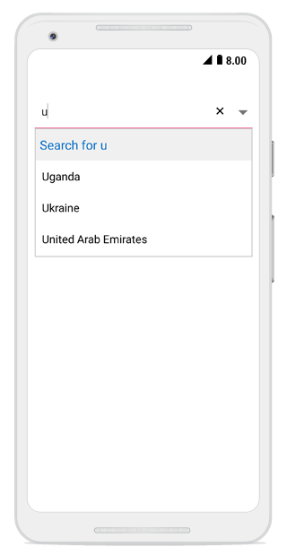

# Header and Footer Views

The SfComboBox control allows you to add custom header and footer views to the dropdown list, providing additional functionality and improved user experience. These views can display contextual information, search hints, action buttons, or any custom content that enhances the dropdown interface.

## Overview
You can add header and footer views to the dropdown list in the SfComboBox by enabling the `ShowDropDownHeaderView` and `ShowDropDownFooterView` properties. This feature is particularly useful for:

- Displaying search context or instructions
- Adding action buttons (like "Add New Item")
- Showing category information
- Providing additional navigation options
## Header Content

The header content appears at the top of the SfComboBox dropdown list. Use the `DropDownHeaderView` property to set the header content, and adjust its height using the `DropDownHeaderViewHeight` property.

### Implementation
The following code example illustrates how to set header content in the SfComboBox:




//Create header view
TextView headerView = new TextView(this);
headerView.TextAlignment = TextAlignment.Center;
headerView.TextSize = 20;
headerView.Gravity = GravityFlags.CenterVertical;
headerView.SetTextColor(Color.ParseColor("#006bcd"));
headerView.SetBackgroundColor(Color.ParseColor("#f0f0f0"));
    
comboBox.IsEditableMode = true;
comboBox.ShowDropDownHeaderView = true;
comboBox.DropDownHeaderViewHeight = 50;
comboBox.SelectedDropDownItemColor = Color.Transparent;
//set header view
comboBox.DropDownHeaderView = headerView;

comboBox.TextChanged += (object sender, TextChangedEventArgs e) => 
 {
    headerView.Text = "Search for " + e.Value;
 }; 
	 




## Footer Content

The footer content appears at the bottom of the SfComboBox dropdown list. Use the `DropDownFooterView` property to set the footer content, and adjust its height using the `DropDownFooterViewHeight` property.

### Implementation
The following code example illustrates how to set footer content in the SfComboBox:




//create footer view
TextView footerView = new TextView(this);
footerView.Text = "Add New";
footerView.TextAlignment = TextAlignment.Center;
footerView.TextSize = 20;
footerView.SetTextColor(Color.ParseColor("#006bcd"));
footerView.SetBackgroundColor(Color.ParseColor("#f0f0f0"));
footerView.Gravity = GravityFlags.Center;
            
comboBox.IsEditableMode = true;
comboBox.ShowDropDownFooterView = true;
comboBox.DropDownFooterViewHeight = 50;
comboBox.SelectedDropDownItemColor = Color.Transparent;
//set footer view
comboBox.DropDownFooterView = footerView;





