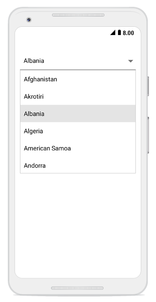

# Populating Items in Xamarin.Android ComboBox

The SfComboBox control can be populated with a list of strings or business objects, which assist users when typing. Users can choose an item from the filtered suggestion list.

The `DataSource` property is used to populate data in the SfComboBox control. This section explains how to populate the ComboBox with a list of strings and a list of employee details separately.

## Populating String Data

Create an instance of the string list and populate items as shown below.




List<String> countryList = new List<String>();
countryList.Add("Afghanistan");
countryList.Add("Akrotiri");
countryList.Add("Albania");
countryList.Add("Algeria");
countryList.Add("American Samoa");
countryList.Add("Andorra"); 
comboBox.DataSource = countryList;
comboBox.ComboBoxMode= ComboBoxMode.Suggest; 



	

## Populating Business Objects
 
Apart from string data, the SfComboBox can also work with business object data. The following example demonstrates how to create Model and ViewModel classes to populate the ComboBox with employee details.

### Create and Initialize Business Models

Define a simple model class "Employee" with fields ID and Name. Then, populate employee data in the ViewModel.





// Create a class which holds the data source data
public class Employee 
{ 
    
private int id; 
public int ID 
{ 
get { return id; } 
set { id = value; } 
} 
private string name; 
public string Name 
{ 
get { return name; }
set { name = value; } 
} 
} 

// Create the ViewModel Class
public class EmployeeViewModel 
{ 

private ObservableCollection<Employee> employeeCollection; 
public ObservableCollection<Employee> EmployeeCollection 
{ 
get { return employeeCollection; } 
set { employeeCollection = value; } 
} 

public EmployeeViewModel() 
{ 

//Crete the data source 
employeeCollection = new ObservableCollection<Employee>(); 
employeeCollection.Add(new Employee() { ID = 1, Name = "Frank" }); 
employeeCollection.Add(new Employee() { ID = 2, Name = "James" }); 
employeeCollection.Add(new Employee() { ID = 3, Name = "Steve" }); 
employeeCollection.Add(new Employee() { ID = 4, Name = "Lucas" }); 
employeeCollection.Add(new Employee() { ID = 5, Name = "Mark" }); 
employeeCollection.Add(new Employee() { ID = 6, Name = "Michael" }); 
employeeCollection.Add(new Employee() { ID = 7, Name = "Aldrin" }); 
employeeCollection.Add(new Employee() { ID = 8, Name = "Jack" }); 
employeeCollection.Add(new Employee() { ID = 9, Name = "Howard" }); 

} 

}





### Setting DisplayMemberPath

The control is populated with a list of employees. However, the Employee model contains two properties: ID and Name. You need to specify which property should be used for filtering suggestions. The `DisplayMemberPath` property specifies the property path used for filtering on business objects. In this case, configure the control to provide suggestions based on the Name property.




// To display the Name, set the DisplayMemberPath
comboBox.DisplayMemberPath = "Name";
// Add the data source
comboBox.DataSource = new EmployeeViewModel().EmployeeCollection; 




