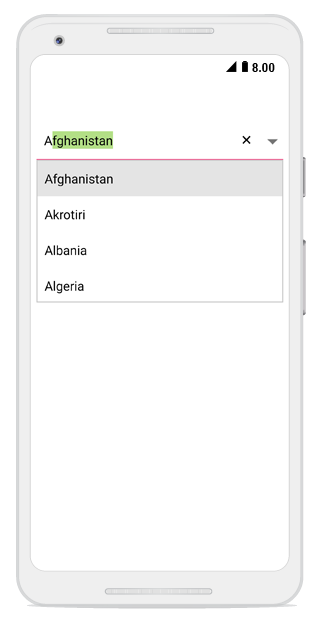

# Suggestion Display Mode

The `ComboBoxMode` property determines how filtered suggestions are displayed based on the text entered by the user. The available display modes are described below:
* Suggest

* Append
* SuggestAppend

N> The default mode is Suggest.

## Suggest Mode

The Suggest mode displays filtered suggestions in a drop-down list below the ComboBox.



	
comboBox.ComboBoxMode = ComboBoxMode.Suggest;	





## Append Mode

The Append mode automatically appends the first matching string to the entered text, allowing users to see potential completions inline.



	
comboBox.ComboBoxMode = ComboBoxMode.Append;





## SuggestAppend Mode

The SuggestAppend mode combines both approaches by displaying suggestions in a drop-down list while simultaneously appending the first matching string to the entered text.



	
comboBox.ComboBoxMode = ComboBoxMode.SuggestAppend;





