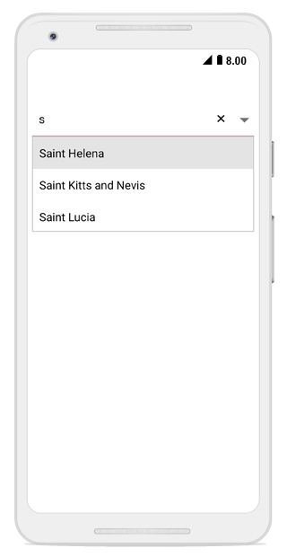
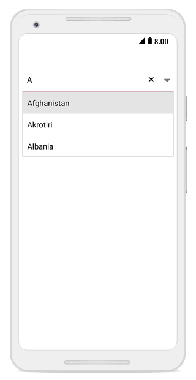
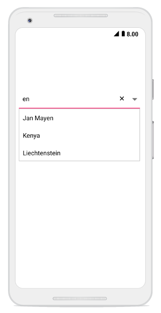
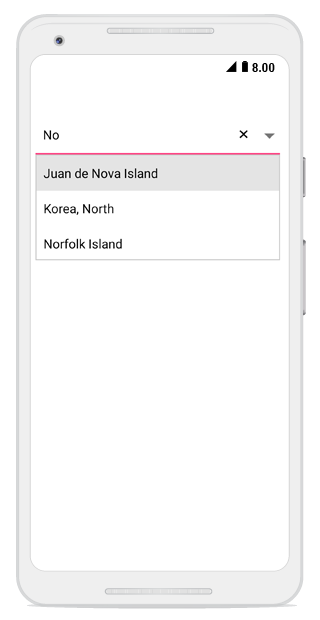
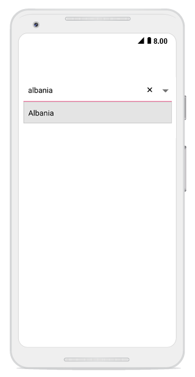
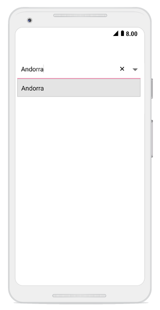
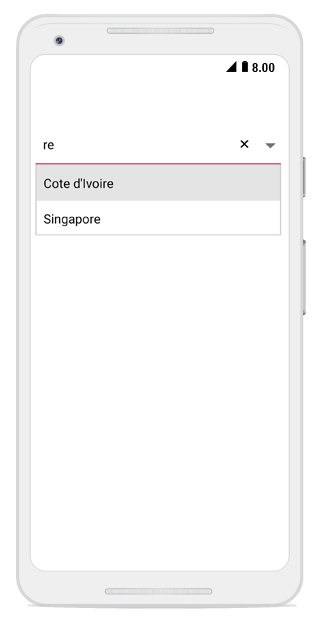
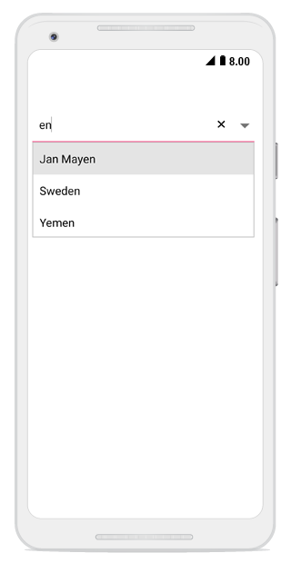
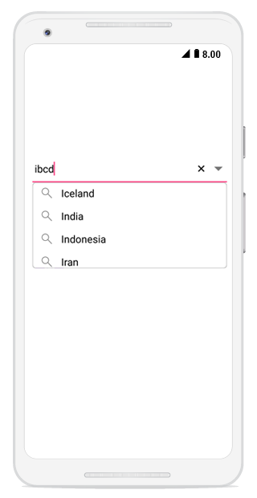

# Various Filter Options for Suggestions

The SfComboBox provides filtering options to filter suggestions in the dropdown list.




comboBox.AllowFiltering = true;
comboBox.IsEditableMode = true;	 




## Types of Filtering

String comparison for filtering suggestions can be configured using the `SuggestionMode` property. The default filtering strategy is `StartsWith`, and it is case insensitive. The available filtering modes are:

* StartsWith
* StartsWithCaseSensitive
* Contains
* ContainsWithCaseSensitive
* Equals
* EqualsWithCaseSensitive
* EndsWith
* EndsWithCaseSensitive
* Custom

## StartsWith Mode
### Words that Start with Input Text

Displays suggestions based on items that begin with the entered characters.




    comboBox.SuggestionMode = SuggestionMode.StartsWith;   	
	 



	

### Case-Sensitive StartsWith

Displays suggestions based on items that begin with the entered characters, with case-sensitive matching.



	
	comboBox.SuggestionMode = SuggestionMode.StartsWithCaseSensitive;
	 



	

## Contains Mode
### Words that Contain the Input Text

Displays suggestions for items that contain the entered text anywhere within the string.



	
	comboBox.SuggestionMode = SuggestionMode.Contains;
	 



	

### Case-Sensitive Contains

Displays suggestions for items that contain the entered text with case-sensitive matching.



	
	comboBox.SuggestionMode = SuggestionMode.ContainsWithCaseSensitive;
	 



	

## Equals Mode
### Words that Equal the Input Text

Displays suggestions for items that exactly match the entered text.



	
	comboBox.SuggestionMode = SuggestionMode.Equals;
	 



	

### Case-Sensitive Equals

Displays suggestions for items that exactly match the entered text with case-sensitive comparison.



	
	comboBox.SuggestionMode = SuggestionMode.EqualsWithCaseSensitive;
	 



	

## EndsWith Mode
### Words that End with Input Text

Displays suggestions based on items that end with the entered characters.



	
	comboBox.SuggestionMode = SuggestionMode.EndsWith;
	 



	

### Case-Sensitive EndsWith

Displays suggestions based on items that end with the entered characters, with case-sensitive matching.



	
comboBox.SuggestionMode = SuggestionMode.EndsWithCaseSensitive;
	 



	

## Custom Filter Mode

The Custom mode allows you to implement custom filtering logic by handling the filtering events or providing custom filter predicates.



	
comboBox.SuggestionMode = SuggestionMode.Custom;
	 



	

