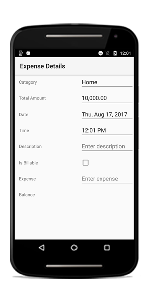
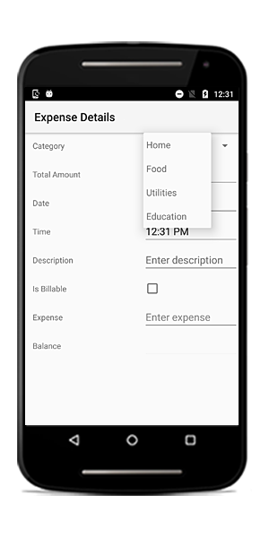
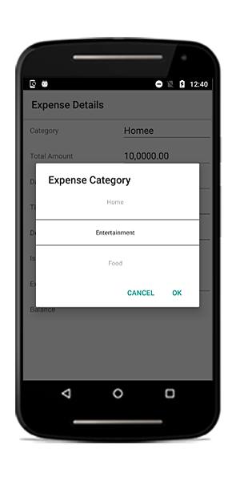
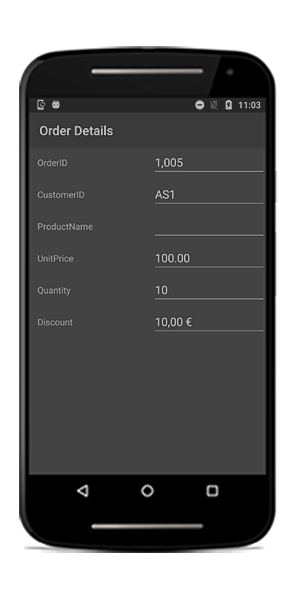
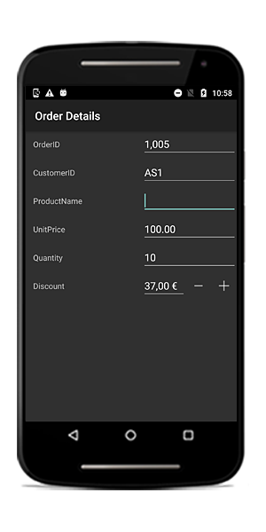

# Editors

The data form supports several built-in editors as follows:

<table>
<tr>
<th>Editor name</th>
<th>Editor class</th>
<th>Supported Data Type/Attribute</th>
<th>Input control loaded</th>
</tr>
<tr>
<td>
Text
</td>
<td>
{{'[DataFormTextEditor](https://help.syncfusion.com/cr/cref_files/xamarin-android/sfdataform/Syncfusion.SfDataForm.Android~Syncfusion.Android.DataForm.Editors.DataFormTextEditor.html)'| markdownify }}
</td>
<td>
The String type property and any other type apart from the below specified cases.
</td>
<td>
EditText
</td>
</tr>
<tr>
<td>
MultilineText
</td>
<td>
{{'[DataFormMultiLineTextEditor](https://help.syncfusion.com/cr/cref_files/xamarin-android/sfdataform/Syncfusion.SfDataForm.Android~Syncfusion.Android.DataForm.Editors.DataFormMultiLineTextEditor.html)'| markdownify }}
</td>
<td>
The String type property with multi line text.
[DataType(DataType.Multiline)] 
</td>
<td>
EditText
</td>
</tr>
<tr>
<td>
Numeric
</td>
<td>
{{'[DataFormNumericEditor](https://help.syncfusion.com/cr/cref_files/xamarin-android/sfdataform/Syncfusion.SfDataForm.Android~Syncfusion.Android.DataForm.Editors.DataFormNumericEditor.html)'| markdownify }}
</td>
<td>
The property of Int, Double, Float, Decimal, Long types and also its nullable property.
</td>
<td>
SfNumericTextBox
</td>
</tr>
<tr>
<td>
Percent
</td>
<td>
{{'[DataFormNumericEditor](https://help.syncfusion.com/cr/cref_files/xamarin-android/sfdataform/Syncfusion.SfDataForm.Android~Syncfusion.Android.DataForm.Editors.DataFormNumericEditor.html)'| markdownify }}
</td>
<td>
The property of Int, Double, Float, Decimal, Long types and also its nullable property with [DataType(“Percent”)] attribute.
</td>
<td>
SfNumericTextBox
</td>
</tr>
<tr>
<td>
Currency
</td>
<td>
{{'[DataFormNumericEditor](https://help.syncfusion.com/cr/cref_files/xamarin-android/sfdataform/Syncfusion.SfDataForm.Android~Syncfusion.Android.DataForm.Editors.DataFormNumericEditor.html)'| markdownify }}
</td>
<td>
The property of Int, Double, Float, Decimal, Long types and also its nullable property with [DataType(DataType.Currency)] attribute.
</td>
<td>
SfNumericTextBox
</td>
</tr>
<tr>
<td>
Date
</td>
<td>
{{'[DataFormDateEditor](https://help.syncfusion.com/cr/cref_files/xamarin-android/sfdataform/Syncfusion.SfDataForm.Android~Syncfusion.Android.DataForm.Editors.DataFormDateEditor.html)'| markdownify }}
</td>
<td>
DateTime type property and the property with [DataType(DataType.Date)] and [DataType(DataType.DateTime)] attributes.
</td>
<td>
SfDatePicker
</td>
</tr>
<tr>
<td>
Time
</td>
<td>
{{'[DataFormTimeEditor](https://help.syncfusion.com/cr/cref_files/xamarin-android/sfdataform/Syncfusion.SfDataForm.Android~Syncfusion.Android.DataForm.Editors.DataFormTimeEditor.html)'| markdownify }}
</td>
<td>
The property with [DataType(DataType.Time)] attribute.
</td>
<td>
SfTimePicker
</td>
</tr>
<tr>
<td>
NumericUpDown
</td>
<td>
{{'[DataFormNumericUpDownEditor](https://help.syncfusion.com/cr/cref_files/xamarin-android/sfdataform/Syncfusion.SfDataForm.Android~Syncfusion.Android.DataForm.Editors.DataFormNumericUpDownEditor.html)'| markdownify }}
</td>
<td>
Int or Double type property.
</td>
<td>
SfNumericUpDown
</td>
</tr>
<tr>
<td>
Segment
</td>
<td>
{{'[DataFormSegmentedEditor](https://help.syncfusion.com/cr/cref_files/xamarin-android/sfdataform/Syncfusion.SfDataForm.Android~Syncfusion.Android.DataForm.Editors.DataFormSegmentedEditor.html)'| markdownify }}
</td>
<td>
Enum type property.
</td>
<td>
RadioGroup
</td>
</tr>
<tr>
<td>
Bool
</td>
<td>
{{'[DataFormCheckBoxEditor](https://help.syncfusion.com/cr/cref_files/xamarin-android/sfdataform/Syncfusion.SfDataForm.Android~Syncfusion.Android.DataForm.Editors.DataFormCheckBoxEditor.html)'| markdownify }}
</td>
<td>
Bool type property.
</td>
<td>
CheckBox
</td>
</tr>
<tr>
<td>
Switch
</td>
<td>
{{'[DataFormSwitchEditor](https://help.syncfusion.com/cr/cref_files/xamarin-android/sfdataform/Syncfusion.SfDataForm.Android~Syncfusion.Android.DataForm.Editors.DataFormSwitchEditor.html)'| markdownify }}
</td>
<td>
Bool type property.
</td>
<td>
Switch
</td>
</tr>
<tr>
<td>
Picker
</td>
<td>
{{'[DataFormPickerEditor](https://help.syncfusion.com/cr/cref_files/xamarin-android/sfdataform/Syncfusion.SfDataForm.Android~Syncfusion.Android.DataForm.Editors.DataFormPickerEditor.html)'| markdownify }}
</td>
<td>
Enum and List type property. 
[EnumDataTypeAttribute]
</td>
<td>
SfPicker
</td>
</tr>
<tr>
<td>
DropDown
</td>
<td>
{{'[DataFormDropDownEditor](https://help.syncfusion.com/cr/cref_files/xamarin-android/sfdataform/Syncfusion.SfDataForm.Android~Syncfusion.Android.DataForm.Editors.DataFormDropDownEditor.html)'| markdownify }}
</td>
<td>
Enum and List type property.
[EnumDataTypeAttribute]
</td>
<td>
Spinner
</td>
</tr>
<tr>
<td>
Password
</td>
<td>
{{'[DataFormPasswordEditor](https://help.syncfusion.com/cr/cref_files/xamarin-android/sfdataform/Syncfusion.SfDataForm.Android~Syncfusion.Android.DataForm.Editors.DataFormPasswordEditor.html)'| markdownify }}
</td>
<td>
The String type property and property with 
[DataType(DataType.Password)] attribute.
</td>
<td>
EditText
</td>
</tr>
</table>

## Text editor

In the text editor, the [EditText](https://developer.xamarin.com/guides/android/user_interface/form_elements/edit_text/) is loaded.

### Loading upper case keyboard in EditText

You can load upper case letters keyboard by setting the [InputType](https://help.syncfusion.com/cr/cref_files/xamarin-android/sfdataform/Syncfusion.SfDataForm.Android~Syncfusion.Android.DataForm.DataFormTextItem~InputType.html) as `TextFlagCapCharacters`.



dataForm.AutoGeneratingDataFormItem += DataForm_AutoGeneratingDataFormItem;
private void DataForm_AutoGeneratingDataFormItem(object sender, AutoGeneratingDataFormItemEventArgs e)
{    
    if (e.DataFormItem != null && e.DataFormItem.Name == "Name")
    {
        (e.DataFormItem as DataFormTextItem).InputType = Android.Text.InputTypes.TextFlagCapCharacters;
    }
}



## Numeric editor

In the numeric editor, the [SfNumericTextBox](https://help.syncfusion.com/xamarin-android/introduction/overview) is loaded.

### Change maximum NumberDecimalDigits in the numeric editor

In the `SfNumericTextBox`, two decimal digits will be displayed by default. You can change the number of decimal digits being displayed by setting the [MaximumNumberDecimalDigits](https://help.syncfusion.com/cr/cref_files/xamarin-android/sfdataform/Syncfusion.SfDataForm.Android~Syncfusion.Android.DataForm.DataFormNumericItemBase~MaximumNumberDecimalDigits.html) property in the [DataFormNumericItem](https://help.syncfusion.com/cr/cref_files/xamarin-android/sfdataform/Syncfusion.SfDataForm.Android~Syncfusion.Android.DataForm.DataFormNumericItem.html).



dataForm.AutoGeneratingDataFormItem += DataForm_AutoGeneratingDataFormItem;
private void DataForm_AutoGeneratingDataFormItem(object sender, AutoGeneratingDataFormItemEventArgs e)
{
    if (e.DataFormItem != null && e.DataFormItem.Name == "Amount")
    {
        (e.DataFormItem as DataFormNumericItem).MaximumNumberDecimalDigits = 3;
    }
}



## Date editor

In the date editor, the [SfDatePicker](https://help.syncfusion.com/cr/cref_files/xamarin-android/sfdataform/Syncfusion.SfDataForm.Android~Syncfusion.Android.DataForm.Editors.SfDatePicker.html) will be loaded.

### Customizing format in date editor

In the `SfDatePicker`, short date will be shown by default. You can change the applied format by setting the [Format](https://help.syncfusion.com/cr/cref_files/xamarin-android/sfdataform/Syncfusion.SfDataForm.Android~Syncfusion.Android.DataForm.DataFormDateItem~Format.html) property in [DataFormDateItem](https://help.syncfusion.com/cr/cref_files/xamarin-android/sfdataform/Syncfusion.SfDataForm.Android~Syncfusion.Android.DataForm.DataFormDateItem.html).



dataForm.AutoGeneratingDataFormItem += DataForm_AutoGeneratingDataFormItem;

private void DataForm_AutoGeneratingDataFormItem(object sender, AutoGeneratingDataFormItemEventArgs e)
{   

    if (e.DataFormItem != null && e.DataFormItem.Name == "Date")
    {
        (e.DataFormItem as DataFormDateItem).Format = "ddd, MMM d, yyyy";
    }
}



### Setting MaximumDate and MinimumDate in date editor

You can customize the maximum and minimum allowable dates in the `SfDatePicker` by setting [MaximumDate](https://help.syncfusion.com/cr/cref_files/xamarin-android/sfdataform/Syncfusion.SfDataForm.Android~Syncfusion.Android.DataForm.DataFormDateItem~MaximumDate.html) and [MinimumDate](https://help.syncfusion.com/cr/cref_files/xamarin-android/sfdataform/Syncfusion.SfDataForm.Android~Syncfusion.Android.DataForm.DataFormDateItem~MinimumDate.html) in the [DataFormDateItem](https://help.syncfusion.com/cr/cref_files/xamarin-android/sfdataform/Syncfusion.SfDataForm.Android~Syncfusion.Android.DataForm.DataFormDateItem.html) respectively.



dataForm.AutoGeneratingDataFormItem += DataForm_AutoGeneratingDataFormItem;

private void DataForm_AutoGeneratingDataFormItem(object sender, AutoGeneratingDataFormItemEventArgs e)
{
    if (e.DataFormItem != null && e.DataFormItem.Name == "Date")
    {
        (e.DataFormItem as DataFormDateItem).MinimumDate = new DateTime(2017, 5, 5);
        (e.DataFormItem as DataFormDateItem).MaximumDate = new DateTime(2017, 9, 2);
    }
}




## Drop down editor

In the drop down editor, the [Spinner](https://developer.xamarin.com/guides/android/user_interface/spinner/) will be loaded.

### Customizing ItemsSource of spinner

By default, the `ItemsSource` for spinner is auto-generated for enum types and collection type properties. For other types, you can set the `ItemsSource` by using the [SourceProvider](https://help.syncfusion.com/cr/cref_files/xamarin-android/sfdataform/Syncfusion.SfDataForm.Android~Syncfusion.Android.DataForm.SfDataForm~SourceProvider.html).

#### Using SourceProvider



private string _ItemName;
public string ItemName
{
    get
    {
        return _ItemName;
    }
    set
    {
        _ItemName = value;
    }
}
public class SourceProviderExt : SourceProvider
{
    public override IList GetSource(string sourceName)
    {
        var list = new List<string>();
        if (sourceName == "ItemName")
        {
            list.Add("Item1");
            list.Add("Item2");
            list.Add("Item3");
        }
        return list;
    }
}
dataForm.SourceProvider = new SourceProviderExt();
dataForm.RegisterEditor("ItemName", "DropDown");



#### Using ItemsSource property

You can also set the ItemsSource for drop down editor by using the [ItemsSource](https://help.syncfusion.com/cr/cref_files/xamarin-android/sfdataform/Syncfusion.SfDataForm.Android~Syncfusion.Android.DataForm.DataFormDropDownItem~ItemsSource.html) property in the `DataFormDropDownItem`.



dataForm.AutoGeneratingDataFormItem += DataForm_AutoGeneratingDataFormItem;

private void DataForm_AutoGeneratingDataFormItem(object sender, AutoGeneratingDataFormItemEventArgs e)
{
    if (e.DataFormItem != null && e.DataFormItem.Name == "Name")
    {
        var list = new List<string>();
        list.Add("Home");
        list.Add("Food");
        list.Add("Utilities");
        list.Add("Education");
        (e.DataFormItem as DataFormDropDownItem).ItemsSource = list;
    }
}



You can also change the `ItemsSource` at runtime.



private void Button_Click(object sender, EventArgs e)
{
    var dataFormItem = dataForm.ItemManager.DataFormItems["Name"];
    if (dataFormItem.Name == "Name")
    {
        var list = new List<string>();
        list.Add("Home");
        list.Add("Food");
        list.Add("Utilities");
        list.Add("Education");
        (dataFormItem as DataFormDropDownItem).ItemsSource = list;
    }
}



## Picker editor

In the picker editor, the [SfPicker](https://help.syncfusion.com/cr/cref_files/xamarin-android/sfdataform/Syncfusion.SfDataForm.Android~Syncfusion.Android.DataForm.Editors.SfPicker.html) will be loaded.

### Changing title in the SfPicker

You can show some text in the `SfPicker` popup by using the [Title](https://help.syncfusion.com/cr/cref_files/xamarin-android/sfdataform/Syncfusion.SfDataForm.Android~Syncfusion.Android.DataForm.DataFormPickerItem~Title.html) property in the [DataFormPickerItem](https://help.syncfusion.com/cr/cref_files/xamarin-android/sfdataform/Syncfusion.SfDataForm.Android~Syncfusion.Android.DataForm.DataFormPickerItem.html).



dataForm.AutoGeneratingDataFormItem += DataForm_AutoGeneratingDataFormItem;

private void DataForm_AutoGeneratingDataFormItem(object sender, AutoGeneratingDataFormItemEventArgs e)
{
    if (e.DataFormItem != null && e.DataFormItem.Name == "Name")
    {
        (e.DataFormItem as DataFormPickerItem).Title = "Expense Category";
    }
}



### Customizing ItemsSource of SfPicker

By default, the `ItemsSource` for picker is auto-generated for enum type and collection type properties. For other types, you can set the `ItemsSource` by using [SourceProvider](https://help.syncfusion.com/cr/cref_files/xamarin-android/sfdataform/Syncfusion.SfDataForm.Android~Syncfusion.Android.DataForm.SfDataForm~SourceProvider.html).

### Using SourceProvider



private string _ItemName;
public string ItemName
{
    get
    {
        return _ItemName;
    }
    set
    {
        _ItemName = value;
    }
}
public class SourceProviderExt : SourceProvider
{
    public override IList GetSource(string sourceName)
    {
        var list = new List<string>();
        if (sourceName == "ItemName")
        {
            list.Add("Item1");
            list.Add("Item2");
            list.Add("Item3");
        }
        return list;
    }
}
dataForm.SourceProvider = new SourceProviderExt();
dataForm.RegisterEditor("ItemName", "Picker");



You can also set `ItemsSource` for picker editor by using the [ItemsSource](https://help.syncfusion.com/cr/cref_files/xamarin-android/sfdataform/Syncfusion.SfDataForm.Android~Syncfusion.Android.DataForm.DataFormPickerItem~ItemsSource.html) property in the [DataFormPickerItem](https://help.syncfusion.com/cr/cref_files/xamarin-android/sfdataform/Syncfusion.SfDataForm.Android~Syncfusion.Android.DataForm.DataFormPickerItem.html).



dataForm.AutoGeneratingDataFormItem += DataForm_AutoGeneratingDataFormItem;

private void DataForm_AutoGeneratingDataFormItem(object sender, AutoGeneratingDataFormItemEventArgs e)
{
    if (e.DataFormItem != null && e.DataFormItem.Name == "Name")
    {
        var list = new List<string>();
        list.Add("Home");
        list.Add("Food");
        list.Add("Utilities");
        list.Add("Education");
        (e.DataFormItem as DataFormPickerItem).ItemsSource = list;
    }
}



You can also change the `ItemsSource` at runtime.



private void Button_Click(object sender, EventArgs e)
{
    var dataFormItem = dataForm.ItemManager.DataFormItems["Name"];
    if (dataFormItem.Name == "Name")
    {
        var list = new List<string>();
        list.Add("Home");
        list.Add("Food");
        list.Add("Utilities");
        list.Add("Education");
        (dataFormItem as DataFormPickerItem).ItemsSource = list;
    }
}



## NumericUpDown editor

In the numeric editor, the [SfNumericUpDown](https://help.syncfusion.com/xamarin-android/sfnumericupdown/overview) will be loaded.

### Changing SpinButtonAlignment in NumericUpDown

By default, up down button will be displayed in right side. You can change its alignment by using the [SpinButtonAlignment](https://help.syncfusion.com/cr/cref_files/xamarin-android/sfdataform/Syncfusion.SfDataForm.Android~Syncfusion.Android.DataForm.DataFormNumericUpDownItem~SpinButtonAlignment.html) property in the [DataFormNumericUpDownItem](https://help.syncfusion.com/cr/cref_files/xamarin-android/sfdataform/Syncfusion.SfDataForm.Android~Syncfusion.Android.DataForm.DataFormNumericUpDownItem.html).



dataForm.AutoGeneratingDataFormItem += DataForm_AutoGeneratingDataFormItem;
private void DataForm_AutoGeneratingDataFormItem(object sender, AutoGeneratingDataFormItemEventArgs e)
{
    if (e.DataFormItem != null && e.DataFormItem.Name == "Quantity")
        (e.DataFormItem as DataFormNumericUpDownItem).SpinButtonAlignment = SpinButtonAlignment.Both;
}



### Changing step value in numeric up down

You can change the next increment and decrement values by using the [StepValue](https://help.syncfusion.com/cr/cref_files/xamarin-android/sfdataform/Syncfusion.SfDataForm.Android~Syncfusion.Android.DataForm.DataFormNumericUpDownItem~StepValue.html) property in the [DataFormNumericUpDownItem](https://help.syncfusion.com/cr/cref_files/xamarin-android/sfdataform/Syncfusion.SfDataForm.Android~Syncfusion.Android.DataForm.DataFormNumericUpDownItem.html). The default value of step value is 1.



dataForm.AutoGeneratingDataFormItem += DataForm_AutoGeneratingDataFormItem;

private void DataForm_AutoGeneratingDataFormItem(object sender, AutoGeneratingDataFormItemEventArgs e)
{
    if (e.DataFormItem != null && e.DataFormItem.Name == "Quantity")
        (e.DataFormItem as DataFormNumericUpDownItem).StepValue = 2;
}



### Setting Maximum and Minimum value in numeric up down

You can set minimum and maximum values for numeric up down by using [Minimum](https://help.syncfusion.com/cr/cref_files/xamarin-android/sfdataform/Syncfusion.SfDataForm.Android~Syncfusion.Android.DataForm.DataFormNumericUpDownItem~Minimum.html) and [Maximum](https://help.syncfusion.com/cr/cref_files/xamarin-android/sfdataform/Syncfusion.SfDataForm.Android~Syncfusion.Android.DataForm.DataFormNumericUpDownItem~Maximum.html) properties values respectively.



dataForm.AutoGeneratingDataFormItem += DataForm_AutoGeneratingDataFormItem;

private void DataForm_AutoGeneratingDataFormItem(object sender, AutoGeneratingDataFormItemEventArgs e)
{
    if (e.DataFormItem != null && e.DataFormItem.Name == "Quantity")
    {
        (e.DataFormItem as DataFormNumericUpDownItem).Maximum = 100;
        (e.DataFormItem as DataFormNumericUpDownItem).Minimum = 0;
    }
}



### Enabling auto reverse in numeric up down

In the `SfNumericUpDown`, once maximum and minimum values reached, the value will be unchanged. You can enable the cyclic behavior by setting the [AutoReverse](https://help.syncfusion.com/cr/cref_files/xamarin-android/sfdataform/Syncfusion.SfDataForm.Android~Syncfusion.Android.DataForm.DataFormNumericUpDownItem~AutoReverse.html) to `true` in the [DataFormNumericUpDownItem](https://help.syncfusion.com/cr/cref_files/xamarin-android/sfdataform/Syncfusion.SfDataForm.Android~Syncfusion.Android.DataForm.DataFormNumericUpDownItem.html).



dataForm.AutoGeneratingDataFormItem += DataForm_AutoGeneratingDataFormItem;

private void DataForm_AutoGeneratingDataFormItem(object sender, AutoGeneratingDataFormItemEventArgs e)
{
    if (e.DataFormItem != null && e.DataFormItem.Name == "Quantity")
    {
        (e.DataFormItem as DataFormNumericUpDownItem).AutoReverse = true;
    }
}



### Changing CultureInfo in numeric up down and numeric text box

You can change the culture in `SfNumericTextBox` and `SfNumericUpDown` by using the [CultureInfo](https://help.syncfusion.com/cr/cref_files/xamarin-android/sfdataform/Syncfusion.SfDataForm.Android~Syncfusion.Android.DataForm.DataFormNumericItemBase~CultureInfo.html) property in the [DataFormNumericItemBase](https://help.syncfusion.com/cr/cref_files/xamarin-android/sfdataform/Syncfusion.SfDataForm.Android~Syncfusion.Android.DataForm.DataFormNumericItemBase.html).

#### SfNumericTextBox



private double _discount = 10;
        
[DataType(DataType.Currency)]
public double Discount
{
    get
    {
        return _discount;
    }
    set
    {
        _discount = value;
        RaisePropertyChanged("Discount");
    }
}
dataForm.AutoGeneratingDataFormItem += DataForm_AutoGeneratingDataFormItem;

private void DataForm_AutoGeneratingDataFormItem(object sender, AutoGeneratingDataFormItemEventArgs e)
{
    if (e.DataFormItem != null && e.DataFormItem.Name == "Discount")
    {
        (e.DataFormItem as DataFormNumericItem).CultureInfo = new Java.Util.Locale("fr", "FR");
    }
}



#### SfNumericUpDown



dataForm.RegisterEditor("Discount", "NumericUpDown");
dataForm.AutoGeneratingDataFormItem += DataForm_AutoGeneratingDataFormItem;
private void DataForm_AutoGeneratingDataFormItem(object sender, AutoGeneratingDataFormItemEventArgs e)
{
    if (e.DataFormItem != null && e.DataFormItem.Name == "Discount")
    {
        (e.DataFormItem as DataFormNumericUpDownItem).FormatString = "c";
        (e.DataFormItem as DataFormNumericUpDownItem).CultureInfo = new Java.Util.Locale("fr", "FR");
    }
}



## Password editor

In the password editor, the [EditText](https://developer.xamarin.com/guides/android/user_interface/form_elements/edit_text/) is loaded.
