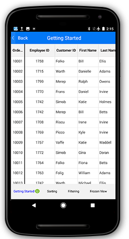
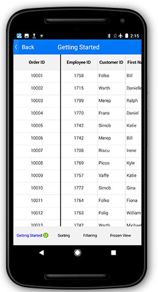
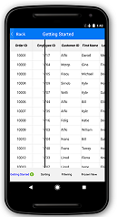

# Columns 

The SfDataGrid allows you to create and add columns in two ways:

* Automatic columns generation based on the underlying collection.
* Manually defining columns in C#.

## Automatic columns generation

#Columns types

Automatic columns can be generated depends on the type of underlying model object.

#GridImageColumn: 
If underlying collection type as ImageSource, GridImageColumn has been generated.


public ImageSource DealerImage;


#GridSwitchColumn:
If underlying collection type as bool, GridSwitchColumn has been generated.


public bool IsOnline;


#GridPickerColumn
If underlying collection type as IsEnum, GridPickerColumn has been generated.

To generate a GridPickerColumn add an enum.Generate a property for that created enum type.


// In OrderInfo.cs

public enum enumType
{
    Adams,
    Crowley,
    Ellis,
    Gable,
    Irvine
}

private enumType name;

public enumType Name
{
    get {return name;}
    set
    {
        name=value;
        RaisePropertyChanged("Name");
    }
}

// In OrderInfoRepository.cs

Name = OrderInfo.enumType.Adams,


#GridNumericColumn
If underlying collection type as int or Nullable<int>,double or Nullable<double>,float or Nullable<float> and decimal or Nullable<decimal>, GridNumericColumn has been generated.


public int EmployeeID;
public Nullable<int> CustomerID;


#GridDateTimeColumn
If underlying collection type as DateTime, GridDateTimeColumn has been generated.


public DateTime ShippingDate;


#GridTextColumn
Other than above all those type(example string) of underlying model object, GridTextColumn has been generated.


public string FirstName;


The SfDataGrid creates columns automatically based on the property [SfDataGrid.AutoGenerateColumns](http://help.syncfusion.com/cr/cref_files/xamarin-android/sfdatagrid/Syncfusion.SfDataGrid.Android~Syncfusion.SfDataGrid.SfDataGrid~AutoGenerateColumns.html). It is a binding property and it decides columns generation for the SfDataGrid based on the [SfDataGrid.AutoGenerateColumnsMode](http://help.syncfusion.com/cr/cref_files/xamarin-android/sfdatagrid/Syncfusion.SfDataGrid.Android~Syncfusion.SfDataGrid.SfDataGrid~AutoGenerateColumnsMode.html) property. 

The `SfDataGrid.AutoGenerateColumnsMode` decides a way to create columns when the `SfDataGrid.AutoGenerateColumns` is set to `true`. It also decides to retain the grouping and sorting when the ItemsSource is changed. 

The `SfDataGrid.AutoGenerateColumnsMode` is of type `AutoGenerateColumnsMode` which has the following five options.

<table>
<tr>
<th> Modes </th>
<th> Description </th>
</tr>
<tr>
<td> {{'[None](http://help.syncfusion.com/cr/cref_files/xamarin-android/sfdatagrid/Syncfusion.SfDataGrid.Android~Syncfusion.SfDataGrid.AutoGenerateColumnsMode.html)'| markdownify }} </td>
<td> Stores only the columns defined in the SfDataGrid.Columns collection.  When changing the ItemsSource, the grouping and sorting for explicitly defined SfDataGrid.Columns alone will be retained. </td>
</tr>
<tr>
<td> {{'[Reset](http://help.syncfusion.com/cr/cref_files/xamarin-android/sfdatagrid/Syncfusion.SfDataGrid.Android~Syncfusion.SfDataGrid.AutoGenerateColumnsMode.html)'| markdownify }}</td>
<td> Retains the columns defined explicitly in the application level and creates columns newly for all the other properties in a data source.  When changing the ItemsSource, the grouping and sorting for explicitly defined SfDataGrid.Columns alone will be retained. </td>
</tr>
<tr>
<td> {{'[ResetAll](http://help.syncfusion.com/cr/cref_files/xamarin-android/sfdatagrid/Syncfusion.SfDataGrid.Android~Syncfusion.SfDataGrid.AutoGenerateColumnsMode.html)'| markdownify }} </td>
<td> When changing the ItemsSource, the columns for the previous data source are cleared and the columns will be created newly for the new data source. Even when columns are explicitly defined it does not consider the defined columns and creates the column based on the underlying collection.  Further, when changing the ItemsSource, the grouping and sorting for all the columns will be cleared. </td>
</tr>
<tr>
<td> {{'[RetainOld](http://help.syncfusion.com/cr/cref_files/xamarin-android/sfdatagrid/Syncfusion.SfDataGrid.Android~Syncfusion.SfDataGrid.AutoGenerateColumnsMode.html)'| markdownify }}  </td>
<td> When changing the ItemsSource, creates columns for all fields in a data source when the Grid does not have any explicit definition for columns. When columns are defined explicitly, the defined columns alone are retained and new columns are not created.  Similarly, when changing the ItemsSource and when the grid have any explicit definition for columns, the grouping and sorting are retained as it is. </td>
</tr>
<tr>
<td> {{'[SmartReset](http://help.syncfusion.com/cr/cref_files/xamarin-android/sfdatagrid/Syncfusion.SfDataGrid.Android~Syncfusion.SfDataGrid.AutoGenerateColumnsMode.html)'| markdownify }} </td>
<td> Retains the columns defined explicitly in the application level and the columns with MappingName identical to the properties in the new data source. Creates columns newly for all the other properties in the data source.  Similarly, it retains the grouping and sorting of the columns that are defined explicitly in application level and the columns with MappingName identical to the properties in the new data source. </td>
</tr>
</table>

The default value of `SfDataGrid.AutoGenerateColumns` property is `true` and `SfDataGrid.AutoGenerateColumnsMode` is `Reset`. Hence by default, the SfDataGrid creates columns automatically for every non-explicitly defined public property in the underlying collection bound to its `ItemsSource` property.

N> When changing the items source for the SfDataGrid ar runtime, the columns are generated on the basis of option set for `SfDataGrid.AutoGenerateColumnsMode`.

### Customize auto generated columns

When the `SfDataGrid.AutoGenerateColumns` is `true`, the [SfDataGrid.AutoGeneratingColumn](http://help.syncfusion.com/cr/cref_files/xamarin-android/sfdatagrid/Syncfusion.SfDataGrid.Android~Syncfusion.SfDataGrid.SfDataGrid~AutoGeneratingColumn_EV.html) event is raised for each GridColumn. This event receives two arguments namely, sender that is SfDataGrid and [AutoGeneratingColumnArgs](http://help.syncfusion.com/cr/cref_files/xamarin-android/sfdatagrid/Syncfusion.SfDataGrid.Android~Syncfusion.SfDataGrid.AutoGeneratingColumnArgs.html).

The `AutoGeneratingColumnArgs` object contains the following properties.

* [Column](http://help.syncfusion.com/cr/cref_files/xamarin-android/sfdatagrid/Syncfusion.SfDataGrid.Android~Syncfusion.SfDataGrid.AutoGeneratingColumnArgs~Column.html): This property returns the created column using which can be customized.
* [Cancel](http://help.syncfusion.com/cr/cref_files/xamarin-android/sfdatagrid/Syncfusion.SfDataGrid.Android~Syncfusion.SfDataGrid.AutoGeneratingColumnArgs_members.html#): This property cancels the column creation.
* PropertyType: This property provides the type of underlying model object which has introduced newly.

You can skip generating a column by handling the `SfDataGrid.AutoGeneratingColumn` event as follows.


dataGrid.AutoGeneratingColumn += GridAutoGeneratingColumns; 

void GridAutoGeneratingColumns(object sender, AutoGeneratingColumnArgs e)
{
    if (e.Column.MappingName == "EmployeeID")
        e.Cancel = true;
}


Customizing the width for auto generated columns as shown below.


void dataGrid_AutoGeneratingColumn(object sender, AutoGeneratingColumnArgs e){
if (e.Column.MappingName == "OrderID") {
    e.Column.Width = 100;
    }
}


You can also apply formatting for auto generated columns as follows.


void GridAutoGeneratingColumns(object sender, AutoGeneratingColumnArgs e)
{
    if (e.Column.MappingName == "Freight") {
        e.Column.Format = "C";
        e.Column.CultureInfo = new CultureInfo ("en-US");
    } else if (e.Column.MappingName == "ShippingDate")
        e.Column.Format = "dd/MM/yyyy";
} 


You can get the property type of underlying model object as follows:


void GridAutoGeneratingColumns(object sender,AutoGeneratingColumnEventArgs e)
{
    if(e.PropertyType == typeof(string))
    {
        // your logic
        bool FirstColumn = true;
    }
}


You can also customize the header text, sorting, alignment, padding, etc. of a column by handling the `SfDataGrid.AutoGeneratingEvent`.

## Manually generating columns

The SfDataGrid also allows defining the columns manually by adding the [GridColumn](http://help.syncfusion.com/cr/cref_files/xamarin-android/sfdatagrid/Syncfusion.SfDataGrid.Android~Syncfusion.SfDataGrid.AutoGeneratingColumnArgs_members.html) objects to the [SfDataGrid.Columns](http://help.syncfusion.com/cr/cref_files/xamarin-android/sfdatagrid/Syncfusion.SfDataGrid.Android~Syncfusion.SfDataGrid.SfDataGrid~Columns.html) collection. In case, if you want only the manually defined columns to be in view, set the [SfDataGrid.AutoGenerateColumns](http://help.syncfusion.com/cr/cref_files/xamarin-android/sfdatagrid/Syncfusion.SfDataGrid.Android~Syncfusion.SfDataGrid.SfDataGrid~AutoGenerateColumns.html) property to `false`. There are different types of columns available in the SfDataGrid and you can create any column through code.
 
The following code example illustrates about creating columns manually in the SfDataGrid.


dataGrid.AutoGenerateColumns = false;

GridTextColumn orderIdColumn = new GridTextColumn ();
orderIdColumn.MappingName = "OrderID";
orderIdColumn.HeaderText = "Order ID";

GridTextColumn customerIdColumn = new GridTextColumn ();
customerIdColumn.MappingName = "CustomerID";
customerIdColumn.HeaderText = "Customer ID";

GridTextColumn customerColumn = new GridTextColumn ();
customerColumn.MappingName = "Customer";

GridTextColumn countryColumn = new GridTextColumn ();
countryColumn.MappingName = "ShipCountry";
countryColumn.HeaderText = "Ship Country";

dataGrid.Columns.Add (orderIdColumn);
dataGrid.Columns.Add (customerIdColumn);
dataGrid.Columns.Add (customerColumn);
dataGrid.Columns.Add (countryColumn); 


## Resizing columns

The SfDataGrid allows resizing the columns by tapping and dragging the right border of the column headers. Resizing can be enabled or disabled by setting the [SfDataGrid.AllowResizingColumn](http://help.syncfusion.com/cr/cref_files/xamarin-android/sfdatagrid/Syncfusion.SfDataGrid.Android~Syncfusion.SfDataGrid.SfDataGrid~AllowResizingColumn.html) property. A resizing indicator is displayed while resizing a column.

N> Resizing considers 'GridColumn.MinimumWidth' and 'GridColumn.MaximumWidth' of the column and will not resize the minimum and maximum width constraints.


dataGrid.AllowResizingColumn = true;


You can change the column width by tapping and dragging the resizing indicator.

N> The resizing indicator appears when tapping the right corner of the column header.

You can interactively hide a column by setting the `GridColumn.MinimumWidth` property to zero and resizing the column to a width less than 0.

### Resizing modes

The SfDataGrid allows two modes of resizing set by using the 'SfDataGrid.ResizingMode' property. 

* [OnMoved](http://help.syncfusion.com/cr/cref_files/xamarin-android/sfdatagrid/Syncfusion.SfDataGrid.Android~Syncfusion.SfDataGrid.ResizingMode.html): The resizing indicator is moved based on the touch point and the width of the column is updated as the resizing indicator moves.
* [OnTouchUp](http://help.syncfusion.com/cr/cref_files/xamarin-android/sfdatagrid/Syncfusion.SfDataGrid.Android~Syncfusion.SfDataGrid.ResizingMode.html): The resizing indicator is moved based on the touch point. However, the width of the column is updated only on a touch up operation.

N> The default resizing mode is OnMoved.

The following image shows the resizing mode OnMoved.

The following image shows the resizing mode OnTouchUp.

### Resizing events

The resizing operation can be handled using the [SfDataGrid.ColumnResizing](http://help.syncfusion.com/cr/cref_files/xamarin-android/sfdatagrid/Syncfusion.SfDataGrid.Android~Syncfusion.SfDataGrid.SfDataGrid~ColumnResizing_EV.html) event. The `SfDataGrid.ColumnResizing` event is fired upon resizing a column and will be continuously fired till the resizing operation ends. By handling the `SfDataGrid.ColumnResizing` event, you can also cancel the resizing of a particular column.

The `SfDataGrid.ColumnResizing` event provides the following properties through [GridResizingEventArgs](http://help.syncfusion.com/cr/cref_files/xamarin-android/sfdatagrid/Syncfusion.SfDataGrid.Android~Syncfusion.SfDataGrid.GridResizingEventArgs.html).

* [Index](http://help.syncfusion.com/cr/cref_files/xamarin-android/sfdatagrid/Syncfusion.SfDataGrid.Android~Syncfusion.SfDataGrid.GridResizingEventArgs~Index.html): Returns the index of the resizing column.
* [NewValue](http://help.syncfusion.com/cr/cref_files/xamarin-android/sfdatagrid/Syncfusion.SfDataGrid.Android~Syncfusion.SfDataGrid.GridResizingEventArgs~Index.html): Returns the current width of the resizing column.
* [ResizingState](http://help.syncfusion.com/cr/cref_files/xamarin-android/sfdatagrid/Syncfusion.SfDataGrid.Android~Syncfusion.SfDataGrid.GridResizingEventArgs~ResizingState.html): Returns the current state of the user-interaction through a value from the ProgressStates enum.
* [Cancel](https://msdn.microsoft.com/query/dev10.query?appId=Dev10IDEF1&l=EN-US&k=k(System.ComponentModel.CancelEventArgs.Cancel)&rd=true): Returns the Boolean property to cancel the event and the resizing operation. 

### Cancel resizing for a column

You can cancel resizing for a particular column using the `SfDataGrid.ColumnResizing` event. You can cancel the resizing operation of a column based on the different arguments provided in the `GridResizingEventArgs`. 

The following code example shows how to cancel resizing for a column using the `SfDataGrid.ColumnResizing` event using the `Index` value. 


    this.dataGrid.ResizingColumns += dataGrid_ResizingColumns;
    private void DataGrid_ColumnResizing(object sender, GridResizingEventArgs e)
        {
            //Code to end resizing if ColumnIndex is 2
            if (e.Index == 2)
                e.Cancel = true;
        }


The below code example shows how to cancel resizing for a column using the `SfDataGrid.ColumnResizing` event using the `NewValue` value. 


    this.dataGrid.ResizingColumns += dataGrid_ResizingColumns;
    private void DataGrid_ColumnResizing(object sender, GridResizingEventArgs e)
        {
            //Code to end resizing if Column's Width is >= 100
            if (e.NewValue >= 100 ||)
                e.Cancel = true;
        }


The below code example shows how to cancel resizing for a column using the `SfDataGrid.ColumnResizing` event using the `ProgressStates` value. 


    this.dataGrid.ResizingColumns += dataGrid_ResizingColumns;
    private void DataGrid_ColumnResizing(object sender, GridResizingEventArgs e)
        {
            //Code to end resizing if interaction state is Progressing
            if (e.ResizingState = ProgressStates.Progressing)
                e.Cancel = true;
        }
