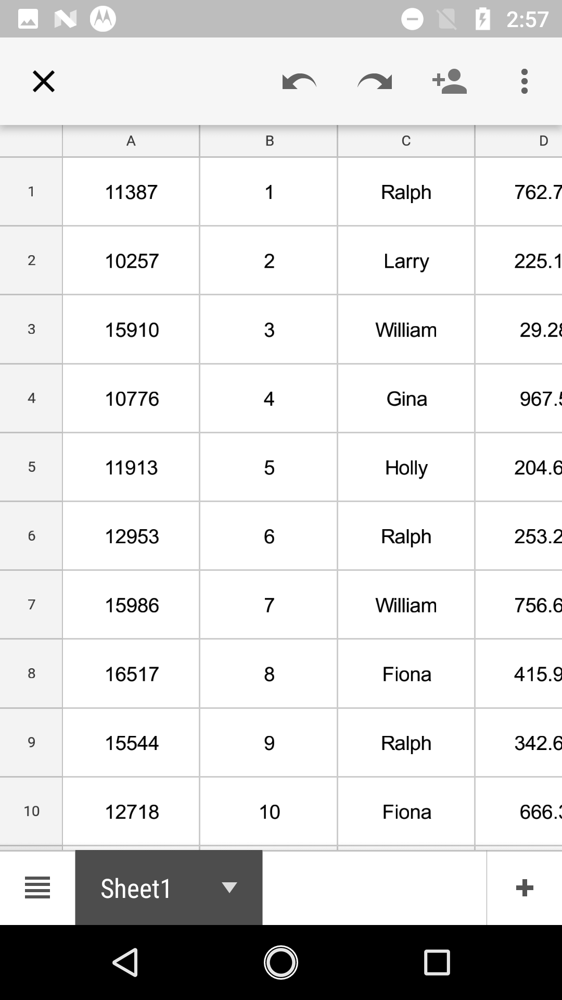
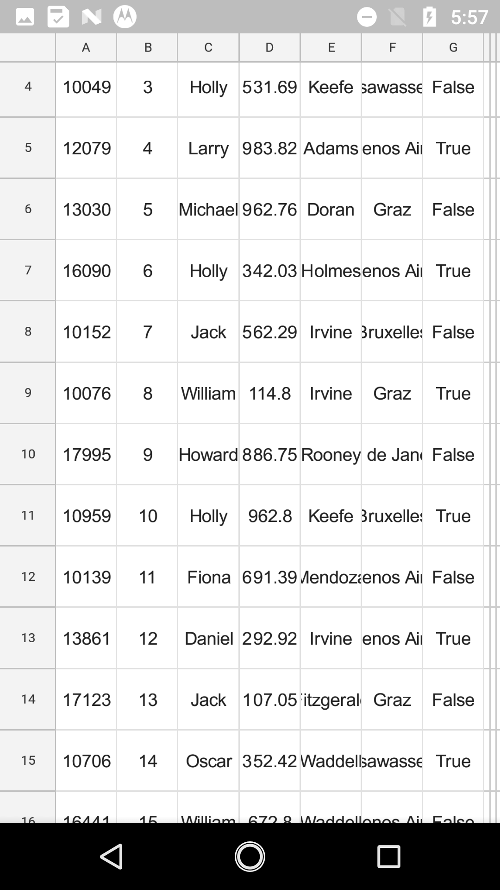

# Exporting

SfDataGrid provides support for exporting the data to Excel with several customization options like custom appearance, excluding specific columns, excluding headers, setting custom row height, setting custom column width, etc. It also provides support for [Grouping](https://help.syncfusion.com/xamarin-android/sfdatagrid/grouping), [Filtering](https://help.syncfusion.com/xamarin-android/sfdatagrid/filtering) and [Sorting](https://help.syncfusion.com/xamarin-android/sfdatagrid/sorting) when exporting.

The following assemblies needs to be added for exporting to Excel file.

<table>
<tr>
<th>Project</th>
<th>Required assembly</th>
</tr>
<tr>
<td>android</td>
<td>android\Syncfusion.SfGridConverter.Android.dll pcl\Syncfusion.Compression.Portable.dll pcl\Syncfusion.Pdf.Portable.dll pcl\Syncfusion.XlsIO.Portable.dll </td>
</tr>
</table>

The below code explains how to create and display a SfDataGrid in view.


// In MainActivity.cs

SfDataGrid sfGrid;
LinearLayout layout;
Button btn1;

protected override void OnCreate(Bundle bundle)
{
    base.OnCreate(bundle);

    sfGrid = new SfDataGrid(BaseContext);
    sfGrid.AutoGenerateColumns = false;
    sfGrid.ItemsSource = new ViewModel().OrdersInfo;

    sfGrid.Columns.Add(new GridTextColumn() { MappingName = "OrderID" });
    sfGrid.Columns.Add(new GridTextColumn() { MappingName = "FirstName" });
    sfGrid.Columns.Add(new GridTextColumn() { MappingName = "Freight", HeaderText = "Freight" });
    sfGrid.Columns.Add(new GridTextColumn() { MappingName = "LastName" });
    sfGrid.Columns.Add(new GridTextColumn() { MappingName = "ShipCity", HeaderText = "City" });
    sfGrid.Columns.Add(new GridTextColumn() { MappingName = "IsClosed" });

    btn1 = new Button(BaseContext);
    btn1.Text = "Export To Excel";
    btn1.Click += ExportToExcel_Clicked;

    layout = new LinearLayout(BaseContext);
    layout.Orientation = Orientation.Vertical;
    layout.AddView(sfGrid, LinearLayout.LayoutParams.MatchParent,1500);
    layout.AddView(btn1, LinearLayout.LayoutParams.MatchParent, 200);

    SetContentView(layout);
}


## Export to Excel

You can export data to excel by using the [ExportToExcel](http://help.syncfusion.com/cr/cref_files/xamarin-android/sfgridconverter/Syncfusion.SfGridConverter.Android~Syncfusion.SfDataGrid.Exporting.DataGridExcelExportingController~ExportToExcel.html) method by passing the `SfDataGrid` as an argument. The following code example illustrates exporting data to excel using the `ExportToExcel` method.


private void ExportToExcel_Clicked(object sender, EventArgs e)
{
    DataGridExcelExportingController excelExport = new DataGridExcelExportingController();
    var excelEngine = excelExport.ExportToExcel(this.sfGrid, new DataGridExcelExportingOption() { ExportRowHeight = false, ExportColumnWidth = false, DefaultColumnWidth = 100, DefaultRowHeight = 60 });
    var workbook = excelEngine.Excel.Workbooks[0];
    MemoryStream stream = new MemoryStream();
    workbook.SaveAs(stream);
    workbook.Close();
    excelEngine.Dispose();
    Save("DataGrid.xlsx", "application/msexcel", stream,sfGrid.Context);
}


### Exporting Options

You can also export data to excel with various customizing options while exporting the SfDataGrid by passing the grid and [DataGridExcelExportingOption](http://help.syncfusion.com/cr/cref_files/xamarin-android/sfgridconverter/Syncfusion.SfGridConverter.Android~Syncfusion.SfDataGrid.Exporting.DataGridExcelExportingOption.html) as arguments to the `ExportToExcel` method. The following code example illustrates this.


DataGridExcelExportingController excelExport = new DataGridExcelExportingController ();
DataGridExcelExportingOption exportOption = new DataGridExcelExportingOption ();
exportOption.ExportColumnWidth = false;
exportOption.DefaultColumnWidth = 150;
var excelEngine = excelExport.ExportToExcel (this.dataGrid, exportOption); 


SfDataGrid provides you with several properties in `DataGridExcelExportingOption` class to customize the grid while exporting it to excel. 

#### AllowOutlining

If you export the data grid with grouping applied, you can enable the group expand/collapse option in excel sheet, by setting [DataGridExcelExportingOption.AllowOutlining](https://help.syncfusion.com/cr/cref_files/xamarin-android/sfgridconverter/Syncfusion.SfGridConverter.Android~Syncfusion.SfDataGrid.Exporting.DataGridExcelExportingOption~AllowOutlining.html) as `true`. This property's default value is false and hence you cannot expand/collapse the group in excel sheet by default.


DataGridExcelExportingOption option = new DataGridExcelExportingOption();
option.AllowOutlining = true; 


#### AllowSortingAndFiltering

SfDataGrid allow you to export the data grid to excel with sorting and filter option enabled on column header in excel sheet by setting [DataGridExcelExportingOption.AllowSortingAndFiltering](https://help.syncfusion.com/cr/cref_files/xamarin-android/sfgridconverter/Syncfusion.SfGridConverter.Android~Syncfusion.SfDataGrid.Exporting.DataGridExcelExportingOption~AllowSortingAndFiltering.html) as `true`. This property's default value is false.


DataGridExcelExportingOption option = new DataGridExcelExportingOption();
option.AllowSortingAndFiltering = true; 


#### ApplyGridStyle

SfDataGrid allows to export the data with the applied GridStyle by setting [DataGridExcelExportingOption.ApplyGridStyle](https://help.syncfusion.com/cr/cref_files/xamarin-android/sfgridconverter/Syncfusion.SfGridConverter.Android~Syncfusion.SfDataGrid.Exporting.DataGridExcelExportingOption~ApplyGridStyle.html) as `true`. By default data will be exported without the GridStyle.


DataGridExcelExportingOption option = new DataGridExcelExportingOption();
option.ApplyGridStyle = true; 


#### DefaultColumnWidth

SfDataGrid allow you to customize the column width in excel file based on your requirement by using [DataGridExcelExportingOption.DefaultColumnWidth](https://help.syncfusion.com/cr/cref_files/xamarin-android/sfgridconverter/Syncfusion.SfGridConverter.Android~Syncfusion.SfDataGrid.Exporting.DataGridExcelExportingOption~DefaultColumnWidth.html) property. The `DefaultColumnWidth` value will be applied to all the columns in the excel sheet.


DataGridExcelExportingOption option = new DataGridExcelExportingOption();
option.DefaultColumnWidth = 100; 


#### DefaultRowHeight

SfDataGrid allow you to customize the row height in excel file based on your requirement by using [DataGridExcelExportingOption.DefaultRowHeight](https://help.syncfusion.com/cr/cref_files/xamarin-android/sfgridconverter/Syncfusion.SfGridConverter.Android~Syncfusion.SfDataGrid.Exporting.DataGridExcelExportingOption~DefaultRowHeight.html) property. The `DefaultRowHeight` value will be applied to all the rows in the excel sheet.


DataGridExcelExportingOption option = new DataGridExcelExportingOption();
option.DefaultRowHeight = 20; 


#### ExcludedColumns

By default, all the columns (including hidden columns) in SfDataGrid will be exported to Excel. If you want to exclude particular columns while exporting to excel, you can add those columns to the [DataGridExcelExportingOption.ExcludeColumns](https://help.syncfusion.com/cr/cref_files/xamarin-android/sfgridconverter/Syncfusion.SfGridConverter.Android~Syncfusion.SfDataGrid.Exporting.DataGridExcelExportingOption~ExcludedColumns.html) list.


DataGridExcelExportingOption option = new DataGridExcelExportingOption();
var list = new List<string>();
list.Add("OrderID");
list.Add("LastName");
option.ExcludedColumns = list;


### ExportColumnWidth

By default data grid columns will be exported to excel with the value of the `DataGridExcelExportingOption.DefaultColumnWidth`. But you can also export the data grid to excel with the exact column widths from the SfDataGrid by setting [DataGridExcelExportingOption.ExportColumnWidth](https://help.syncfusion.com/cr/cref_files/xamarin-android/sfgridconverter/Syncfusion.SfGridConverter.Android~Syncfusion.SfDataGrid.Exporting.DataGridExcelExportingOption~ExportColumnWidth.html) as `true`. `ExportColumnWidth` property's default value is false.


DataGridExcelExportingOption option = new DataGridExcelExportingOption();
option.ExportColumnWidth = true;


### ExportRowHeight

By default data grid rows will be exported to excel with the value of the `DataGridExcelExportingOption.DefaultRowHeight`. But you can also export the data grid to excel with the exact row heights from the SfDataGrid by setting [DataGridExcelExportingOption.ExportRowHeight](https://help.syncfusion.com/cr/cref_files/xamarin-android/sfgridconverter/Syncfusion.SfGridConverter.Android~Syncfusion.SfDataGrid.Exporting.DataGridExcelExportingOption~ExportRowHeight.html) as `true`. `ExportRowHeight` property's default value is false.


DataGridExcelExportingOption option = new DataGridExcelExportingOption();
option.ExportRowHeight = true;


#### ExcelVersion

SfDataGrid allows you to export the data to excel in specific versions based on your requirement by using [DataGridExcelExportingOption.ExcelVersion](https://help.syncfusion.com/cr/cref_files/xamarin-android/sfgridconverter/Syncfusion.SfGridConverter.Android~Syncfusion.SfDataGrid.Exporting.DataGridExcelExportingOption~ExcelVersion.html) property.


DataGridExcelExportingOption option = new DataGridExcelExportingOption();
option.ExcelVersion = Syncfusion.XlsIO.ExcelVersion.Excel2013;


#### ExportGroups

By default, all the groups in data grid will be exported to Excel sheet. If you want to export the data grid without Groups, set the [DataGridExcelExportingOption.ExportGroups](https://help.syncfusion.com/cr/cref_files/xamarin-android/sfgridconverter/Syncfusion.SfGridConverter.Android~Syncfusion.SfDataGrid.Exporting.DataGridExcelExportingOption~ExportGroups.html) property as `false`.


DataGridExcelExportingOption option = new DataGridExcelExportingOption();
option.ExportGroups = false;


* ExportGroups is true

* ExportGroups = false

#### ExportHeader

By default, column headers will be exported to Excel sheet. If you want to export the SfDataGrid without the column headers, set the [DataGridExcelExportingOption.ExportHeader](https://help.syncfusion.com/cr/cref_files/xamarin-android/sfgridconverter/Syncfusion.SfGridConverter.Android~Syncfusion.SfDataGrid.Exporting.DataGridExcelExportingOption~ExportHeader.html) as `false`.


DataGridExcelExportingOption option = new DataGridExcelExportingOption();
option.ExportHeader = false;


#### ExportTableSummary

By default, the table summaries in data grid will be exported to excel. If you want to export SfDataGrid without the table summaries, set the [DataGridExcelExportingOption.ExportTableSummary](https://help.syncfusion.com/cr/cref_files/xamarin-android/sfgridconverter/Syncfusion.SfGridConverter.Android~Syncfusion.SfDataGrid.Exporting.DataGridExcelExportingOption~ExportTableSummary.html) property as `false`.


DataGridExcelExportingOption option = new DataGridExcelExportingOption();
option.ExportTableSummary = true;


#### BottomTableSummaryStyle

SfDataGrid provides support to export the bottom TableSummary with custom style by using [DataGridExcelExportingOption.BottomTableSummaryStyle](https://help.syncfusion.com/cr/cref_files/xamarin-android/sfgridconverter/Syncfusion.SfGridConverter.Android~Syncfusion.SfDataGrid.Exporting.DataGridExcelExportingOption~BottomTableSummaryStyle.html) property.


DataGridExcelExportingOption option = new DataGridExcelExportingOption();
option.BottomTableSummaryStyle = new ExportCellStyle()
{
    BackgroundColor = Color.Yellow,
    BorderColor = Color.Red,
    ForegroundColor = Color.Red,
};


#### GroupCaptionStyle

SfDataGrid provides support to export the GroupCaptionSummaries with custom style by using [DataGridExcelExportingOption.GroupCaptionStyle](https://help.syncfusion.com/cr/cref_files/xamarin-android/sfgridconverter/Syncfusion.SfGridConverter.Android~Syncfusion.SfDataGrid.Exporting.DataGridExcelExportingOption~GroupCaptionStyle.html) property.


DataGridExcelExportingOption option = new DataGridExcelExportingOption();
option.GroupCaptionStyle = new ExportCellStyle()
{
    BackgroundColor = Color.LightGreen,
    BorderColor = Color.Gold,
    ForegroundColor = Color.Red,
};


#### HeaderStyle

SfDataGrid allow to export the column headers with custom style by using [DataGridExcelExportingOption.HeaderStyle](https://help.syncfusion.com/cr/cref_files/xamarin-android/sfgridconverter/Syncfusion.SfGridConverter.Android~Syncfusion.SfDataGrid.Exporting.DataGridExcelExportingOption~HeaderStyle.html) property.


DataGridExcelExportingOption option = new DataGridExcelExportingOption();
option.HeaderStyle = new ExportCellStyle()
{
    BackgroundColor = Color.Yellow,
    BorderColor = Color.Red,
    ForegroundColor = Color.Black,
};


#### RecordStyle

SfDataGrid allow to export the records with custom style by using [DataGridExcelExportingOption.RecordStyle](https://help.syncfusion.com/cr/cref_files/xamarin-android/sfgridconverter/Syncfusion.SfGridConverter.Android~Syncfusion.SfDataGrid.Exporting.DataGridExcelExportingOption~RecordStyle.html) property.


DataGridExcelExportingOption option = new DataGridExcelExportingOption();
option.RecordStyle = new ExportCellStyle()
{
    BackgroundColor = Color.LightGreen,
    BorderColor = Color.Gold,
    ForegroundColor = Color.Red,
};


#### TopTableSummaryStyle

SfDataGrid provides support to export the top TableSummary with custom style by using [DataGridExcelExportingOption.TopTableSummaryStyle](https://help.syncfusion.com/cr/cref_files/xamarin-android/sfgridconverter/Syncfusion.SfGridConverter.Android~Syncfusion.SfDataGrid.Exporting.DataGridExcelExportingOption~TopTableSummaryStyle.html) property.


DataGridExcelExportingOption option = new DataGridExcelExportingOption();
option.TopTableSummaryStyle = new ExportCellStyle()
{
    BackgroundColor = Color.Yellow,
    BorderColor = Color.Red,
    ForegroundColor = Color.Red,
};


#### StartColumnIndex

By default the exported SfDataGrid will start from the 0th column in the Excel sheet. But you can specify the start column in the excel sheet based on your requirement by using [DataGridExcelExportingOption.StartColumnIndex](https://help.syncfusion.com/cr/cref_files/xamarin-android/sfgridconverter/Syncfusion.SfGridConverter.Android~Syncfusion.SfDataGrid.Exporting.DataGridExcelExportingOption~StartColumnIndex.html) property.


DataGridExcelExportingOption option = new DataGridExcelExportingOption();
option.StartColumnIndex = 4;


#### StartRowIndex

By default the exported SfDataGrid will start from the 0th row in the Excel sheet. But you can specify the start row in the excel sheet based on your requirement by using [DataGridExcelExportingOption.StartRowIndex](https://help.syncfusion.com/cr/cref_files/xamarin-android/sfgridconverter/Syncfusion.SfGridConverter.Android~Syncfusion.SfDataGrid.Exporting.DataGridExcelExportingOption~StartRowIndex.html) property.


DataGridExcelExportingOption option = new DataGridExcelExportingOption();
option.StartRowIndex = 10;


  

#### ExportAllPages

While exporting to excel, when you are using SfDataPager inside the SfDataGrid, by default it will be export only the current page. However you can export all the pages by setting the [DataGridExcelExportingOption.ExportAllPages](https://help.syncfusion.com/cr/cref_files/xamarin-android/sfgridconverter/Syncfusion.SfGridConverter.Android~Syncfusion.SfDataGrid.Exporting.DataGridExcelExportingOption~ExportAllPages.html) to `true`. The default value for this property is false.


DataGridExcelExportingOption option = new DataGridExcelExportingOption();
option.ExportAllPages = true;


* ExportAllPages is false
  

* ExportAllPages is true
  

### Events

The SfDataGrid provides you the following events for exporting to excel:

* [RowExporting](http://help.syncfusion.com/cr/cref_files/xamarin-android/sfgridconverter/Syncfusion.SfGridConverter.Android~Syncfusion.SfDataGrid.Exporting.DataGridExcelExportingController~RowExporting_EV.html) – This event is raised while exporting a row at the execution time before the row is exported.
* [CellExporting](http://help.syncfusion.com/cr/cref_files/xamarin-android/sfgridconverter/Syncfusion.SfGridConverter.Android~Syncfusion.SfDataGrid.Exporting.DataGridExcelExportingController~CellExporting_EV.html) – This event is raised while exporting a cell at the execution time before the cell is exported.

#### RowExporting

The [DataGridRowExcelExportingEventHandler](http://help.syncfusion.com/cr/cref_files/xamarin-android/sfgridconverter/Syncfusion.SfGridConverter.Android~Syncfusion.SfDataGrid.Exporting.DataGridRowExcelExportingEventHandler.html) delegate allows you to customize the styles for record rows and group caption rows. The `RowExporting` event is triggered with [DataGridRowExcelExportingEventArgs](http://help.syncfusion.com/cr/cref_files/xamarin-android/sfgridconverter/Syncfusion.SfGridConverter.Android~Syncfusion.SfDataGrid.Exporting.DataGridRowExcelExportingEventArgs.html) that contains the following properties:

* [Range](http://help.syncfusion.com/cr/cref_files/xamarin-android/sfgridconverter/Syncfusion.SfGridConverter.Android~Syncfusion.SfDataGrid.Exporting.DataGridRowExcelExportingEventArgs~Range.html) – Specifies the excel range to be exported. It provides full access to the exporting cell in excel.
* [Record](http://help.syncfusion.com/cr/cref_files/xamarin-android/sfgridconverter/Syncfusion.SfGridConverter.Android~Syncfusion.SfDataGrid.Exporting.DataGridRowExcelExportingEventArgs~Record.html) – Gets the collection of underlying data objects that are exported.
* [RowType](http://help.syncfusion.com/cr/cref_files/xamarin-android/sfgridconverter/Syncfusion.SfGridConverter.Android~Syncfusion.SfDataGrid.Exporting.DataGridRowExcelExportingEventArgs~RowType.html) – Specifies the row type by using `ExportRowType` Enum. You can use this property to check the row type and apply different styles based on the row type.
* [Worksheet](http://help.syncfusion.com/cr/cref_files/xamarin-android/sfgridconverter/Syncfusion.SfGridConverter.Android~Syncfusion.SfDataGrid.Exporting.DataGridRowExcelExportingEventArgs~WorkSheet.html) – Sets the `Worksheet` properties such as sheet protection, gridlines, and so on. 

You can use this event to customize the properties of the grid rows that are exported to excel. The following code example illustrates how to change the background color of the record rows and caption summary rows while exporting.


//HandlingRowExportingEvent for exporting to excel
DataGridExcelExportingController excelExport = new DataGridExcelExportingController ();
excelExport.RowExporting += excelExport_RowExporting; 

void excelExport_RowExporting (object sender, DataGridRowExcelExportingEventArgs e)
{
    if (e.RowType == ExportRowType.Record) {
        if ((e.Record.Data as OrderInfo).IsClosed)
            e.Range.CellStyle.ColorIndex= Syncfusion.XlsIO.ExcelKnownColors.Yellow;
        else
            e.Range.CellStyle.ColorIndex= Syncfusion.XlsIO.ExcelKnownColors.LightGreen;
    }

    if (e.RowType == ExportRowType.CaptionSummary) {
        e.Range.CellStyle.ColorIndex= Syncfusion.XlsIO.ExcelKnownColors.Grey_25_percent;
    }
}


  

#### CellExporting

The [DataGridCellExcelExportingEventHandler](http://help.syncfusion.com/cr/cref_files/xamarin-android/sfgridconverter/Syncfusion.SfGridConverter.Android~Syncfusion.SfDataGrid.Exporting.DataGridCellExcelExportingEventHandler.html) delegate allows you to customize the styles for header cells, record cells and group caption cells. The `CellExporting` event is triggered with [DataGridCellExcelExportingEventArgs](http://help.syncfusion.com/cr/cref_files/xamarin-android/sfgridconverter/Syncfusion.SfGridConverter.Android~Syncfusion.SfDataGrid.Exporting.DataGridCellExcelExportingEventArgs.html) that contains the following properties:

* [CellType](http://help.syncfusion.com/cr/cref_files/xamarin-android/sfgridconverter/Syncfusion.SfGridConverter.Android~Syncfusion.SfDataGrid.Exporting.DataGridCellExcelExportingEventArgs~CellType.html) – Specifies the cell type by using `ExportCellType` `Enum`. You can use this property to check the cell type and apply different cell styles based on the cell type.
* [CellValue](http://help.syncfusion.com/cr/cref_files/xamarin-android/sfgridconverter/Syncfusion.SfGridConverter.Android~Syncfusion.SfDataGrid.Exporting.DataGridCellExcelExportingEventArgs~CellValue.html) – Contains the actual value that is exported to the excel. You can use this value to apply formatting in excel using `Range` property.
* [ColumnName](http://help.syncfusion.com/cr/cref_files/xamarin-android/sfgridconverter/Syncfusion.SfGridConverter.Android~Syncfusion.SfDataGrid.Exporting.DataGridCellExcelExportingEventArgs~ColumnName.html) – Specifies the column name (MappingName) of the exporting cell. You can apply formatting for a particular column by checking the `ColumnName`.
* [Handled](http://help.syncfusion.com/cr/cref_files/xamarin-android/sfgridconverter/Syncfusion.SfGridConverter.Android~Syncfusion.SfDataGrid.Exporting.DataGridCellExcelExportingEventArgs~Handled.html) – Determines whether the cell is exported to excel or not.
* [Range](http://help.syncfusion.com/cr/cref_files/xamarin-android/sfgridconverter/Syncfusion.SfGridConverter.Android~Syncfusion.SfDataGrid.Exporting.DataGridCellExcelExportingEventArgs~Range.html) – Specifies the excel range to be exported. It provides full access to the exporting cell in excel.
* [Record](http://help.syncfusion.com/cr/cref_files/xamarin-android/sfgridconverter/Syncfusion.SfGridConverter.Android~Syncfusion.SfDataGrid.Exporting.DataGridCellExcelExportingEventArgs~Record.html) – Gets the collection of underlying data objects that are exported. 

You can use this event to customize the properties of the grid cells that are exported to excel. The following code example illustrates how to customize the background color, foreground color and cell value of the header cells, record cells and caption summary cells while exporting.


//HandlingCellExportingEvent for exporting to excel
DataGridExcelExportingController excelExport = new DataGridExcelExportingController ();
excelExport.CellExporting += excelExport_CellExporting;  

private void ExcelExport_CellExporting(object sender, DataGridCellExcelExportingEventArgs e)
{
    if (e.CellType == ExportCellType.HeaderCell)
    {
        e.Range.CellStyle.ColorIndex = Syncfusion.XlsIO.ExcelKnownColors.White;
        e.Range.CellStyle.PatternColorIndex = Syncfusion.XlsIO.ExcelKnownColors.Red;
        e.Range.CellStyle.BeginUpdate();
        e.Range.CellStyle.Borders.LineStyle = Syncfusion.XlsIO.ExcelLineStyle.Dotted;
        e.Range.CellStyle.Borders[ExcelBordersIndex.DiagonalDown].LineStyle = ExcelLineStyle.Dash_dot_dot;
        e.Range.CellStyle.Borders[ExcelBordersIndex.DiagonalUp].LineStyle = ExcelLineStyle.Dash_dot_dot;
        e.Range.CellStyle.Borders.Color = ExcelKnownColors.Black;
        e.Range.CellStyle.EndUpdate();
    }

    if (e.CellType == ExportCellType.RecordCell)
    {
        e.Range.CellStyle.ColorIndex = Syncfusion.XlsIO.ExcelKnownColors.Yellow;
        e.Range.CellStyle.PatternColorIndex = Syncfusion.XlsIO.ExcelKnownColors.Black;
        e.Range.CellStyle.BeginUpdate();
        e.Range.CellStyle.Borders.LineStyle = Syncfusion.XlsIO.ExcelLineStyle.Dash_dot_dot;
        e.Range.CellStyle.Borders[ExcelBordersIndex.DiagonalDown].LineStyle = ExcelLineStyle.Dotted;
        e.Range.CellStyle.Borders[ExcelBordersIndex.DiagonalUp].LineStyle = ExcelLineStyle.Dotted;
        e.Range.CellStyle.Borders.Color = ExcelKnownColors.Black;
        e.Range.CellStyle.EndUpdate();
    }

    if (e.CellType == ExportCellType.GroupCaptionCell)
    {
        e.Range.CellStyle.ColorIndex = Syncfusion.XlsIO.ExcelKnownColors.Grey_25_percent;
        e.Range.CellStyle.PatternColorIndex = Syncfusion.XlsIO.ExcelKnownColors.Blue;
        e.Range.CellStyle.BeginUpdate();
        e.Range.CellStyle.Borders.LineStyle = Syncfusion.XlsIO.ExcelLineStyle.Thin;
        e.Range.CellStyle.Borders[ExcelBordersIndex.DiagonalDown].LineStyle = ExcelLineStyle.None;
        e.Range.CellStyle.Borders[ExcelBordersIndex.DiagonalUp].LineStyle = ExcelLineStyle.None;
        e.Range.CellStyle.Borders.Color = ExcelKnownColors.Black;
        e.Range.CellStyle.EndUpdate();
    }
}


  

#### Custom Borders

SfDataGrid allow to export the data to excel with custom borders style in excel sheet. This can be achieved by handling `CellExporting` event. Refer the below code snippet to customize the border style.


private void ExcelExport_CellExporting(object sender, DataGridCellExcelExportingEventArgs e)
{
    if (e.CellType == ExportCellType.RecordCell)
    {
        e.Range.CellStyle.BeginUpdate();
        e.Range.CellStyle.Borders.LineStyle = Syncfusion.XlsIO.ExcelLineStyle.Dash_dot;
        e.Range.CellStyle.Borders[ExcelBordersIndex.DiagonalDown].LineStyle = ExcelLineStyle.Dash_dot;
        e.Range.CellStyle.Borders[ExcelBordersIndex.DiagonalUp].LineStyle = ExcelLineStyle.Dash_dot_dot;
        e.Range.CellStyle.Borders.Color = ExcelKnownColors.Black;
        e.Range.CellStyle.EndUpdate();
    }
}

  

## Save a file

The below code snippet explains how to save the converted excel sheet in our local device.


public void Save(string fileName, String contentType, MemoryStream stream,Context context)
{
    string exception = string.Empty;
    string root = null;
    if (Android.OS.Environment.IsExternalStorageEmulated)
    {
        root = Android.OS.Environment.ExternalStorageDirectory.ToString();
    }
    else
        root = System.Environment.GetFolderPath(System.Environment.SpecialFolder.MyDocuments);

        Java.IO.File myDir = new Java.IO.File(root + "/Syncfusion");
        myDir.Mkdir();

        Java.IO.File file = new Java.IO.File(myDir, fileName);

        if (file.Exists())
        {
            file.Delete();
            file.CreateNewFile();
        }
        try
        {
            FileOutputStream outs = new FileOutputStream(file, false);
            outs.Write(stream.ToArray());

            outs.Flush();
            outs.Close();
        }
        catch (Exception e)
        {
            exception = e.ToString();
        }
        if (file.Exists() && contentType != "application/html")
        {
            Android.Net.Uri path = Android.Net.Uri.FromFile(file);
            string extension = Android.Webkit.MimeTypeMap.GetFileExtensionFromUrl(Android.Net.Uri.FromFile(file).ToString());
            string mimeType = Android.Webkit.MimeTypeMap.Singleton.GetMimeTypeFromExtension(extension);
            Intent intent = new Intent(Intent.ActionView);
            intent.SetDataAndType(path, mimeType);
            this.StartActivity(Intent.CreateChooser(intent, "Choose App"));
        }
}


## Exporting unbound columns

`SfDataGrid.GridUnboundColumns` will be exported as like `SfDataGrid.GridTextColumns` without any specific codes. You can customize the `SfDataGrid.GridUnboundColumns` as like `SfDataGrid.GridTextColumns` using `CellExporting` and `RowExporting` events.

The below code illustrates how to create and export unbound columns.


var unboundColumn = new GridUnboundColumn()
{
    MappingName = "Unbound",
    Expression = "OrderID",
};

sfGrid.Columns.Add(unboundColumn);


The below screenshot shows that the unbound column is exported to excel sheet along with text columns.

