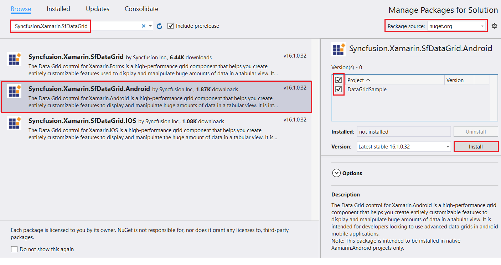
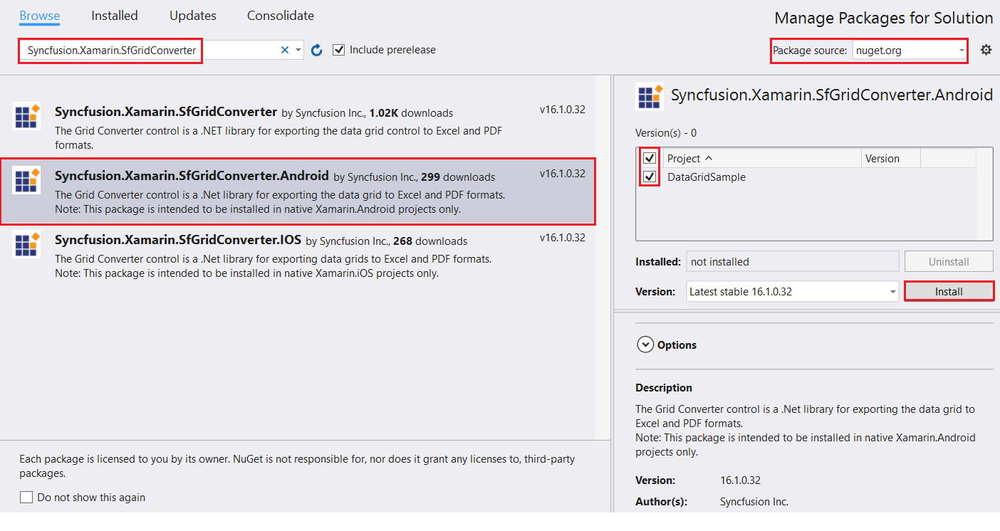
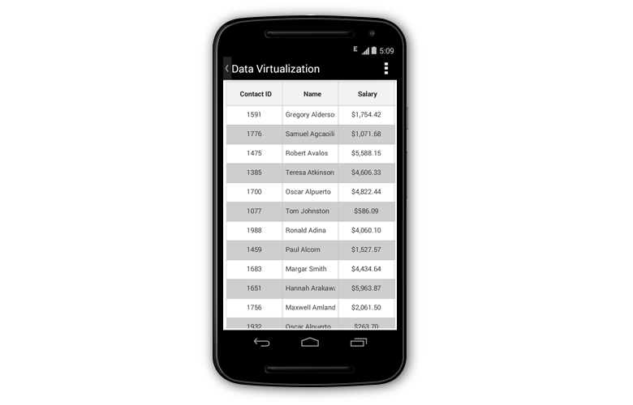
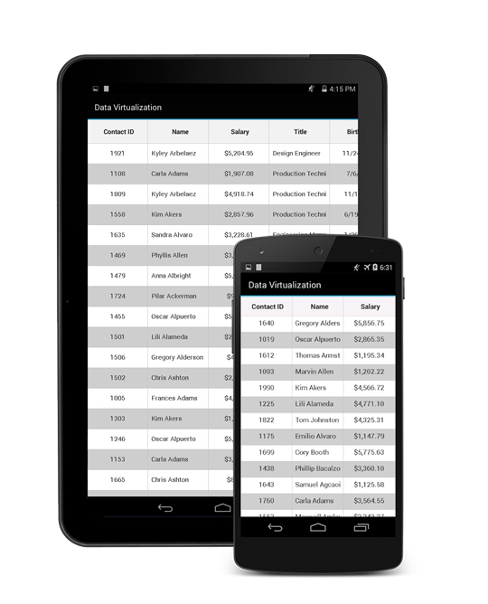
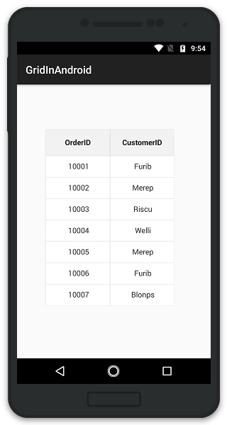

# Getting Started

This section provides a quick overview of working with the data grid for Xamarin.Android. You will walk through the entire process of creating a real world of the data grid.

## Assembly deployment

After installing Essential Studio for Xamarin, you can find all the required assemblies in the installation folders, {Syncfusion Essential Studio Installed location}\Essential Studio\{{ site.releaseversion }}\Xamarin\lib

Eg: C:\Program Files (x86)\Syncfusion\Essential Studio\{{ site.releaseversion }}\Xamarin\lib

N> Assemblies can be found in the unzipped package location on a Mac.

### Adding SfDataGrid Reference

Syncfusion Xamarin components are available in [nuget.org](https://www.nuget.org/). To add SfDataGrid to your project, open the NuGet package manager in Visual Studio, and search for [Syncfusion.Xamarin.SfDataGrid](https://www.nuget.org/packages/Syncfusion.Xamarin.SfDataGrid.Android/#), and then install it.

To know more about obtaining our components, refer to this [link](https://help.syncfusion.com/xamarin-android/introduction/download-and-installation). Also, if you prefer to manually refer the assemblies instead of NuGet, refer the list of assemblies mentioned in the table below.

<table>
<tr>
<th>Project</th>
<th>Required assemblies</th>
</tr>
<tr>
<td>Xamarin.Android</td>
<td>Syncfusion.Linq.Android.dll Syncfusion.SfDataGrid.Android.dll Syncfusion.GridCommon.Portable.dll Syncfusion.SfNumericTextBox.Android.dll </td>
</tr>
</table>

To export the SfDataGrid to Excel and PDF formats, search for [Syncfusion.Xamarin.SfGridConverter](https://www.nuget.org/packages/Syncfusion.Xamarin.SfGridConverter.Android/) in the NuGet package manager, and then install it.

If you prefer to manually refer the assemblies instead of NuGet, refer the list of assemblies mentioned in the table below.

<table>
<tr>
<th>Project</th>
<th>Required assemblies</th>
</tr>
<tr>
<td>Xamarin.Android</td>
<td>Syncfusion.SfGridConverter.Android.dll pcl\Syncfusion.Compression.Portable.dll pcl\Syncfusion.Pdf.Portable.dll pcl\Syncfusion.XlsIO.Portable.dll </td>
</tr>
</table>

## Create a simple data grid

This section explains how to create a data grid and configure it. The data grid control can be configured entirely in C# code. The following figure shows how the output will look on Android devices.

You can download the entire source code of this demo for Xamarin.Android from [here](http://files2.syncfusion.com/Xamarin.Android/Samples/DataGrid_GettingStartedAndroid.zip).
 
In this walk through, you will create a new application that contains the data grid which includes the following topics:

* [Creating the project](#creating-the-project)  
* [Adding data grid in Xamarin.Android](#adding-sfdatagrid-in-xamarinandroid) 
* [Create data model](#create-datamodel-for-the-sfdatagrid)  
* [Binding data](#binding-data-to-sfdatagrid) 
* [Defining columns](#defining-columns) 
* [Sorting](#sorting) 
* [Grouping](#grouping) 
* [Selection](#selection)

## Creating the project

Create a new Android application in Xamarin Studio or Visual Studio for Xamarin.Android.

## Adding the data grid in Xamarin.Android

1. Add the required assembly references to the project as discussed in the [Assembly deployment](#assembly-deployment) section.

2. Import the data grid control namespace Syncfusion.SfDataGrid.

3. Create an instance of the data grid control and add it as a child to the view hosted in the activity.


using Syncfusion.SfDataGrid; 

[Activity (Label = "GettingStarted", MainLauncher = true)]
public class MainActivity : Activity
{
    SfDataGrid dataGrid;
    protected override void OnCreate (Bundle bundle)
    {
        base.OnCreate (bundle);
        SetContentView (Resource.Layout.Main);
        RelativeLayout layout = (RelativeLayout)FindViewById (Resource.Id.Relative);
        dataGrid = new SfDataGrid (BaseContext);
        layout.AddView (dataGrid);
    }
}


## Create a data model for the SfDataGrid

The data grid is a data-bound control, so we must create a data model to bind it to the control. 

Create a simple data source as shown in the following code example in a new class file and save it as **OrderInfo.cs** file. 


public class OrderInfo
{
    private int orderID;
    private string customerID;
    private string customer;
    private string shipCity;
    private string shipCountry;

    public int OrderID {
        get { return orderID; }
        set { this.orderID = value; }
    }

    public string CustomerID {
        get { return customerID; }
        set { this.customerID = value; }
    }

    public string ShipCountry {
        get { return shipCountry; }
        set { this.shipCountry = value; }
    }

    public string Customer {
        get { return this.customer; }
        set { this.customer = value; }
    }

    public string ShipCity {
        get { return shipCity; }
        set { this.shipCity = value; }
    }

    public OrderInfo (int orderId, string customerId, string country, string customer, string shipCity)
    {
        this.OrderID = orderId;
        this.CustomerID = customerId;
        this.Customer = customer;
        this.ShipCountry = country;
        this.ShipCity = shipCity;
    }
} 


N> If you want your data model to respond to property changes, implement the `INotifyPropertyChanged` interface in your model class

Create a model repository class with OrderInfo collection property initialized with required number of data objects in a new class file as shown in the following code example and save it as **OrderInfoRepository.cs** file.


public class OrderInfoRepository
{
    private ObservableCollection<OrderInfo> orderInfo;
    public ObservableCollection<OrderInfo> OrderInfoCollection {
        get { return orderInfo; }
        set { this.orderInfo = value; }
    }

    public OrderInfoRepository ()
    {
        orderInfo = new ObservableCollection<OrderInfo> ();
        this.GenerateOrders ();
    }

    private void GenerateOrders ()
    {
        orderInfo.Add (new OrderInfo (1001, "Maria Anders", "Germany", "ALFKI", "Berlin"));
        orderInfo.Add (new OrderInfo (1002, "Ana Hardy", "Mexico", "ANATR", "Mexico D.F."));
        orderInfo.Add (new OrderInfo (1003, "Ant Fuller", "Mexico", "ANTON", "Mexico D.F."));
        orderInfo.Add (new OrderInfo (1004, "Thomas Hardy", "UK", "AROUT", "London"));
        orderInfo.Add (new OrderInfo (1005, "Tim Adams", "Sweden", "BERGS", "Berlin"));
        orderInfo.Add (new OrderInfo (1006, "Hanna Moos", "Germany", "BLAUS", "Mannheim"));
        orderInfo.Add (new OrderInfo (1007, "Andrew Fuller", "France", "BLONP", "Strasbourg"));
        orderInfo.Add (new OrderInfo (1008, "Martin King", "Spain", "BOLID", "Madrid"));
        orderInfo.Add (new OrderInfo (1009, "Lenny Lin", "France", "BONAP", "Marseille"));
        orderInfo.Add (new OrderInfo (1010, "John Carter", "Canada", "BOTTM", "Tsawassen"));
        orderInfo.Add (new OrderInfo (1011, "Lenny King", "UK", "AROUT", "London"));
        orderInfo.Add (new OrderInfo (1012, "Anne Wilson", "Germany", "BLAUS", "Mannheim"));
        orderInfo.Add (new OrderInfo (1013, "Ana Kyle", "France", "BLONP", "Strasbourg"));
        orderInfo.Add (new OrderInfo (1014, "Gina Irene", "UK", "AROUT", "London"));
    }
}


## Binding data to the data grid

To bind the data source of the data grid, set the [SfDataGrid.ItemsSource](http://help.syncfusion.com/cr/cref_files/xamarin-android/sfdatagrid/Syncfusion.SfDataGrid.Android~Syncfusion.SfDataGrid.SfDataGrid~ItemsSource.html) property as follows.  

The following code example binds the collection created in the previous step to the`SfDataGrid.ItemsSource` property.


OrderInfoRepository viewModel = new OrderInfoRepository ();
dataGrid.ItemsSource = viewModel.OrderInfoCollection; 


Now, run the application to render the following output.

## Defining columns

By default, the data grid automatically creates the column for all the properties in the data source. The type of the generated column depends on the type of data in the column. When the column is auto generated, handle the [SfDataGrid.AutoGeneratingColumn](http://help.syncfusion.com/cr/cref_files/xamarin-android/sfdatagrid/Syncfusion.SfDataGrid.Android~Syncfusion.SfDataGrid.SfDataGrid~AutoGeneratingColumn_EV.html) event to customize or cancel the columns before it is added to the Columns collection in the data grid.
 
Columns can also be manually defined by setting the [SfDataGrid.AutoGenerateColumns](http://help.syncfusion.com/cr/cref_files/xamarin-android/sfdatagrid/Syncfusion.SfDataGrid.Android~Syncfusion.SfDataGrid.SfDataGrid~AutoGenerateColumns.html) property to false and by adding the [GridColumn](http://help.syncfusion.com/cr/cref_files/xamarin-android/sfdatagrid/Syncfusion.SfDataGrid.Android~Syncfusion.SfDataGrid.GridColumn.html) objects to the [SfDataGrid.Columns](http://help.syncfusion.com/cr/cref_files/xamarin-android/sfdatagrid/Syncfusion.SfDataGrid.Android~Syncfusion.SfDataGrid.GridColumn.html) collection. The following code example illustrates how this can be done. 


dataGrid.AutoGenerateColumns = false;

GridTextColumn orderIdColumn = new GridTextColumn ();
orderIdColumn.MappingName = "OrderID";
orderIdColumn.HeaderText = "Order ID";

GridTextColumn customerIdColumn = new GridTextColumn ();
customerIdColumn.MappingName = "CustomerID";
customerIdColumn.HeaderText = "Customer ID";

GridTextColumn customerColumn = new GridTextColumn ();
customerColumn.MappingName = "Customer";
customerColumn.HeaderText = "Customer";

GridTextColumn countryColumn = new GridTextColumn ();
countryColumn.MappingName = "ShipCountry";
countryColumn.HeaderText = "Ship Country";

dataGrid.Columns.Add (orderIdColumn);
dataGrid.Columns.Add (customerIdColumn);
dataGrid.Columns.Add (customerColumn);
dataGrid.Columns.Add (countryColumn); 


## Sorting

The data grid applies sorting to its data by setting the [SfDataGrid.AllowSorting](http://help.syncfusion.com/cr/cref_files/xamarin-android/sfdatagrid/Syncfusion.SfDataGrid.Android~Syncfusion.SfDataGrid.SfDataGrid~AllowSorting.html) property to true.
 

dataGrid.AllowSorting = true; 


Run the application and touch the header cell to sort the data and the following output will be displayed.
 

You can also configure sorting by adding the column to the [SfDataGrid.SortColumnDescriptions](http://help.syncfusion.com/cr/cref_files/xamarin-android/sfdatagrid/Syncfusion.SfDataGrid.Android~Syncfusion.SfDataGrid.SfDataGrid~SortColumnDescriptions.html) collection as follows.


dataGrid.SortColumnDescriptions.Add (new SortColumnDescription () { ColumnName = "CustomerID" });


## Grouping

The data grid allows grouping a column by adding the column to the [SfDataGrid.GroupColumnDescriptions](http://help.syncfusion.com/cr/cref_files/xamarin-android/sfdatagrid/Syncfusion.SfDataGrid.Android~Syncfusion.SfDataGrid.SfDataGrid~SortColumnDescriptions.html) collection as follows.


dataGrid.GroupColumnDescriptions.Add (new GroupColumnDescription () { ColumnName = "Product" });


Run the application to render the following output. 

## Selection

The data grid allows selecting the row or rows by setting the [SfDataGrid.SelectionMode](http://help.syncfusion.com/cr/cref_files/xamarin-android/sfdatagrid/Syncfusion.SfDataGrid.Android~Syncfusion.SfDataGrid.SfDataGrid~SelectionMode.html) property. You can set the `SfDataGrid.SelectionMode` property to single, multiple, single deselect, or none. Information about the selected row or rows can be tracked using the [SfDataGrid.SelectedItem](http://help.syncfusion.com/cr/cref_files/xamarin-android/sfdatagrid/Syncfusion.SfDataGrid.Android~Syncfusion.SfDataGrid.SfDataGrid~SelectedItem.html) and [SfDataGrid.SelectedItems](http://help.syncfusion.com/cr/cref_files/xamarin-android/sfdatagrid/Syncfusion.SfDataGrid.Android~Syncfusion.SfDataGrid.SfDataGrid~SelectedItems.html) properties.

You can handle the selection operations with the help of the [SelectionChanging](http://help.syncfusion.com/cr/cref_files/xamarin-android/sfdatagrid/Syncfusion.SfDataGrid.Android~Syncfusion.SfDataGrid.SfDataGrid~SelectionChanging_EV.html) and [SelectionChanged](http://help.syncfusion.com/cr/cref_files/xamarin-android/sfdatagrid/Syncfusion.SfDataGrid.Android~Syncfusion.SfDataGrid.SfDataGrid~SelectionChanging_EV.html) events of the data grid.

## Loading the data grid with customized height and width

The data grid can be loaded with specific height and width inside different layouts by specifying the height and width of the data grid when adding it as a child to its parent.

The following code example illustrates how this can be done.


protected override void OnCreate(Bundle bundle)
{
    base.OnCreate(bundle);
    linearLayout = new LinearLayout(this);
    datagrid = new SfDataGrid(this);
    viewModel = new ViewModel();
    datagrid.ItemsSource = viewModel.OrdersInfo;
    //To place SfDataGrid at center position, padding has been set.
    linearLayout.SetPadding(80, 250, 0, 0);
    linearLayout.AddView(datagrid, 500, 500);
    SetContentView(linearLayout);
} 


The following screenshot shows how the data grid is loaded with specific height and width.

