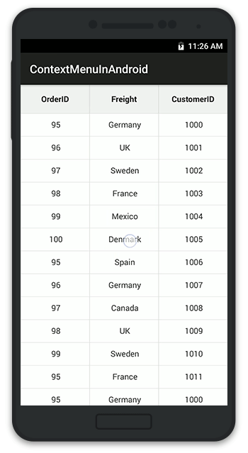

# Grid Events

## GridTapped event

The event will be triggered whenever you tap the SfDataGrid with [GridTappedEventsArgs](https://help.syncfusion.com/cr/cref_files/xamarin-android/sfdatagrid/Syncfusion.SfDataGrid.Android~Syncfusion.SfDataGrid.GridTappedEventsArgs.html) that contains the following properties.

* [RowIndex](https://help.syncfusion.com/cr/cref_files/xamarin-android/sfdatagrid/Syncfusion.SfDataGrid.Android~Syncfusion.SfDataGrid.GridTappedEventsArgs~RowColumnIndex.html) - Gets the row index of the row on which you tapped
* [ColumnIndex](https://help.syncfusion.com/cr/cref_files/xamarin-android/sfdatagrid/Syncfusion.SfDataGrid.Android~Syncfusion.SfDataGrid.GridTappedEventsArgs~RowColumnIndex.html) - Gets the column index of the column on which you tapped
* [RowData](https://help.syncfusion.com/cr/cref_files/xamarin-android/sfdatagrid/Syncfusion.SfDataGrid.Android~Syncfusion.SfDataGrid.GridTappedEventsArgs~RowData.html) - Gets the row data of the row on which you tapped

The following code illustrates how to hook the `GridTapped` event and get the row and column details based on where you tapped on SfDataGrid.


dataGrid.GridTapped += DataGrid_GridTapped;

private void DataGrid_GridTapped(object sender, GridTappedEventsArgs e)
{
    var rowIndex = e.RowColumnIndex.RowIndex;
    var rowData = e.RowData;
    var columnIndex = e.RowColumnIndex.ColumnIndex;
}


## GridDoubleTapped event

The event will be triggered whenever you double tap the SfDataGrid with [GridDoubleTappedEventsArgs](https://help.syncfusion.com/cr/cref_files/xamarin-android/sfdatagrid/Syncfusion.SfDataGrid.Android~Syncfusion.SfDataGrid.GridDoubleTappedEventsArgs.html) that contains the following properties. 

* [RowIndex](https://help.syncfusion.com/cr/cref_files/xamarin-android/sfdatagrid/Syncfusion.SfDataGrid.Android~Syncfusion.SfDataGrid.GridDoubleTappedEventsArgs~RowColumnIndex.html) - Gets the row index of the row on which you double tapped
* [ColumnIndex](https://help.syncfusion.com/cr/cref_files/xamarin-android/sfdatagrid/Syncfusion.SfDataGrid.Android~Syncfusion.SfDataGrid.GridDoubleTappedEventsArgs~RowColumnIndex.html) - Gets the column index of the column on which you double tapped
* [RowData](https://help.syncfusion.com/cr/cref_files/xamarin-android/sfdatagrid/Syncfusion.SfDataGrid.Android~Syncfusion.SfDataGrid.GridDoubleTappedEventsArgs~RowData.html) - Gets the row data of the row on which you double tapped

The following code illustrates how to hook the `GridDoubleTapped` event and get the row and column details based on where you double tapped on SfDataGrid.


dataGrid.GridDoubleTapped += DataGrid_GridDoubleTapped;

private void DataGrid_GridDoubleTapped(object sender, GridDoubleTappedEventsArgs e)
{
    var rowIndex = e.RowColumnIndex.RowIndex;
    var rowData = e.RowData;
    var columnIndex = e.RowColumnIndex.ColumnIndex;
}


## GridLongPressed event

The event will be triggered whenever you long press the SfDataGrid with [GridLongPressedEventsArgs](https://help.syncfusion.com/cr/cref_files/xamarin-android/sfdatagrid/Syncfusion.SfDataGrid.Android~Syncfusion.SfDataGrid.GridLongPressedEventsArgs.html) that contains the following properties.

* [RowIndex](https://help.syncfusion.com/cr/cref_files/xamarin-android/sfdatagrid/Syncfusion.SfDataGrid.Android~Syncfusion.SfDataGrid.GridLongPressedEventsArgs~RowColumnIndex.html) - Gets the row index of the row on which you long pressed
* [ColumnIndex](https://help.syncfusion.com/cr/cref_files/xamarin-android/sfdatagrid/Syncfusion.SfDataGrid.Android~Syncfusion.SfDataGrid.GridLongPressedEventsArgs~RowColumnIndex.html) - Gets the column index of the column on which you long pressed
* [RowData](https://help.syncfusion.com/cr/cref_files/xamarin-android/sfdatagrid/Syncfusion.SfDataGrid.Android~Syncfusion.SfDataGrid.GridLongPressedEventsArgs~RowData.html) - Gets the row data of the row on which you long pressed

The following code illustrates how to hook the `GridLongPressed` event and get the row and column details based on where you long pressed on SfDataGrid. 


dataGrid.GridLongPressed += DataGrid_GridLongPressed;

private void DataGrid_GridLongPressed(object sender, GridLongPressedEventsArgs e)
{
    var rowIndex = e.RowColumnIndex.RowIndex;
    var rowData = e.RowData;
    var columnIndex = e.RowColumnIndex.ColumnIndex;
}


## GridViewCreated event

The event will be triggered once the [SfDataGrid.View](https://help.syncfusion.com/cr/cref_files/xamarin-android/sfdatagrid/Syncfusion.SfDataGrid.Android~Syncfusion.SfDataGrid.SfDataGrid~View.html) is created with [GridViewCreatedEventArgs](https://help.syncfusion.com/cr/cref_files/xamarin-android/sfdatagrid/Syncfusion.SfDataGrid.Android~Syncfusion.SfDataGrid.GridViewCreatedEventArgs.html).

The following code illustrates how to hook the `GridViewCreated` event and how to set alternate row colors in SfDataGrid.


dataGrid.GridViewCreated += DataGrid_GridViewCreated;

private void DataGrid_GridViewCreated(object sender, GridViewCreatedEventArgs e)
{
    (sender as SfDataGrid).GridStyle = new CustomGridStyle();    
}

internal class CustomGridStyle : DataGridStyle
{
    public override Color GetAlternatingRowBackgroundColor()
    {
        return Color.Aqua;
    }
}


## GridLoaded event

The event will be triggered once the components in the SfDataGrid are initialized and rendered with [GridLoadedEventArgs](https://help.syncfusion.com/cr/cref_files/xamarin-android/sfdatagrid/Syncfusion.SfDataGrid.Android~Syncfusion.SfDataGrid.GridLoadedEventArgs.html).

The following code illustrates how to hook the `GridLoaded` event and how to show the `ProgressDialog` until the grid comes to view.


dataGrid.GridLoaded += DataGrid_GridLoaded;

private async void DataGrid_GridLoaded(object sender, GridLoadedEventArgs e)
{
    ProgressDialog progressDialog = ProgressDialog.Show(this, "Please wait...","Loading the source..");
    await Task.Delay(2000);
    progressDialog.Hide();
}


## Create custom Context Menu using Grid Events

SfDataGrid allows you to display any custom view like a context menu that can act similar to a pop using the `GridLongPressed` event and `GridTapped` event.

The following code illustrates how to create a custom context menu using Grid events.


public class MainActivity : Activity
{
    LinearLayout contextMenu;
    Button sortButton;
    Button clearSortButton;
    SfDataGrid dataGrid;
    ViewModel viewModel;
    RelativeLayout relativeLayout;
    private bool isContextMenuDisplayed = false;
    private string currentColumnName;
       
    protected override void OnCreate(Bundle bundle)
    {
        base.OnCreate(bundle);
        dataGrid = new SfDataGrid(this);
        viewModel = new ViewModel();
        relativeLayout = new RelativeLayout(this);
        // Creates the view for the ContextMenu
        CreateContextMenu();
        dataGrid.ColumnSizer = ColumnSizer.Star;
        dataGrid.ItemsSource = viewModel.Collection;
        dataGrid.AutoGenerateColumns = true;
        dataGrid.GridLongPressed += DataGrid_GridLongPressed;
        dataGrid.GridTapped += DataGrid_GridTapped;
        relativeLayout.AddView(dataGrid);               
        SetContentView (relativeLayout);
    }

    public void CreateContextMenu()
    {
        contextMenu = new LinearLayout(this);
        contextMenu.Orientation = Orientation.Vertical;

        sortButton = new Button(this);
        sortButton.Text = "Sort";
        sortButton.SetBackgroundColor(Color.Black);
        sortButton.SetTextColor(Color.White);
        sortButton.Touch += SortButton_Touch;

        clearSortButton = new Button(this);
        clearSortButton.Text = "Clear sort";
        clearSortButton.SetBackgroundColor(Color.Black);
        clearSortButton.SetTextColor(Color.White);
        clearSortButton.Touch += ClearSortButton_Touch;

        // A custom view hosting two buttons are now created
        contextMenu.AddView(sortButton);
        contextMenu.AddView(clearSortButton);

        var sortButtonLayoutParams = (LinearLayout.LayoutParams)sortButton.LayoutParameters;
        sortButtonLayoutParams.BottomMargin = 20;
        var clearSortButtonLayoutParams = (LinearLayout.LayoutParams)clearSortButton.LayoutParameters;
        clearSortButtonLayoutParams.TopMargin = 20;
    }

    // Removes the sorting applied to the SfDataGrid
    private void ClearSortButton_Touch(object sender, Android.Views.View.TouchEventArgs e)
    {
        relativeLayout.RemoveView(contextMenu);
        isContextMenuDisplayed = false;
        dataGrid.SortColumnDescriptions.Clear();
    }
        
    // Sorts the SfDataGrid data based on the column selected in the context menu
    private void SortButton_Touch(object sender, Android.Views.View.TouchEventArgs e)
    {
        relativeLayout.RemoveView(contextMenu);
        isContextMenuDisplayed = false;
        dataGrid.SortColumnDescriptions.Clear();
        dataGrid.SortColumnDescriptions.Add(new SortColumnDescription()
        {
            ColumnName = currentColumnName
        });
        }

    private void DataGrid_GridLongPressed(object sender, GridLongPressedEventArgs e)
    {
        if (!isContextMenuDisplayed)
        {
            currentColumnName = dataGrid.Columns[e.RowColumnIndex.ColumnIndex].MappingName;
            var point = dataGrid.RowColumnIndexToPoint(e.RowColumnIndex);
            contextMenu.SetX(point.X);
            contextMenu.SetY(point.Y);
            // Display the ContextMenu when the SfDataGrid is long pressed
            relativeLayout.AddView(contextMenu,330,400);
            isContextMenuDisplayed = true;
        }
        else
        {
            // Hides the context menu when SfDataGrid is long pressed when the context menu is already visible in screen
            relativeLayout.RemoveView(contextMenu);
            isContextMenuDisplayed = false;
        }
    }

    private void DataGrid_GridTapped(object sender, GridTappedEventArgs e)
    {
        // Hides the context menu when SfDataGrid is tapped anywhere outside the context menu view
        relativeLayout.RemoveView(contextMenu); 
        isContextMenuDisplayed = false;
    }
}


Please refer the below GIF for the final rendering on execution of the above code example.

