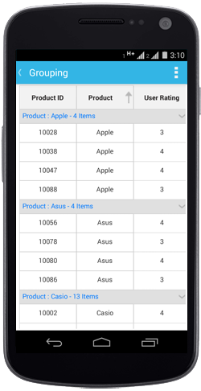

# Grouping 

A group represents a collection of records that belong to a particular category. When grouping is applied, the data is organized into a hierarchical structure based on matching field values. The records having identical values in the grouped column are combined to form a group. Each group is identified by its `CaptionSummaryRow` to get the underlying records in view.

## Programmatic Grouping

SfDataGrid also allows to perform grouping from the code by defining the [GroupColumnDescription](http://help.syncfusion.com/cr/cref_files/xamarin/sfdatagrid/Syncfusion.SfDataGrid.XForms~Syncfusion.SfDataGrid.XForms.GroupColumnDescription.html) object and adding it in the [SfDataGrid.GroupColumnDescriptions](http://help.syncfusion.com/cr/cref_files/xamarin/sfdatagrid/Syncfusion.SfDataGrid.XForms~Syncfusion.SfDataGrid.XForms.SfDataGrid~GroupColumnDescriptions.html) collection. SfDataGrid groups the data based on the `GroupColumnDescription` object that is added to this collection.

`GroupColumnDescription` object holds following two properties:

* ColumnName: Name of the grouped column.
* Converter: Get the `IValueConverter` as input that helps to apply the custom grouping.

The following code example illustrates how to apply grouping by a column in SfDataGrid.


    dataGrid.GroupColumnDescriptions.Add (new GroupColumnDescription () {
    ColumnName = "CustomerID",
}); 


The following screenshot shows the output rendered when grouping is applied.

## Expand groups while grouping
 
You can expand all the groups while grouping by setting [SfDataGrid.AutoExpandGroups](http://help.syncfusion.com/cr/cref_files/xamarin/sfdatagrid/Syncfusion.SfDataGrid.XForms~Syncfusion.SfDataGrid.XForms.SfDataGrid~AutoExpandGroups.html) to `true`. So, when user group any column, then all groups will be in expanded state. 



<syncfusion:SfDataGrid  x:Name="dataGrid"
                        AutoExpandGroups="True"
                        AllowGroupExpandCollapse="True"
                        ItemsSource="{Binding Orders}"/>


this.dataGrid.AutoExpandGroups = true;
this.dataGrid.AllowGroupExpandCollapse = true;



## Expand or collapse the groups

By default, the groups will be in expanded state in a SfDataGrid. However, you can expand or collapse a group in runtime by setting the `SfDataGrid.AllowGroupExpandCollapse` as `true`.



<syncfusion:SfDataGrid  x:Name="dataGrid"
                        AllowGroupExpandCollapse="True"
                        ItemsSource="{Binding Orders}"/>
                       


this.dataGrid.AllowGroupExpandCollapse = true;



### Programmatically expanding or collapsing the groups

You can allow end-user to expand or collapse the groups programmatically at runtime.

#### Expand or collapse all the Groups

You can expand or collapse all the groups at programmatically at runtime by using `SfDataGrid.ExpandAllGroup` and `SfDataGrid.CollpaseAllGroup` methods.



this.dataGrid.ExpandAllGroup();
this.dataGrid.CollapseAllGroup();



#### Expand or Collapse the specific Group

You can expand or collapse specific group by using `SfDataGrid.ExpandGroup` and `SfDataGrid.CollapseGroup` methods.



var group = (dataGrid.View.Groups[0] as Group);
this.dataGrid.ExpandGroup(group);
this.dataGrid.CollapseGroup(group);



## Custom Grouping

SfDataGrid allows you to group a column based on custom logic when the standard grouping techniques do not meet the requirements. To achieve the CustomGrouping, you need to write a converter that implements `IValueConverter` with your CustomGrouping logic and assign that converter to the [GroupColumnDescription.Converter](http://help.syncfusion.com/cr/cref_files/xamarin/sfdatagrid/Syncfusion.SfDataGrid.XForms~Syncfusion.SfDataGrid.XForms.GroupColumnDescription~Converter.html) property.

The following code example illustrates how to set the custom grouping converter for the group description that is added to group the Freight column.


dataGrid.GroupColumnDescriptions.Add (new GroupColumnDescription () {
    ColumnName = "Freight",
    Converter = new GroupConverter()
}); 


The following code example illustrates the converter used for applying CustomGrouping logic.


public class GroupConverter : IValueConverter
{
    public GroupConverter()
    {
        
    }

    public object Convert(object value, Type targetType, object parameter, CultureInfo culture)
    {
        var orderInfo = value as OrderInfo;
        if (orderInfo.Freight > 0 && orderInfo.Freight <= 250)
            return "<=250";
        else if (orderInfo.Freight > 250 && orderInfo.Freight <= 500)
            return ">250 & <=500";
        else if (orderInfo.Freight > 500 && orderInfo.Freight <= 750)
            return ">500 & <=750";
        else
            return ">1000";
    }

    public object ConvertBack(object value, Type targetType, object parameter, CultureInfo culture)
    {
        return null;
    }
}


## Events

### GroupExpanding event

The `SfDataGrid.GroupExpanding` event occurs when the group is being expanded.
 
The `GroupChangingEventArgs` of the `GroupExpanding` event provides the information about the expanding group and it has the following members.

`Syncfusion.Data.Group` - Gets the group that’s being expanded.

`Cancel` – Decides whether to cancel the group expansion.
 
You can cancel the group expansion by setting [GroupChangingEventArgs.Cancel](http://msdn.microsoft.com/query/dev10.query?appId=Dev10IDEF1&l=EN-US&k=k(System.ComponentModel.CancelEventArgs.Cancel)&rd=true) to `true`.



this.dataGrid.GroupExpanding += dataGrid_GroupExpanding;

void dataGrid_GroupExpanding(object sender, Syncfusion.SfDataGrid.XForms.GroupChangingEventArgs e)
{
    if (e.Group.Key.Equals(1001))    
        e.Cancel = true;    
}       



### GroupExpanded event

The `SfDataGrid.GroupExpanded` event occurs after the group is expanded.

The `GroupChangedEventArgs` of the `GroupExpanded` event provides the information about the expanded group and it has the following member.

`Syncfusion.Data.Group` - Gets the expanded group.

### GroupCollapsing event 

The `SfDataGrid.GroupCollapsing` event occurs when the group is being collapsed.

The `GroupChangingEventArgs` of the `GroupCollapsing` event provides the information about the collapsing group and it contains the following member.

`Syncfusion.Data.Group` - Gets the group that’s being collapsed.

`Cancel` – Decides whether to cancel the group collapsing.

You can cancel the group is being collapsed by using [GroupChangingEventArgs.Cancel](http://msdn.microsoft.com/query/dev10.query?appId=Dev10IDEF1&l=EN-US&k=k(System.ComponentModel.CancelEventArgs.Cancel)&rd=true) of `GroupCollapsing` event.



this.dataGrid.GroupCollapsing += dataGrid_GroupCollapsing;

void dataGrid_GroupCollapsing(object sender, Syncfusion.SfDataGrid.XForms.GroupChangingEventArgs e)
{
    if (e.Group.Key.Equals(1001))    
        e.Cancel = true;    
}



### GroupCollapsed event
 
The `SfDataGrid.GroupCollapsed` event occurs after the group is collapsed.
 
`GroupChangedEventArgs` of the `GroupCollapsed` event  provides the information about collapsed group and it contains the following member.

`Syncfusion.Data.Group` - Gets the collapsed group.

## How To

### How to hide the grouped column in SfDataGrid?

In SfDataGrid a column will be generated with the default column width by default. In order to group by a column that should not be visible in view, add the column to the [SfDataGrid.Columns](http://help.syncfusion.com/cr/cref_files/xamarin/sfdatagrid/Syncfusion.SfDataGrid.XForms~Syncfusion.SfDataGrid.XForms.SfDataGrid~Columns.html) collection and set its width as 0. Thus the column will be grouped and will not be visually seen. Please refer the below code example.


dataGrid.Columns.Add (new GridTextColumn () { 
    MappingName = "ShippingDate",
    Width = 0
});

dataGrid.GroupColumnDescriptions.Add (new GroupColumnDescription () { 
    ColumnName = "ShippingDate"
});


