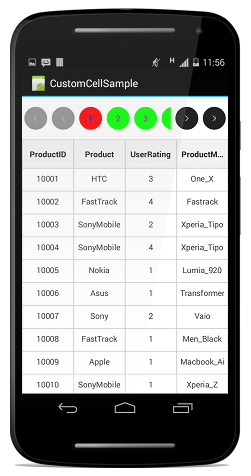

# Paging

The SfDataGrid provides interactive support to manipulate data using the [SfDataPager](http://help.syncfusion.com/cr/cref_files/xamarin-android/sfdatagrid/Syncfusion.SfDataGrid.Android~Syncfusion.SfDataGrid.DataPager_namespace.html) control. It also provides built-in options to page data on demand when dealing with large volumes of data. SfDataGrid lets you to place the `SfDataPager` above or below it as per your requirement which lets you to easily manage the data paging.

To use the paging functionality in SfDataGrid add the below namespace to your project.
`Syncfusion.SfDataGrid.DataPager`

## Normal Paging

SfDataGrid performs paging of data using the `SfDataPager`. Follow the below procedure to enable paging in SfDataGrid.

* Create a new SfDataPager instance and bind the data collection to the [SfDataPager.Source](http://help.syncfusion.com/cr/cref_files/xamarin-android/sfdatagrid/Syncfusion.SfDataGrid.Android~Syncfusion.SfDataGrid.DataPager.SfDataPager~Source.html) property based on which [SfDataPager.PagedSource](http://help.syncfusion.com/cr/cref_files/xamarin-android/sfdatagrid/Syncfusion.SfDataGrid.Android~Syncfusion.SfDataGrid.DataPager.SfDataPager~PagedSource.html) is created internally. 
* Bind the `PagedSource` property to the [ItemsSource](http://help.syncfusion.com/cr/cref_files/xamarin-android/sfdatagrid/Syncfusion.SfDataGrid.Android~Syncfusion.SfDataGrid.SfDataGrid~ItemsSource.html) of the SfDataGrid. 
* Set the number of rows to be displayed in a page by setting the [SfDataPager.PageSize](http://help.syncfusion.com/cr/cref_files/xamarin-android/sfdatagrid/Syncfusion.SfDataGrid.Android~Syncfusion.SfDataGrid.DataPager.SfDataPager~PageSize.html) property.
* Set the number of buttons that need to be displayed in view by setting the [SfDataPager.NumericButtonCount](http://help.syncfusion.com/cr/cref_files/xamarin-android/sfdatagrid/Syncfusion.SfDataGrid.Android~Syncfusion.SfDataGrid.DataPager.SfDataPager~NumericButtonCount.html) property.

N> The `SfDataPager.PageSize` property should not be assigned with a value of 0.

The following code example shows how to implement paging in SfDataGrid for Xamarin.Android.


public class MainActivity : Activity
{
   SfDataGrid sfGrid;
   PagingViewModel viewModel;
   SfDataPager sfDataPager;
  
   protected override void OnCreate(Bundle bundle)
   {
      base.OnCreate(bundle);
      LinearLayout linearLayout = new LinearLayout(this);
      linearLayout.Orientation = Orientation.Vertical;
      sfDataPager = new SfDataPager(this);
      sfGrid = new SfDataGrid(this);
      viewModel = new PagingViewModel();
      sfDataPager.PageSize = 15;
      sfDataPager.Source =  viewModel.OrdersInfo;
      sfDataPager.NumericButtonCount = 20;
      sfGrid.AutoGeneratingColumn += GridGenerateColumns;
      sfGrid.ItemsSource = sfDataPager.PagedSource;

      linearLayout.AddView(sfDataPager, new ViewGroup.LayoutParams(ViewGroup.LayoutParams.MatchParent,    
      (int)SfDataGridHelpers.ConvertDpToPixels(this.sfGrid, 75)));
      linearLayout.AddView(sfGrid);
      SetContentView(linearLayout);
}


The following screenshot shows the final outcome upon execution of the above code 

N> `SfDataPager` provides the scrolling animation, while taping the [FirstPageButton](http://help.syncfusion.com/cr/cref_files/xamarin-android/sfdatagrid/Syncfusion.SfDataGrid.Android~Syncfusion.SfDataGrid.DataPager.NavigationButtons.html) or [LastPageButton](http://help.syncfusion.com/cr/cref_files/xamarin-android/sfdatagrid/Syncfusion.SfDataGrid.Android~Syncfusion.SfDataGrid.DataPager.NavigationButtons.html) button.

## On Demand Paging	
In normal Paging, data collection is entirely loaded initially to the `SfDataPager`. However, SfDataGrid also allows you to load the data for the current page dynamically by setting the set [SfDataPager.UseOnDemandPaging](http://help.syncfusion.com/cr/cref_files/xamarin-android/sfdatagrid/Syncfusion.SfDataGrid.Android~Syncfusion.SfDataGrid.DataPager.SfDataPager~UseOnDemandPaging.html) to `true`.

To load current page item dynamically you must hook the [OnDemandLoading](http://help.syncfusion.com/cr/cref_files/xamarin-android/sfdatagrid/Syncfusion.SfDataGrid.Android~Syncfusion.SfDataGrid.DataPager.SfDataPager~OnDemandLoading_EV.html) event. In the `OnDemandLoading` event, use the[LoadDynamicItems](http://help.syncfusion.com/cr/cref_files/xamarin-android/sfdatagrid/Syncfusion.SfDataGrid.Android~Syncfusion.SfDataGrid.DataPager.SfDataPager~LoadDynamicItems.html) method to load the data for the corresponding page in `SfDataPager`.

The `OnDemandLoading` event is triggered when the pager moves to the corresponding page. The `OnDemandLoading` event contains the following event arguments:

* [StartIndex](http://help.syncfusion.com/cr/cref_files/xamarin-android/sfdatagrid/Syncfusion.SfDataGrid.Android~Syncfusion.SfDataGrid.DataPager.OnDemandLoadingEventArgs~StartIndex.html): Corresponding page start index.
* [PageSize](http://help.syncfusion.com/cr/cref_files/xamarin-android/sfdatagrid/Syncfusion.SfDataGrid.Android~Syncfusion.SfDataGrid.DataPager.OnDemandLoadingEventArgs~PageSize.html): Number of items to be loaded for that page.

The following code example illustrates how to load data for the DataPager control dynamically.


private void OnDemandPageLoading(object sender, OnDemandLoadingEventArgs args)
{
   sfDataPager.LoadDynamicItems(args.StartIndex, source.Skip(args.StartIndex).Take(args.PageSize));
}


N> In OnDemandPaging, you cannot assign a value for the Source property in SfDataPager.

When you use `OnDemandPaging`, `SfDataPager.PagedSource` loads only the current page data. Upon navigation to another page, `OnDemandLoading` event is fired which loads another set of data but maintains the previous page data also. When you navigate to previous page again, OnDemandLoading event is not fired and the required data is loaded which was maintained in cache. However for further performance enhancement if you don’t want to maintain the previous page data, you can call [Syncfusion.Data.PagedCollectionView.ResetCache()](https://help.syncfusion.com/cr/cref_files/xamarin-android/linq/Syncfusion.Linq.Android~Syncfusion.Data.PagedCollectionView~ResetCache.html) in `OnDemandLoading` event. ResetCache method call resets the cache except current page.

The following code example illustrates how to use ResetCache method:


private void OnDemandPageLoading(object sender, OnDemandLoadingEventArgs args)
{
  sfDataPager.LoadDynamicItems(args.StartIndex, source.Skip(args.StartIndex).Take(args.PageSize));
  (sfDataPager.PagedSource as PagedCollectionView).ResetCache();
}


## Custom Appearance

The following code example shows how to implement paging with custom appearance in SfDataGrid.


sfDataPager.AppearanceManager = new CustomAppearance();



public class CustomAppearance : AppearanceManager
{
    public override Color GetNavigationButtonBackgroundColor()
    {
        return Color.Rgb(34, 34, 34);
    }
    public override Color GetNumericButtonBackgroundColor()
    {
        return Color.Rgb(0, 255, 0);
    }
    public override Color GetNumericButtonForegroundColor()
    {
        return Color.Rgb(82, 82, 82);
    }
    public override Color GetNumericButtonSelectionBackgroundColor()
    {
        return Color.Rgb(255, 0, 0);
    }
    public override Color GetNumericButtonSelectionForegroundColor()
    {
        return Color.Rgb(0, 0, 255);
    }
}


The following screenshot shows the final outcome upon execution of the above code 

