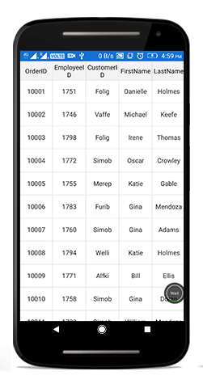
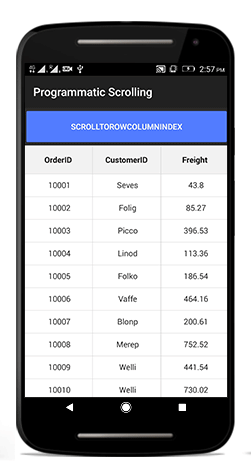
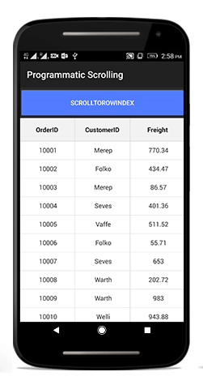
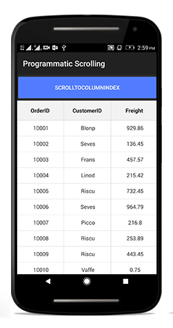

# Scrolling 

## ScrollingMode

SfDataGrid provides three types of scrolling mode which can be customized using the [SfDataGrid.ScrollingMode](http://help.syncfusion.com/cr/cref_files/xamarin-android/sfdatagrid/Syncfusion.SfDataGrid.Android~Syncfusion.SfDataGrid.SfDataGrid~SelectionMode.html) property. By default, the SfDataGrid will scroll its content based on pixel values.

* PixelLine
* Line
* Pixel

### PixelLine

`ScrollingMode.PixelLine`, will allow to scroll its contents like an excel sheet. i.e., whenever a row or a column is clipped on the top, the particular row or column will be auto scrolled to display fully in view.


dataGrid.ScrollingMode = ScrollingMode.PixelLine; 


### Line

`ScrollingMode.Line`, will allow to scroll its contents based on lines. i.e., the view will be updated only when the offset values reaches the origin of a row or column in the bound collection


dataGrid.ScrollingMode = ScrollingMode.Line; 


### Pixel

`ScrollingMode.Pixel`, will allow to scroll its contents based on pixel values. i.e., the view will be updated each pixel change of the offsets and rows or columns will appear clipped when offset exceeds the origin of the row or column.


dataGrid.ScrollingMode = ScrollingMode.Pixel; 


## Programmatic Scrolling

SfDataGrid allow you to scroll to particular Row and Column index from programmatically

### Scroll to Row and Column Index

* You can scroll programmatically to particular Row and Column using [SfDataGrid.ScrollToRowColumnIndex](http://help.syncfusion.com/cr/cref_files/xamarin-android/sfdatagrid/Syncfusion.SfDataGrid.Android~Syncfusion.SfDataGrid.SfDataGrid~ScrollToRowColumnIndex.html) method by passing row and column index.



dataGrid.ScrollToRowColumnIndex(int rowIndex, int columnIndex);

//For example 
dataGrid.ScrollToRowColumnIndex(20, 6);



### Scroll to Row Index

* You can scroll programmatically to particular Row [SfDataGrid.ScrollToRowIndex](http://help.syncfusion.com/cr/cref_files/xamarin-android/sfdatagrid/Syncfusion.SfDataGrid.Android~Syncfusion.SfDataGrid.SfDataGrid~ScrollToRowIndex.html) method by passing row index.



dataGrid.ScrollToRowIndex(int rowIndex);

//For example 
dataGrid.ScrollToRowIndex(20);



### Scroll to Column Index

* You can scroll programmatically to particular Column [SfDataGrid.ScrollToColumnIndex](http://help.syncfusion.com/cr/cref_files/xamarin-android/sfdatagrid/Syncfusion.SfDataGrid.Android~Syncfusion.SfDataGrid.SfDataGrid~ScrollToColumnIndex.html) method by passing column index.



dataGrid.ScrollToColumnIndex(int columnIndex);

//For example
dataGrid.ScrollToColumnIndex(7);



### Vertical Over Scroll Mode
[SfDataGrid.VerticalOverScrollMode](http://help.syncfusion.com/cr/cref_files/xamarin-android/sfdatagrid/Syncfusion.SfDataGrid.Android~Syncfusion.SfDataGrid.SfDataGrid~VerticalOverScrollMode.html) property allows you to customize the bouncing behavior of the SfDataGrid.

 `SfDataGrid.VerticalOverScrollMode` is of type `VerticalScrollMode` which has the below two modes. 
 #### Bounce 
 
 Bounce allows the SfDataGrid to have bouncing effect. The default value of `SfDataGrid.VerticalOverScrollMode` is `Bounce` 

The below code example illustrates the how to customize the bouncing effect in SfDataGrid. 


dataGrid.VerticalOverScrollMode = VerticalOverScrollMode.Bounce;



#### None

None disables the bouncing effect in SfDataGrid.

The below code example illustrates the how to customize the bouncing effect in SfDataGrid. 


dataGrid.VerticalOverScrollMode = VerticalOverScrollMode.None;



