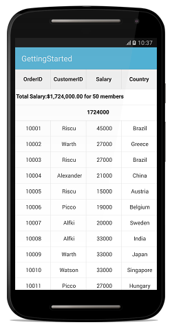
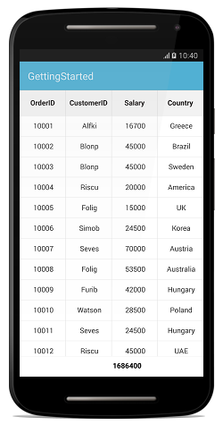
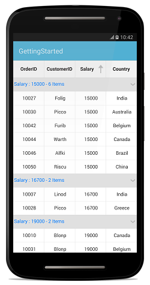
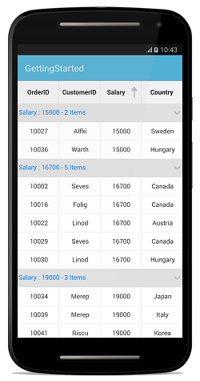
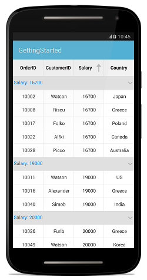
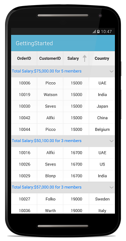

# Summary

SfDataGrid displays the summaries for each group using the [CaptionSummaryRowControl](https://help.syncfusion.com/cr/cref_files/xamarin-android/sfdatagrid/Syncfusion.SfDataGrid.Android~Syncfusion.SfDataGrid.CaptionSummaryRowControl.html) which carries the information about a particular group like the group name, number of items (records) in the group, etc.
You can derive additional information from your data like sum, average, maximum, minimum and count using caption summary. These summary values are computed for groups using [SfDatagrid.GridSummaryRow](https://help.syncfusion.com/cr/cref_files/xamarin-android/sfdatagrid/Syncfusion.SfDataGrid.Android~Syncfusion.SfDataGrid.GridSummaryRow.html) and [SfDatagrid.GridSummaryColumn](https://help.syncfusion.com/cr/cref_files/xamarin-android/sfdatagrid/Syncfusion.SfDataGrid.Android~Syncfusion.SfDataGrid.GridSummaryColumn.html) that implements [ISummaryRow](https://help.syncfusion.com/cr/cref_files/xamarin-android/linq/Syncfusion.Linq.Android~Syncfusion.Data.ISummaryRow.html) and [ISummaryColumn](https://help.syncfusion.com/cr/cref_files/xamarin-android/linq/Syncfusion.Linq.Android~Syncfusion.Data.ISummaryColumn.html) interface.

## Caption Summaries

SfDataGrid provides built-in support for caption summaries. The caption summary value calculated based on the records in a group and the summary information will be displayed in the caption of a group.

Below screenshot shows the built-in caption summary of a group.

### Formatting built-in caption summary

By default, the summary value displayed in caption summary rows based on [SfDataGrid.GroupCaptionTextFormat](https://help.syncfusion.com/cr/cref_files/xamarin-android/sfdatagrid/Syncfusion.SfDataGrid.Android~Syncfusion.SfDataGrid.SfDataGrid~GroupCaptionTextFormat.html) property.
The default group caption format is `{ColumnName}: {Key} - {ItemsCount} Items`.

*  **ColumnName** - Displays the name of the column currently grouped.
*  **Key** - Displays the key value of the group.
*  **ItemsCount** - Displays the number of items in a group.

You can customize this group caption text format by setting the `SfDataGrid.GroupCaptionTextFormat` property. The following code example illustrates how to customize group caption text in SfDataGrid.


//Customized group caption text
dataGrid.GroupCaptionTextFormat = "{ColumnName} : {Key}";


Below screenshot shows the final outcome of the above code.

### Defining summary for row

You can display summary information in a row by setting [GridSummaryRow.ShowSummaryInRow](https://help.syncfusion.com/cr/cref_files/xamarin-android/sfdatagrid/Syncfusion.SfDataGrid.Android~Syncfusion.SfDataGrid.GridSummaryRow~ShowSummaryInRow.html) to `true` and defining summary columns. You have to define [GridSummaryRow.Title](https://help.syncfusion.com/cr/cref_files/xamarin-android/sfdatagrid/Syncfusion.SfDataGrid.Android~Syncfusion.SfDataGrid.GridSummaryRow~Title.html) based on [GridSummaryColumn.Name](https://help.syncfusion.com/cr/cref_files/xamarin-android/sfdatagrid/Syncfusion.SfDataGrid.Android~Syncfusion.SfDataGrid.GridSummaryColumn~Name.html) property to format summary columns values in a row.


GridSummaryRow summaryRow = new GridSummaryRow();
summaryRow.Title = "Total Salary:{TotalSalary} for {ProductCount} items";
summaryRow.ShowSummaryInRow = true;
summaryRow.SummaryColumns.Add{new GridSummaryColumn()
{
    Name = " TotalSalary ",
    MappingName = "Salary",
    Format = "{Sum:c}",
    SummaryType = SummaryType.DoubleAggregate
});
summaryRow.SummaryColumns.Add{new GridSummaryColumn()
{
    Name = " ProductCount ",
    MappingName = "Salary",
    Format = "{Count}",
    SummaryType = SummaryType.CountAggregate
});
sfgrid.CaptionSummaryRow= summaryRow;


The following screenshot shows the final outcome for both values of `ShowSummaryInRow` to `true`.

### Defining summary for column

You can display summary information in the column by setting `GridSummaryRow.ShowSummaryInRow` to `false` and defining summary columns. `SfDataGrid.GridSummaryColumn` is the object of [GridSummaryRow.SummaryColumns](https://help.syncfusion.com/cr/cref_files/xamarin-android/sfdatagrid/Syncfusion.SfDataGrid.Android~Syncfusion.SfDataGrid.GridSummaryRow~SummaryColumns.html) collection that contains the following important properties:

* [Name](https://help.syncfusion.com/cr/cref_files/xamarin-android/sfdatagrid/Syncfusion.SfDataGrid.Android~Syncfusion.SfDataGrid.GridSummaryColumn~Name.html): Defines name of the `GridSummaryColumn` that helps to denote the `GridSummaryColumn` in `GridSummaryRow` with Title.

* [MappingName](https://help.syncfusion.com/cr/cref_files/xamarin-android/sfdatagrid/Syncfusion.SfDataGrid.Android~Syncfusion.SfDataGrid.GridSummaryColumn~MappingName.html): The corresponding column name that is used for the summary calculation.

* [SummaryType](https://help.syncfusion.com/cr/cref_files/xamarin-android/sfdatagrid/Syncfusion.SfDataGrid.Android~Syncfusion.SfDataGrid.GridSummaryColumn~SummaryType.html): It is the SummaryType (enum) property that helps to define the aggregate type for the summary calculation. `DataGrid` control provides the following predefined aggregates.

  * CountAggregate
  * Int32Aggregate
  * DoubleAggregate

* [CustomAggregate](https://help.syncfusion.com/cr/cref_files/xamarin-android/sfdatagrid/Syncfusion.SfDataGrid.Android~Syncfusion.SfDataGrid.GridSummaryColumn~CustomAggregate.html): Defines the `CustomAggregate` class object when the summary type is set as Custom that calculates the custom summaries.

* [Format](https://help.syncfusion.com/cr/cref_files/xamarin-android/sfdatagrid/Syncfusion.SfDataGrid.Android~Syncfusion.SfDataGrid.GridSummaryColumn~Format.html): `String` property that formats the summary value and displays it. `Format` property contains two parts that are separated by a colon (:). First part denotes the aggregate function name and second part denotes display format of the summary value.

Refer [Formatting Summary](#_Formatting_Summary) section to know more about how to format summary and [Aggregate Types](#_Aggregate_Types) section to know about different summary types.

In the below code snippet,the summary is defined for `Salary` column.


GridSummaryRow summaryRow = new GridSummaryRow();
summaryRow.ShowSummaryInRow = false;
summaryRow.SummaryColumns.Add{new GridSummaryColumn()
{
    Name = "CaptionSummary",
    MappingName = "Salary",
    Format = "{Sum:c}",
    SummaryType = SummaryType.DoubleAggregate
});
sfgrid.CaptionSummaryRow= summaryRow;


## Formatting Summary

In the below sections formatting is explained using `CaptionSummary`.

### Defining Summary Function

In the below code snippet `Format` property is defined to display the sum of `Salary` by specifying the function name inside curly braces.

N> `DoubleAggregate` is used as `SummaryType` which has the count, max, min, average and sum functions.


GridSummaryRow summaryRow = new GridSummaryRow();
summaryRow.ShowSummaryInRow = false;
summaryRow.SummaryColumns.Add{new GridSummaryColumn()
{
    Name = "CaptionSummary",
    MappingName = "Salary",
    Format = "{Sum}",
    SummaryType = SummaryType.DoubleAggregate
});
sfgrid.CaptionSummaryRow= summaryRow;


### Formatting Summary Value

You can format the summary value by setting the appropriate format after the aggregate function followed by a colon(:) in [GridSummaryColumn.Format](https://help.syncfusion.com/cr/cref_files/xamarin-android/sfdatagrid/Syncfusion.SfDataGrid.Android~Syncfusion.SfDataGrid.GridSummaryColumn~Format.html) property.

In the below code snippet `Salary` column summary is formatted using `c` format specifier. Refer [here](https://msdn.microsoft.com/en-us/library/dwhawy9k.aspx?f=255&MSPPError=-2147217396) to know about how to set different format.


GridSummaryRow summaryRow = new GridSummaryRow();
summaryRow.ShowSummaryInRow = false;
summaryRow.SummaryColumns.Add{new GridSummaryColumn()
{
    Name = "CaptionSummary",
    MappingName = "Salary",
    Format = "’{Sum:c}’",
    SummaryType = SummaryType.DoubleAggregate
});
sfgrid.CaptionSummaryRow= summaryRow;


### Displaying additional Content in Summary

You can append additional content with summary value using `GridSummaryColumn.Format` property.

In the below code snippet `Total :` text is appended before summary value.


GridSummaryRow summaryRow = new GridSummaryRow();
summaryRow.ShowSummaryInRow = false;
summaryRow.SummaryColumns.Add{new GridSummaryColumn()
{
    Name = "CaptionSummary",
    MappingName = "Salary",
    Format = "Total:{Sum:c}",
    SummaryType = SummaryType.DoubleAggregate
});
sfgrid.CaptionSummaryRow= summaryRow;


### Formatting Summary for Row using Title property

You can format the summary value for a row using [GridSummaryRow.Title](https://help.syncfusion.com/cr/cref_files/xamarin-android/sfdatagrid/Syncfusion.SfDataGrid.Android~Syncfusion.SfDataGrid.GridSummaryRow~Title.html) when `ShowSummaryInRow` is set to `true`.


GridSummaryRow summaryRow = new GridSummaryRow();
summaryRow.Title = "Total Salary:{TotalSalary} for {ProductCount} items";
summaryRow.ShowSummaryInRow = true;
summaryRow.SummaryColumns.Add{new GridSummaryColumn()
{
    Name = " TotalSalary",
    MappingName = "Salary",
    Format = "{Sum:c}",
    SummaryType = SummaryType.DoubleAggregate
});
summaryRow.SummaryColumns.Add{new GridSummaryColumn()
{
    Name = " ProductCount",
    MappingName = "Salary",
    Format = "{Count}",
    SummaryType = SummaryType.DoubleAggregate
});
sfgrid.CaptionSummaryRow= summaryRow;


## Aggregate Types

You can specify the different summary aggregate types by using [GridSummaryColumn.SummaryType](https://help.syncfusion.com/cr/cref_files/xamarin-android/sfdatagrid/Syncfusion.SfDataGrid.Android~Syncfusion.SfDataGrid.GridSummaryColumn~SummaryType.html) property and use the built-in function in `GridSummaryColumn.Format`.

The following are the list of predefined aggregate types and its built-in functions.

<table>
<tr>
<th>
Aggregate Type
</th>
<th>
Built-in function
</th>
</tr>
<tr>
<td>
CountAggregate
</td>
<td>
Count
</td>
</tr>
<tr>
<td>
Int32Aggregate
</td>
<td>
Count, Max, Min, Average and Sum
</td>
</tr>
<tr>
<td>
DoubleAggregate
</td>
<td>
Count, Max, Min, Average and Sum
</td>
</tr>
<tr>
<td>
Custom
</td>
<td>
Used for Custom Summaries
</td>
</tr>
</table>

## Custom Summaries

SfDataGrid allows you to implement your own aggregate functions when the built-in aggregate functions do not meet your requirement.
You can calculate the summary values based on custom logic using [GridSummaryColumn.CustomAggregate](https://help.syncfusion.com/cr/cref_files/xamarin-android/sfdatagrid/Syncfusion.SfDataGrid.Android~Syncfusion.SfDataGrid.GridSummaryColumn~CustomAggregate.html) property.

### Implementing custom aggregate

1. Create a custom aggregate class by deriving from [ISummaryAggregate](https://help.syncfusion.com/cr/cref_files/xamarin-android/linq/Syncfusion.Linq.Android~Syncfusion.Data.ISummaryAggregate.html) interface.
2. In the `CalculateAggregateFunc` method, you have to calculate the summary and assign it to the property.

In the below code snippet, the `Standard Deviation` is calculated for quantity of products.


public class CustomAggregate : ISummaryAggregate
{
    public CustomAggregate()
    {
    }
    public double StdDev { get; set; }
    public Action&lt;System.Collections.IEnumerable, string, System.ComponentModel.PropertyDescriptor&gt; CalculateAggregateFunc()
    {
        return (items, property, pd) =>
        {
            var enumerableItems = items as IEnumerable&lt;OrderInfo&gt;;
            if (pd.Name == "StdDev")
            {
                this.StdDev = enumerableItems.StdDev&lt;OrderInfo&gt;(q => q.OrderID);
            }
        };
    }
}
public static class LinqExtensions
{
    public static double StdDev&lt;T&gt;(this IEnumerable&lt;T&gt; values, Func&lt;T, double?&gt; selector)
    {
        double ret = 0;
        var count = values.Count();
        if (count > 0)
        {
            double? avg = values.Average(selector);
            double sum = values.Select(selector).Sum(d =>
            {
                if (d.HasValue)
                {
                    return Math.Pow(d.Value - avg.Value, 2);
                }
                return 0.0;
            });
            ret = Math.Sqrt((sum) / (count - 1));
        }
        return ret;
    }
}


Assign the custom aggregate to `GridSummaryColumn.CustomAggregate` property and set the `SummaryType` as `Custom`. `GridSummaryColumn.Format` property is defined based on property name in custom aggregate `StdDev`.


GridSummaryRow summaryRow = new GridSummaryRow();
summaryRow.Title = "Standard Deviation:{CaptionSummary}";
summaryRow.ShowSummaryInRow = true;
summaryRow.SummaryColumns.Add(new GridSummaryColumn
{
    Name = "CaptionSummary",
    CustomAggregate  = new CustomAggregate(),
    MappingName = "OrderID",
    Format = "{StdDev}",
    SummaryType = Syncfusion.Data.SummaryType.Custom
});
dataGrid.CaptionSummaryRow = summaryRow;


You can download the sample demo [here](http://www.syncfusion.com/downloads/support/directtrac/general/ze/SummaryDemo-333052166).
