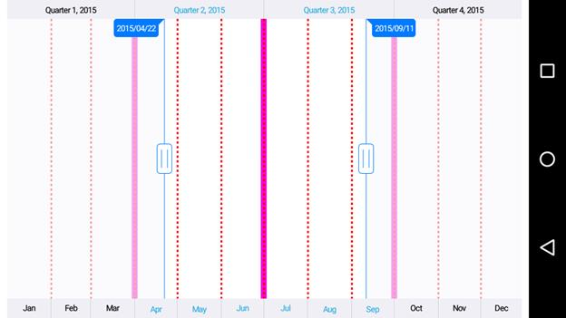

# Grid Lines

The `MinorScaleStyle` and `MajorScaleStyle` properties of `SfDateTimeRangeNavigator` used to customize the minor and major grid lines. Following properties are available in each scale style to configure the grid lines.

* `ShowGridLines` – used to set the visibility of grid lines.
* `GridLineWidth` – used to set the width for grid lines.
* `GridLineColor` – used to set the color for grid lines.
* `GridLinePathEffect` – used to set dashes for grid lines.


[C#]
SfDateTimeRangeNavigator rangenavigator = new SfDateTimeRangeNavigator();
...
rangenavigator.MajorScaleStyle.ShowGridLines = true;
rangenavigator.MajorScaleStyle.GridLineColor =  0xF109D7;
rangenavigator.MajorScaleStyle.GridLineWidth = 10;
rangenavigator.MinorScaleStyle.ShowGridLines = true;
rangenavigator.MinorScaleStyle.GridLineColor = Color.Red;
rangenavigator.MinorScaleStyle.GridLineWidth = 3;
rangenavigator.MinorScaleStyle.GridLinePathEffect = new DashPathEffect(new float[] { 4, 4}, 0);


