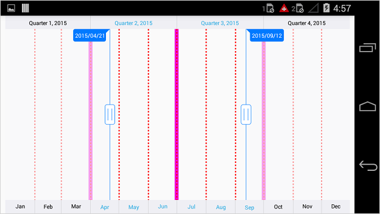

# Grid Lines in Xamarin.Android SfDateTimeRangeNavigator

The [`MinorScaleStyle`](https://help.syncfusion.com/cr/xamarin-android/Com.Syncfusion.Rangenavigator.SfDateTimeRangeNavigator.html#Com_Syncfusion_Rangenavigator_SfDateTimeRangeNavigator_MinorScaleStyle) and [`MajorScaleStyle`](https://help.syncfusion.com/cr/xamarin-android/Com.Syncfusion.Rangenavigator.SfDateTimeRangeNavigator.html#Com_Syncfusion_Rangenavigator_SfDateTimeRangeNavigator_MajorScaleStyle) properties of [`SfDateTimeRangeNavigator`](https://help.syncfusion.com/cr/xamarin-android/Com.Syncfusion.Rangenavigator.SfDateTimeRangeNavigator.html) used to customize the minor and major grid lines. Following properties are available in each scale style to configure the grid lines.

* [`ShowGridLines`](https://help.syncfusion.com/cr/xamarin-android/Com.Syncfusion.Rangenavigator.ScaleStyle.html#Com_Syncfusion_Rangenavigator_ScaleStyle_ShowGridLines) – used to set the visibility of grid lines.
* [`GridLineWidth`](https://help.syncfusion.com/cr/xamarin-android/Com.Syncfusion.Rangenavigator.ScaleStyle.html#Com_Syncfusion_Rangenavigator_ScaleStyle_GridLineWidth) – used to set the width for grid lines.
* [`GridLineColor`](https://help.syncfusion.com/cr/xamarin-android/Com.Syncfusion.Rangenavigator.ScaleStyle.html#Com_Syncfusion_Rangenavigator_ScaleStyle_GridLineColor) – used to set the color for grid lines.
* [`GridLinePathEffect`](https://help.syncfusion.com/cr/xamarin-android/Com.Syncfusion.Rangenavigator.ScaleStyle.html#Com_Syncfusion_Rangenavigator_ScaleStyle_GridLinePathEffect) – used to set dashes for grid lines.


[C#]
SfDateTimeRangeNavigator rangeNavigator = new SfDateTimeRangeNavigator();
...
rangeNavigator.MajorScaleStyle.ShowGridLines = true;
rangeNavigator.MajorScaleStyle.GridLineColor =  0xF109D7;
rangeNavigator.MajorScaleStyle.GridLineWidth = 10;
rangeNavigator.MinorScaleStyle.ShowGridLines = true;
rangeNavigator.MinorScaleStyle.GridLineColor = Color.Red;
rangeNavigator.MinorScaleStyle.GridLineWidth = 3;
rangeNavigator.MinorScaleStyle.GridLinePathEffect = new DashPathEffect(new float[] { 4, 4}, 0);


