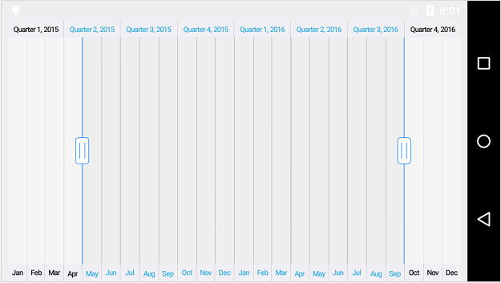

# Selecting Range

The left and right thumb of `SfDateTimeRangeNavigator` are used to indicate the selected range in the large collection of data. Following are the ways you can select a range.

* By dragging the thumbs.
* By tapping on the minor and major labels.
* By setting the [`ViewRangeStart`](https://help.syncfusion.com/cr/cref_files/xamarin-android/sfchart/Syncfusion.SfChart.Android~Com.Syncfusion.Rangenavigator.SfDateTimeRangeNavigator~ViewRangeStart.html) and [`ViewRangeEnd`](https://help.syncfusion.com/cr/cref_files/xamarin-android/sfchart/Syncfusion.SfChart.Android~Com.Syncfusion.Rangenavigator.SfDateTimeRangeNavigator~ViewRangeEnd.html) properties.

Following code example shows how to configure the selected range using `ViewRangeStart` and `ViewRangeEnd` properties of `SfDateTimeRangeNavigator`.


SfDateTimeRangeNavigator sfRangeNavigator = new SfDateTimeRangeNavigator(); 

sfRangeNavigator.ViewRangeStart = new GregorianCalendar(2015, 4, 1).Time;

sfRangeNavigator.ViewRangeEnd = new GregorianCalendar(2016, 9, 1).Time;



## Deferred Update

[`RangeChanged`](https://help.syncfusion.com/cr/cref_files/xamarin-android/sfchart/Syncfusion.SfChart.Android~Com.Syncfusion.Rangenavigator.SfDateTimeRangeNavigator~RangeChanged_EV.html) event will be fired whenever you drag the thumbs. If you are doing some long running tasks in this event handler, then dragging the thumbs will not be smooth. You can delay this event by enabling [`DeferredUpdateEnabled`](https://help.syncfusion.com/cr/cref_files/xamarin-android/sfchart/Syncfusion.SfChart.Android~Com.Syncfusion.Rangenavigator.SfDateTimeRangeNavigator~DeferredUpdateEnabled.html) property. If this property is set to true, the `RangeChanged` event will get fired only when you stop dragging or if the thumb is held for more than 500 milliseconds. If it is false, the range will be updated for every movement of the thumb. However, It is true by default.


SfDateTimeRangeNavigator sfRangeNavigator = new SfDateTimeRangeNavigator(); 

sfRangeNavigator.DeferredUpdateEnabled = false;


## RangeChanged Event

This event is triggered when the selected range of the `SfDateTimeRangeNavigator` is changed. The argument contains the following information.

* [`ViewRangeStart`](https://help.syncfusion.com/cr/cref_files/xamarin-android/sfchart/Syncfusion.SfChart.Android~Com.Syncfusion.Rangenavigator.SfDateTimeRangeNavigator+RangeChangedEventArgs~ViewRangeStart.html) – used to get the start date of the selected range.
* [`ViewRangeEnd`](https://help.syncfusion.com/cr/cref_files/xamarin-android/sfchart/Syncfusion.SfChart.Android~Com.Syncfusion.Rangenavigator.SfDateTimeRangeNavigator+RangeChangedEventArgs~ViewRangeEnd.html) – used to get the end date of the selected range.