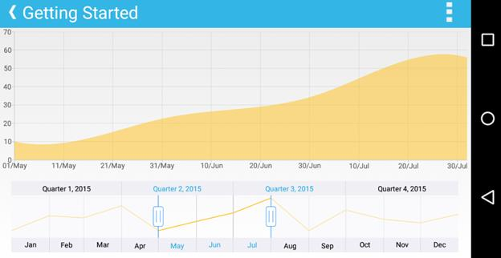

# Getting started
## Create your first DateTime Range Navigator in Xamarin.Android

This section walks you through the steps required to add SfDateTimeRangeNavigator and populate it with data, and also explains how to respond to range selection performed in the control. 

### Reference Essential Studio components in your solution

After installing Essential Studio for Xamarin, you can find all the required assemblies in the installation folders, 

{Syncfusion Installed location}\Essential Studio\12.4.0.24\lib

N> Assemblies are available in unzipped package location in Mac.

Add the following assembly references to the Android project,

android\Syncfusion.SfChart.Andriod.dll

### Add and configure the SfDateTimeRangeNavigator 

First, let us initialize the control with major and minor date time scales by specifying the minimum and maximum date to be visualized in the control using `Minimum` and `Maximum` properties.

Following code example illustrates this,


[C#]

SfDateTimeRangeNavigator sfDateTimeRangeNavigator = new SfDateTimeRangeNavigator();

sfDateTimeRangeNavigator.Minimum = new GregorianCalendar(2015, 01, 01).Time;

sfDateTimeRangeNavigator.Maximum = new GregorianCalendar(2016, 01, 01).Time;



### Handle range selection

In real time, other controls like chart, grid etc., are updated in response to the range selection performed in `SfDateTimeRangeNavigator`. You can handle the selection using `RangeChanged` event and update other controls based on the selected date time or perform some other tasks using the selected data.

N> You can get the selected date time using `P0` and `P1`.

Following code example illustrates how to handle range selection and update chart's date time axis range,


[C#]

sfDateTimeRangeNavigator.RangeChanged += sfDateTimeRangeNavigator_RangeChanged;

void sfDateTimeRangeNavigator_RangeChanged(object sender, SfDateTimeRangeNavigator.RangeChangedEventArgs e)
{
    //Updating chart's date time range
    dateTimeAxis.Minimum = e.P0;
    dateTimeAxis.Maximum = e.P1;
}



