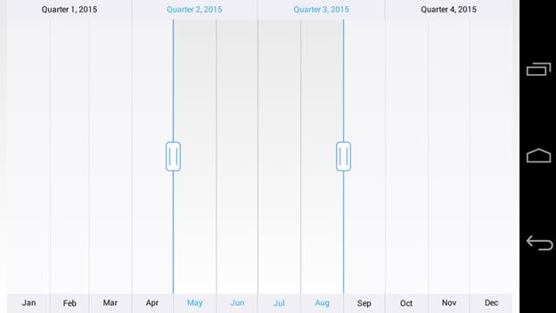
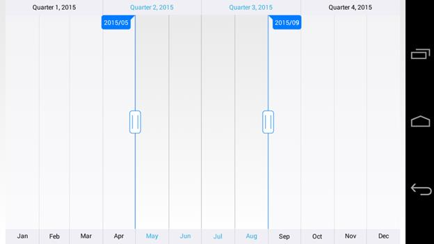
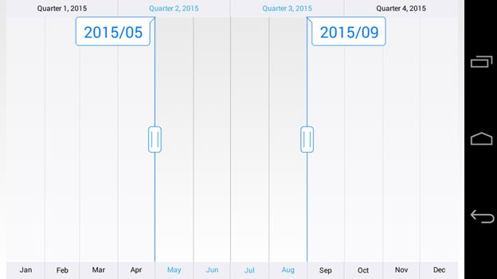

# Tooltip

The tooltip is used to show the selected range start and end value of the `SfDateTimeRangeNavigator``.`

## Tooltip Visibility

The `TooltipEnabled` property of `SfDateTimeRangeNavigator` is used to control the visibility of the left and right tooltip. It is true by default.


[C#]
SfDateTimeRangeNavigator rangeNavigator = new SfDateTimeRangeNavigator(this);

rangeNavigator.TooltipEnabled = false;


## Tooltip Format

You can format the date value of the tooltip using `TooltipFormat` property of `SfDateTimeRangeNavigator`.


[C#]
dateTimeRangeNavigator.TooltipFormat = "yyyy/MM";


## Appearance Customization

The `LeftTooltipStyle` and `RightTooltipStyle` properties of `SfDateTimeRangeNavigator` are used to customize the left and right tooltip. Following properties are available in each tooltip style to customize the appearance of the tooltip.

* `TextColor` – used to change the color of the tooltip text.
* `TextSize` - used to change the text size of the tooltip.
* `BackgroundColor` – used to change the background color of the tooltip.
* `StrokeColor` – used to change the border color of the tooltip.
* `StrokeWidth` – used to change the thickness of the tooltip border.
* `Typeface` – used to change the font family and font weight
* `MarginLeft` - used to change the left margin of the tooltip text.
* `MarginTop` - used to change the top margin of the tooltip text.
* `MarginRight` - used to change the right margin of the tooltip text.
* `MarginBottom` - used to change the bottom margin of the tooltip text.


[C#]
dateTimeRangeNavigator.LeftTooltipStyle.TextColor = Color.Blue;
dateTimeRangeNavigator.LeftTooltipStyle.BackgroundColor = Color.White;
dateTimeRangeNavigator.LeftTooltipStyle.StrokeColor = Color.Blue;
dateTimeRangeNavigator.LeftTooltipStyle.StrokeWidth = 2;
dateTimeRangeNavigator.LeftTooltipStyle.TextSize = 30;
dateTimeRangeNavigator.LeftTooltipStyle.MarginLeft = 15;
dateTimeRangeNavigator.LeftTooltipStyle.MarginTop = 15;
dateTimeRangeNavigator.LeftTooltipStyle.MarginRight = 15;
dateTimeRangeNavigator.LeftTooltipStyle.MarginBottom = 15;
dateTimeRangeNavigator.RightTooltipStyle.TextColor = Color.Blue;
dateTimeRangeNavigator.RightTooltipStyle.BackgroundColor = Color.White;
dateTimeRangeNavigator.RightTooltipStyle.StrokeColor = Color.Blue;
dateTimeRangeNavigator.RightTooltipStyle.StrokeWidth = 2;
dateTimeRangeNavigator.RightTooltipStyle.TextSize = 30;
dateTimeRangeNavigator.RightTooltipStyle.MarginLeft = 15;
dateTimeRangeNavigator.RightTooltipStyle.MarginTop = 15;
dateTimeRangeNavigator.RightTooltipStyle.MarginRight = 15;
dateTimeRangeNavigator.RightTooltipStyle.MarginBottom = 15;


