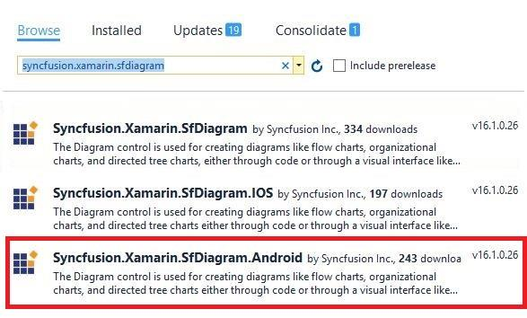

# Getting Started
This section provides a quick overview for working with Diagram for Xamarin.Android. This walkthrough demonstrates that, how to create a simple flow chart and an organization chart.

## Assemblies Required

After installing Essential Studio for Xamarin, you can find all the required assemblies in the installation folders.
{Syncfusion Essential Studio Installed location}\Essential Studio{Essential Studio version}\Xamarin\lib\android\
Example: C:\Program Files (x86)\Syncfusion\Essential Studio\15.4.0.17\Xamarin\lib\android
For creating a diagram for android, the following assemblies need to be referenced in your Android project.
•	Syncfusion.SfDiagram.Android

## Basic building blocks of Diagram

• **Diagram-** It represents the drawing surface where all the graphical elements like nodes and connectors resides, can be used to display various types of diagrams and it is the root instance of the diagram control. A Diagram instance contains a collection of nodes and connectors to represent the  graphical diagram.
• **Nodes-** This represents the geometric shapes such as flowchart elements, network diagram elements, use case elements, etc. 
• **Connectors-** These are the objects used to create link between two nodes, to represent the relationships between them in the diagram. 
• **Ports-** It represents a point in the node, where the connectors can be connected. A Node can contain any number of ports.
• **Annotation-** It is a block of the text that can be displayed over a Node or Connector. Annotation is used to textually represent an object with a string that can be edited at run time.

## Creating a Simple Flow Chart

Create a new cross platform app (Xamarin.Android) with portable class library in the Visual Studio and name the project as “GettingStarted” and refer to the above mentioned assemblies to the respective projects.
**Adding SfDiagram in Xamarin.Android**
1.Create a new blank application for Android using Visual Studio and name it as “GettingStartedDroid”. Refer the above-mentioned assemblies to the project.
Add the below code in the Main.axml to include PDF Viewer control.


<?xml version="1.0" encoding="utf-8"?> 
<LinearLayout xmlns:android="http://schemas.android.com/apk/res/android" android:orientation="vertical" android:layout_width="match_parent" android:layout_height="match_parent"
android:id="@+id/linear_layout"> 
<Syncfusion.SfDiagram.Android.SfDiagram android:layout_width="match_parent" android:layout_height="match_parent" android:id="@+id/diagram_control" /> </LinearLayout>


Please add the below code snippet in the MainActivity class
•	In the MainActivity.cs class, declare an instance of SfDiagram globally.
•	In the override method OnCreate, set the content view to Main.


using Syncfusion.SfDiagram.Android;
namespace GettingStarted
{
    public class MainActivity : Activity    
{
        SfDiagram diagram;
        protected override void OnCreate(Bundle bundle)
       {
               base.OnCreate(bundle);
               SetContentView(Resource.Layout.Main);
               Diagram = FindViewById<SfDiagram>(Resource.Id.diagram_control);
        }
    }
}



The following code snippet illustrates the creation of Nodes and Connectors in the diagram.


protected override void OnCreate(Bundle bundle)
{
base.OnCreate(bundle);

// Set our view from the "main" layout resource
SetContentView(Resource.Layout.Main);
LinearLayout linear_Layout = FindViewById<LinearLayout>(Resource.Id.linear_layout);
SfDiagram diagram = new SfDiagram(this);
diagram.LayoutParameters = new LayoutParams(LayoutParams.MatchParent, LayoutParams.MatchParent);
Node Begin = AddNode("Begin", 300, 120, 240, 80, "Begin", ShapeType.Ellipse);
Node Process = AddNode("Process", 300, 280, 240, 120, "Process", ShapeType.Rectangle);
Node End = AddNode("End", 380, 450, 80, 80, "End", ShapeType.Ellipse);
//Add nodes to the SfDiagram
diagram.AddNode(Begin);
diagram.AddNode(Process);
diagram.AddNode(End);
Connector connector1 = new Connector(this)
{
SourceNode = Begin,
TargetNode = Process,
};
Connector connector2 = new Connector(this)
{
SourceNode = Process,
TargetNode = End,
};
//Add connectors to the SfDiagram
diagram.AddConnector(connector1);
diagram.AddConnector(connector2);
linearLayout.AddView(diagram);
}

//Create Node
public Node AddNode(string id, float offsetX, float offsetY, float width, float height, string text, ShapeType shape)
{
Node node = new Node(this);
node.OffsetX = offsetX;
node.OffsetY = offsetY;
node.Height = height;
node.Width = width;
node.ShapeType = shape;
node.Style.Brush = new SolidBrush(Color.Rgb(100, 149, 237));
node.Annotations.Add(new Annotation() { Content = text, FontSize = 18, TextBrush = new SolidBrush(Color.White) });
return node;
}



The flow chart will get displayed in the SfDiagram as follows

This demo project can be downloaded from the following link.
[GettingStarted_Demo](http://files2.syncfusion.com/Xamarin.Android/Samples/GettingStarted_Android_SfDiagram.zip)

## Create a simple organizational chart

SfDiagram provides support to auto-arrange the nodes based on hierarchical relation. Organization chart is an example of displaying hierarchical information.
Now, you have to create a class named “Employee” to store the employee’s information like name, designation, ID, reporting person ID, etc. Also, create a collection class that stores a collection of the employees.


//Employee Business Object
public class Employee
{
    public string ParentId { get; set; }
    public string Name { get; set; }
    public string Designation { get; set; }
    public int EmployeeId { get; set; }
}
//Employee Collection
public class Employees : ObservableCollection<Employee>  
{

}



**Initialize Employee data**
Define Employee Information as a Collection. The below code example shows an employee array whose,
•Name is used as a unique identifier and
•ParentId is used to identify the person to whom an employee report to, in the organization.



//Initializes the employee collection
ObservableCollection<Employee> employees = new ObservableCollection<Employee>();
employees.Add(new Employee() { Name = "Elizabeth", EmployeeId = "1", ParentId = "", Designation = "CEO" });
employees.Add(new Employee() { Name = "Christina", EmployeeId = "2", ParentId = "1", Designation = "Manager" });
employees.Add(new Employee() { Name = "Yang", EmployeeId = "3", ParentId = "1", Designation = "Manager" });
employees.Add(new Employee() { Name = "Yoshi", EmployeeId = "4", ParentId = "2", Designation = "Team Lead" });
employees.Add(new Employee() { Name = "Philip", EmployeeId = "5", ParentId = "2", Designation = "S/w Developer" });
employees.Add(new Employee() { Name = "Roland", EmployeeId = "6", ParentId = "3", Designation = "TeamLead" });
employees.Add(new Employee() { Name = "Yvonne", EmployeeId = "7", ParentId = "3", Designation = "Testing Engineer" });
//Initializes the DataSourceSettings
diagram.DataSourceSettings = new DataSourceSettings() { DataSource = employees, Id = "EmployeeId", ParentId = "ParentId" };
//Initializes the Layout
DirectedTreeLayout treeLayout = new DirectedTreeLayout() { HorizontalSpacing = 80, VerticalSpacing = 50, TreeOrientation = TreeOrientation.TopToBottom };

diagram.LayoutManager = new LayoutManager() { Layout = treeLayout };



The Employee data is displayed in the SfDiagram as follows

This demo project can be downloaded from the following link.
[OrganizationalChart_Demo](http://files2.syncfusion.com/Xamarin.Android/Samples/OrganizationalChart_Android_SfDiagram.zip)
