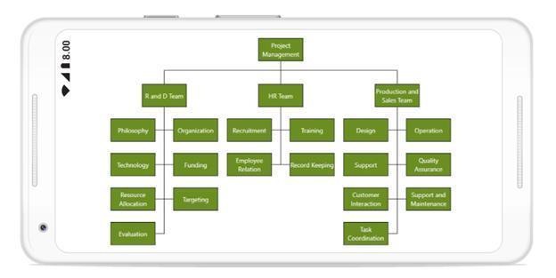

# Layouts
The SfDiagram supports auto-arranging the nodes in diagram area that is referred as layout.
The automatic layout with employee class and DataSourceSettings is explained and the initial steps for all the layouts are given as follows:

## Create class for data
You have to create a class for data, employee with the properties to store employee’s information like team, role, ID, reporting person ID, and more. It is also required to create a collection, that stores collection of employees.


//Employee Business Object
public class Employee
{
public string Team { get; set; }
public string Role { get; set; }
public int EmpiD { get; set; }
}
//Employee Collection
public class Employees : ObservableCollection<Employee>
{
}



## Initialize Data Source Settings 
The following code example illustrates the initialization of data source settings


// Initializes the DataSourceSettings 
DataSourceSettings setting = new DataSourceSettings();
setting.DataSource = employee;
setting.Id = "ID";
setting.ParentId = "ReportingId";
diagram.DataSourceSettings = setting;



## Organization Layout
An organizational chart is a diagram that displays the structure and relationship of an organization. To create an organizational chart, you should set the type as LayoutType.Organization. The following code example illustrates how to create an organizational chart:


//Employee Collection
ObservableCollection<Employee> employee = new ObservableCollection<Employee>();
employee.Add(new Employee { EmpiD = 0, Role = "Project Management" });
employee.Add(new Employee { EmpiD = 1,  Role = "R and D Team" ,Team = "0" });
employee.Add(new Employee { EmpiD = 3 , Role = "Philosophy", Team = "1" });
employee.Add(new Employee { EmpiD =4 , Role = "Organization", Team = "1" });
employee.Add(new Employee { EmpiD = 5 , Role = "Technology", Team = "1" });
employee.Add(new Employee { EmpiD = 7,  Role = "Funding" ,Team = "1" });
employee.Add(new Employee { EmpiD = 8 , Role = "Resource Allocation" ,Team = "1" });
employee.Add(new Employee { EmpiD = 9,  Role = "Targeting" ,Team = "1" });
employee.Add(new Employee { EmpiD = 11,  Role = "Evaluation" ,Team = "1" });
employee.Add(new Employee { EmpiD = 156 , Role = "HR Team", Team = "0" });
employee.Add(new Employee { EmpiD = 13 , Role = "Recruitment", Team = "156" });
employee.Add(new Employee { EmpiD = 113 , Role = "Training" ,Team = "156" });
employee.Add(new Employee { EmpiD = 112 , Role = "Employee Relation" ,Team = "156" });
employee.Add(new Employee { EmpiD = 14 , Role = "Record Keeping", Team = "156" });
employee.Add(new Employee { EmpiD = 17 , Role = "Production and Sales Team" ,Team = "0" });
employee.Add(new Employee { EmpiD = 119,  Role = "Design", Team = "17" });
employee.Add(new Employee { EmpiD = 19 , Role = "Operation", Team = "17" });
employee.Add(new Employee { EmpiD = 20 , Role = "Support" ,Team = "17" });
employee.Add(new Employee { EmpiD = 21 , Role = "Quality Assurance" ,Team = "17" });
employee.Add(new Employee { EmpiD = 23 , Role = "Customer Interaction" ,Team = "17" });
employee.Add(new Employee { EmpiD = 24 , Role = "Support and Maintenance" ,Team = "17" });
employee.Add(new Employee { EmpiD = 25 , Role = "Task Coordination", Team = "17" });

//Set parentId and id for DataSourceSettings
DataSourceSettings setting = new DataSourceSettings();
setting.DataSource = employee;
setting.Id = "EmpiD";
setting.ParentId = "Team";
diagram.DataSourceSettings = setting;
diagram.LayoutManager = new LayoutManager() { Layout = new DirectedTreeLayout() { TreeOrientation = TreeOrientation.TopToBottom, Type = LayoutType.Organization } };


Organizational chart layout starts parsing from root and iterate through all its child elements. The “BeginNodeLayout” event provides necessary information of node’s children and the way to arrange (orientation, type, etc.) them.

## BeginNodeLayout
You can change the chart type and orientation by using BeginNodeLayout event of the SfDiagram. This event will fire for each node added in layout when the layout is getting updated. By default, chart type is alternate and orientation is vertical. The following code example illustrates how to register an event and how to change chart type and orientation:


// Registering an event 
diagram.BeginNodeLayout += Diagram_BeginNodeLayout; 

private void Diagram_BeginNodeLayout(object sender, BeginNodeLayoutEventArgs args)
{
    if (!args.HasSubTree)
    {
       args.Type = ChartType.Left;
       args.Orientation = Orientation.Vertical;
    }
}




## BeginNodeRender
You can change node content using BeginNodeRender event of the SfDiagram. This event will fire for each node added in layout when the layout is getting updated.


// Registering an event
diagram.BeginNodeRender += Diagram_BeginNodeRender;

private void Diagram_BeginNodeRender(object sender, BeginNodeRenderEventArgs args)
        {
            Node node = args.Item as Node;
            node.Width = 150;
            node.Height = 60;
            node.ShapeType = ShapeType.Rectangle;
            Style style = new Style() { Brush = new SolidBrush(Color.OliveDrab) };
            node.Style = style;
            AnnotationCollection annotations = new AnnotationCollection(this);
            Annotation annotation = new Annotation()
            {
                Content = (node.Content as Employee).Role,
                HorizontalAlignment = HorizontalAlignment.Center,
                VerticalAlignment = VerticalAlignment.Center,
                TextBrush = new SolidBrush(Color.White)
            };
            annotations.Add(annotation);
            node.Annotations = annotations;
        }



## Expand and Collapse Node
You can expand and collapse the parent node using NodeClicked event of the SfDiagram. This event will fire when you click node in the Layout.


// Registering an event
diagram.BeginNodeLayout += Diagram_BeginNodeLayout;

void Diagram_NodeClicked(object sender, NodeClickedEventArgs args)
 {
     if ((args.Item.Content as Employee).HasChild && args.Item.IsExpanded)
         {
                args.Item.IsExpanded = false;
         }
     else if ((args.Item.Content as Employee).HasChild && !args.Item.IsExpanded)
         {
                args.Item.IsExpanded = true;
         }
  }



