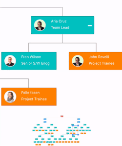

# Overview panel
The overview panel is used to display a preview (overall mini view) of the entire content of a diagram. This helps you to see overall picture of a large diagram and easily navigate to a position of the page using view port rectangle.
When working on a large diagram, you may not know the part you are working or navigation from one part to another is difficult. To navigate, you can zoom out the entire diagram and find where you are. This solution is not suitable when some frequent navigation is required.
The overview control solved this problem by displaying a preview (overall view) of the entire diagram, a rectangle indicated viewport of the diagram. Navigation becomes easy by dragging this rectangle. 

## Create Overview Panel 
The following code illustrates how to create the overview panel in diagram.



//Define overview panel 
OverviewPanel overview = new OverviewPanel(diagram.Context);
overview.Width = 500;
overview.Height = 500;
overview.IsVisible = true;
diagram.OverviewPanel = overview;


 

### PreventRefresh
Prevents the diagram to be updated in overview panel if any interaction takes place in the diagram layer. Prevents the diagram update for the entire actions till it turns true. It will be helpful when there is no need of frequent refreshing in the overview panel whenever diagram changes.


//Define prevent refresh property 
   overview.PreventRefresh = true;



### ForceRefresh 
Method to force refresh the diagram in overview panel. When the overview panel is prevented from updating diagram interaction by enabling PreventRefresh, force refresh is used to update the diagram in the overview panel. 


  //Define force refresh method 
   overview.ForceRefresh();



## Customizing view port rect 
The “StartX” and “StartY” properties are used to define the start position of the view port rect over the overview panel. The following code illustrates how to customize the view port rect.


 //Customize the view port rect 
  ViewportRect ViewportRect = new ViewportRect(overview);
  ViewportRect.StrokeColor = Color.Black;
  ViewportRect.StartX = 300;
  ViewportRect.StartY = 100;



