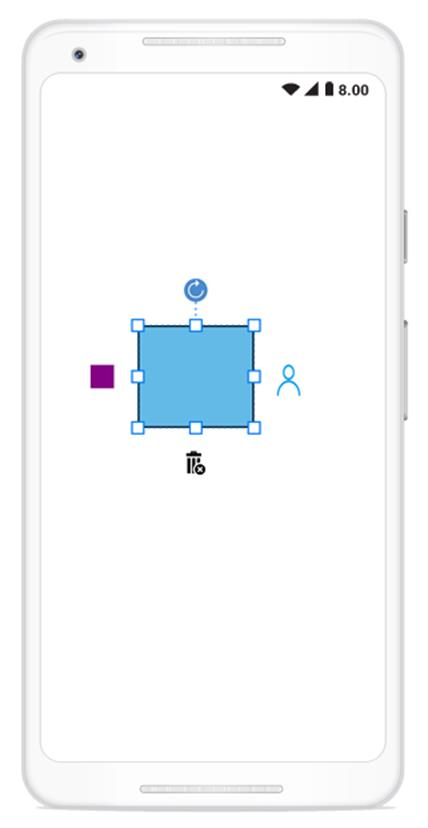

# User handles
User handles are customizable handles which can be used to perform custom actions and also default clipboard actions. You can able to customize the user handles using:
* SfGraphicPath
* Image
* View
The following code illustrates how to add custom user handle in diagram:


//Add graphic path into user handle
SfGraphics graph = new SfGraphics();
Pen stroke = new Pen();
stroke.Brush = new SolidBrush(Color.Transparent);
stroke.StrokeWidth = 3;
stroke.StrokeBrush = new SolidBrush(Color.Rgb(24, 161, 237));
graph.DrawEllipse(stroke, new System.Drawing.Rectangle(10, 0, 20, 20));
graph.DrawArc(stroke, 0, 20, 40, 40, 180, 180);
diagram.UserHandles.Add(new Syncfusion.SfDiagram.Android.UserHandle("SfGraphicsPath", UserHandlePosition.Right, graph) { BackgroundColor = Color.Transparent });

//Add image into user handle
var image = new ImageView(this);
image.SetImageResource(Resource.Drawable.delete);
diagram.UserHandles.Add(new Syncfusion.SfDiagram.Android.UserHandle("delete", UserHandlePosition.Bottom, image));

//Add View into user handle
var view = new View(this);
view.SetBackgroundColor(Color.Purple);
diagram.UserHandles.Add(new Syncfusion.SfDiagram.Android.UserHandle("View", UserHandlePosition.Left, view));




## User handles clicked event
The following code illustrate how to define user handles clicked event and its action.


//User handles clicked event
diagram.UserHandleClicked += Diagram_UserHandleClicked;

private void Diagram_UserHandleClicked(object sender, UserHandleClickedEventArgs args)
        {
            if (args.Item.Name == "Image")
            {
                diagram.Delete();
            }
        }



