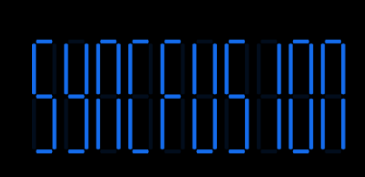
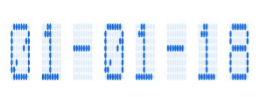
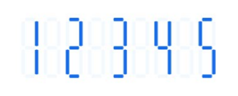

# Customize character segments in Xamarin.Android DigitalGauge

The characters of a digital gauge can be customized in terms of [`CharacterWidth`](https://help.syncfusion.com/cr/xamarin-android/Com.Syncfusion.Gauges.SfDigitalGauge.SfDigitalGauge.html#Com_Syncfusion_Gauges_SfDigitalGauge_SfDigitalGauge_CharacterWidth), [`CharacterHeight`](https://help.syncfusion.com/cr/xamarin-android/Com.Syncfusion.Gauges.SfDigitalGauge.SfDigitalGauge.html#Com_Syncfusion_Gauges_SfDigitalGauge_SfDigitalGauge_CharacterHeight), [`CharacterSpacing`](https://help.syncfusion.com/cr/xamarin-android/Com.Syncfusion.Gauges.SfDigitalGauge.SfDigitalGauge.html#Com_Syncfusion_Gauges_SfDigitalGauge_SfDigitalGauge_CharactersSpacing), and [`CharacterStroke`](https://help.syncfusion.com/cr/xamarin-android/Com.Syncfusion.Gauges.SfDigitalGauge.SfDigitalGauge.html#Com_Syncfusion_Gauges_SfDigitalGauge_SfDigitalGauge_CharacterStroke).

## customize character size

The values of digital characters are scaled by altering the height and width of digital characters. It is achieved by setting the [`CharacterHeight`](https://help.syncfusion.com/cr/xamarin-android/Com.Syncfusion.Gauges.SfDigitalGauge.SfDigitalGauge.html#Com_Syncfusion_Gauges_SfDigitalGauge_SfDigitalGauge_CharacterHeight) and [`CharacterWidth`](https://help.syncfusion.com/cr/xamarin-android/Com.Syncfusion.Gauges.SfDigitalGauge.SfDigitalGauge.html#Com_Syncfusion_Gauges_SfDigitalGauge_SfDigitalGauge_CharacterWidth) properties in the digital gauge. Default value of `CharacterHeight` and `CharacterWidth` is 25.



              int totalHeight = this.Resources.DisplayMetrics.HeightPixels;

            SfDigitalGauge sfDigitalGauge = new SfDigitalGauge(this);

            sfDigitalGauge.SetBackgroundColor(Color.White);

            sfDigitalGauge.CharacterStroke = Color.Rgb(20, 108, 237);

            sfDigitalGauge.CharacterHeight = 60;

            sfDigitalGauge.CharacterWidth = 15;

            sfDigitalGauge.SegmentStrokeWidth = 3;

            sfDigitalGauge.CharacterType = CharacterTypes.SegmentSeven;

            sfDigitalGauge.Value = "SYNCFUSION";

            sfDigitalGauge.DimmedSegmentColor = Color.Rgb(20, 108, 237);

            sfDigitalGauge.DimmedSegmentAlpha = 25;

            sfDigitalGauge.LayoutParameters = (new LinearLayout.LayoutParams((int)1000, (int)350));

            LinearLayout linearLayout = new LinearLayout(this);

            linearLayout.LayoutParameters = new FrameLayout.LayoutParams(ViewGroup.LayoutParams.MatchParent, (int)(totalHeight * 0.1));

            linearLayout.SetGravity(GravityFlags.Center);

            linearLayout.AddView(sfDigitalGauge);

            linearLayout.SetBackgroundColor(Color.White);

            SetContentView(linearLayout);



## Setting character spacing

The values of digital characters are spaced by altering the space of digital characters. It is achieved by setting the [`CharacterSpacing`](https://help.syncfusion.com/cr/xamarin-android/Com.Syncfusion.Gauges.SfDigitalGauge.SfDigitalGauge.html#Com_Syncfusion_Gauges_SfDigitalGauge_SfDigitalGauge_CharactersSpacing) property.



            int totalHeight = this.Resources.DisplayMetrics.HeightPixels;

            SfDigitalGauge sfDigitalGauge = new SfDigitalGauge(this);

            sfDigitalGauge.SetBackgroundColor(Color.White);

            sfDigitalGauge.CharacterStroke = Color.Rgb(20, 108, 237);

            sfDigitalGauge.CharacterHeight = 60;

            sfDigitalGauge.CharactersSpacing = 5;

            sfDigitalGauge.CharacterWidth = 15;

            sfDigitalGauge.SegmentStrokeWidth = 3;

            sfDigitalGauge.CharacterType = CharacterTypes.EightCrossEightDotMatrix;

            sfDigitalGauge.Value = "01-01-18";

            sfDigitalGauge.DimmedSegmentColor = Color.Rgb(20, 108, 237);

            sfDigitalGauge.DimmedSegmentAlpha = 25;

            sfDigitalGauge.LayoutParameters = (new LinearLayout.LayoutParams((int)900, (int)350));

            LinearLayout linearLayout = new LinearLayout(this);

            linearLayout.LayoutParameters = new FrameLayout.LayoutParams(ViewGroup.LayoutParams.MatchParent, (int)(totalHeight * 0.1));

            linearLayout.SetGravity(GravityFlags.Center);

            linearLayout.AddView(sfDigitalGauge);

            linearLayout.SetBackgroundColor(Color.White);

            SetContentView(linearLayout);



## Customize character segment stroke

The values of digital characters color can be customized using the [`CharacterStroke`](https://help.syncfusion.com/cr/xamarin-android/Com.Syncfusion.Gauges.SfDigitalGauge.SfDigitalGauge.html#Com_Syncfusion_Gauges_SfDigitalGauge_SfDigitalGauge_CharacterStroke) property.



            int totalHeight = this.Resources.DisplayMetrics.HeightPixels;

            SfDigitalGauge sfDigitalGauge = new SfDigitalGauge(this);

            sfDigitalGauge.SetBackgroundColor(Color.White);

            sfDigitalGauge.CharacterStroke = Color.Purple;

            sfDigitalGauge.CharacterHeight = 60;

            sfDigitalGauge.CharactersSpacing = 5;

            sfDigitalGauge.CharacterWidth = 15;

            sfDigitalGauge.SegmentStrokeWidth = 3;

            sfDigitalGauge.CharacterType = CharacterTypes.SegmentSeven;

            sfDigitalGauge.Value = "1 2 3 4 5";

            sfDigitalGauge.DimmedSegmentColor = Color.Rgb(20, 108, 237);

            sfDigitalGauge.DimmedSegmentAlpha = 20;

            sfDigitalGauge.LayoutParameters = (new LinearLayout.LayoutParams((int)1000, (int)350));

            LinearLayout linearLayout = new LinearLayout(this);

            linearLayout.LayoutParameters = new FrameLayout.LayoutParams(ViewGroup.LayoutParams.MatchParent, (int)(totalHeight * 0.1));

            linearLayout.SetGravity(GravityFlags.Center);

            linearLayout.AddView(sfDigitalGauge);

            linearLayout.SetBackgroundColor(Color.White);

            SetContentView(linearLayout);



## Customize disabled segment

You can customize the color and opacity of disabled segments using the [`DimmedSegmentColor`](https://help.syncfusion.com/cr/xamarin-android/Com.Syncfusion.Gauges.SfDigitalGauge.SfDigitalGauge.html#Com_Syncfusion_Gauges_SfDigitalGauge_SfDigitalGauge_DimmedSegmentColor) and [`DimmedSegmentAlpha`](https://help.syncfusion.com/cr/xamarin-android/Com.Syncfusion.Gauges.SfDigitalGauge.SfDigitalGauge.html#Com_Syncfusion_Gauges_SfDigitalGauge_SfDigitalGauge_DimmedSegmentAlpha) properties. The width of the digital character value can be customized using the [`SegmentStrokeWidth`](https://help.syncfusion.com/cr/xamarin-android/Com.Syncfusion.Gauges.SfDigitalGauge.SfDigitalGauge.html#Com_Syncfusion_Gauges_SfDigitalGauge_SfDigitalGauge_SegmentStrokeWidth) property.



             int totalHeight = this.Resources.DisplayMetrics.HeightPixels;

            SfDigitalGauge sfDigitalGauge = new SfDigitalGauge(this);

            sfDigitalGauge.SetBackgroundColor(Color.White);

            sfDigitalGauge.CharacterStroke = Color.Rgb(20, 108, 237);

            sfDigitalGauge.CharacterHeight = 60;

            sfDigitalGauge.CharactersSpacing = 5;

            sfDigitalGauge.CharacterWidth = 15;

            sfDigitalGauge.SegmentStrokeWidth = 5;

            sfDigitalGauge.CharacterType = CharacterTypes.SegmentSeven;

            sfDigitalGauge.Value = "1 2 3 4 5";

            sfDigitalGauge.DimmedSegmentColor = Color.LightSkyBlue;

            sfDigitalGauge.DimmedSegmentAlpha = 25;

            sfDigitalGauge.LayoutParameters = (new LinearLayout.LayoutParams((int)1000, (int)350));

            LinearLayout linearLayout = new LinearLayout(this);

            linearLayout.LayoutParameters = new FrameLayout.LayoutParams(ViewGroup.LayoutParams.MatchParent, (int)(totalHeight * 0.1));

            linearLayout.SetGravity(GravityFlags.Center);

            linearLayout.AddView(sfDigitalGauge);

            linearLayout.SetBackgroundColor(Color.White);

            SetContentView(linearLayout);



