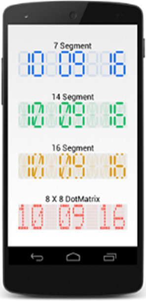

# Getting Started

This section provides overview for working with SfDigitalGauge for Xamarin.Android. It walks through the entire process of creating a SfDigitalGauge.

## Creating Your First SfDigitalGauge in Xamarin.Android

### Referencing Essential Studio Components in Your Solution

After installing Essential Studio for Xamarin, you can find all the required assemblies in the installation folders,

{Syncfusion Installed location}\Essential Studio\12.4.0.24\lib

Add the following assembly references to the Android project,

android\Syncfusion.SfDigitalGauge.Andriod.dll

### Add and Configure the SfDigitalgauge

* Adding reference to DigitalGauge.



	using Com.Syncfusion.Digitalgauge; 



* Create an instance of SfDigitalGauge.



	SfDigitalGauge digitalGauge = new SfDigitalGauge(this);
	SetContentView(digitalGauge);
	


### Configure the properties of SfDigitalGauge



	digitalGauge.Value=”Syncfusion”;
	digitalGauge.CharacterHeight=50;
	digitalGauge.CharacterWidth=50;
	digitalGauge.CharacterType=CharacterTypes.SegmentSeven;



