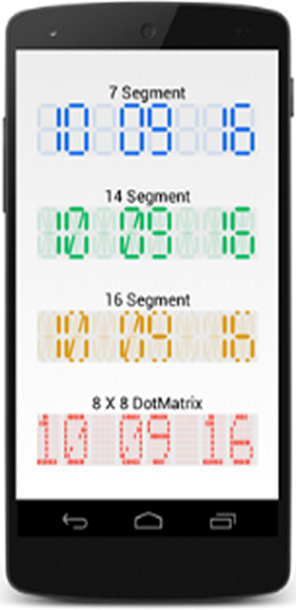

# Overview

The SfDigitalGauge control is used to display alphanumeric characters in digital (LED Display) mode. SfDigitalGauge is used to display a range of values that uses characters in combination with numbers. The SfDigitalGauge control for Xamarin.Android lets you visualize alpha and numeric values over a DigitalGauge frame. SfDigitalGauge is used to display a range of values that uses character in combination with numbers.

## Key Features

* Four Predefined CharacterTypes

* Full Character Customization support has been provided

* Segments can be customized.

* Special characters support has been provided

