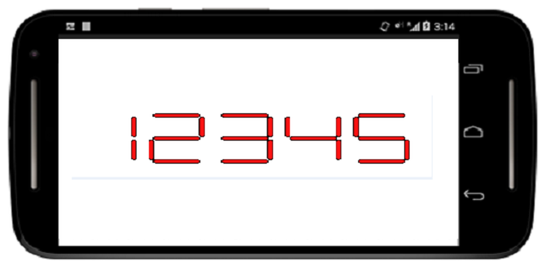
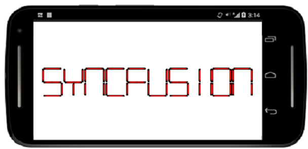
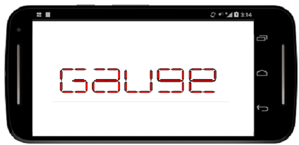
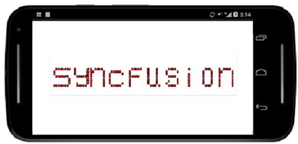

# Various-types-of-Segment

The Digital Characters can be drawn in 4 different segments as follows.
 
1. Seven

2. Fourteen

3. Sixteen

4. EightCrossEightDotMatrix

N> SegmentSeven is the default CharacterType in the SfDigitalGauge.

## SevenSegment





digitalGauge.CharacterType=CharacterTypes.SegmentSeven;





## Fourteen Segment





digitalGauge.CharacterType=CharacterTypes.segmentFourteen;





## Sixteen Segment





digitalGauge.CharacterType=CharacterTypes.segmentSixteen;





## EightCrossEightDotMatrix Segment





digitalGauge.CharacterType=CharacterTypes.EightCrossEightDotMatrix;





