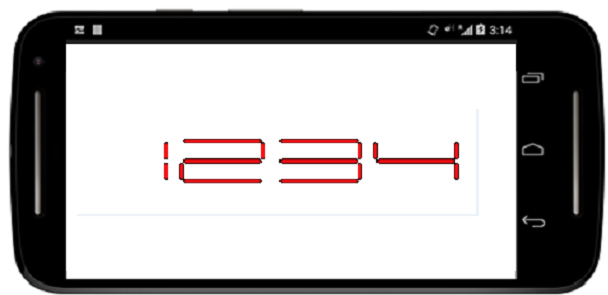

# CharacterWidth

The value of the Digital Characters is scaled by altering the width of the digital characters. It is achieved by setting the characterWidth property.



	  digitalGauge.CharacterWidth=25;



