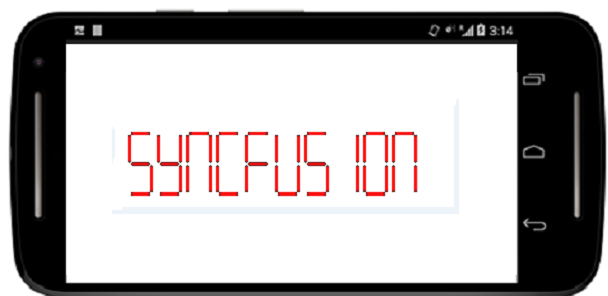

# Value

The Digital Characters in the Digital Gauge is viewed in different types of segments. These digital characters are set to the Digital Gauge through the Value property of type string.



	digitalGauge.Value="Syncfusion”;



